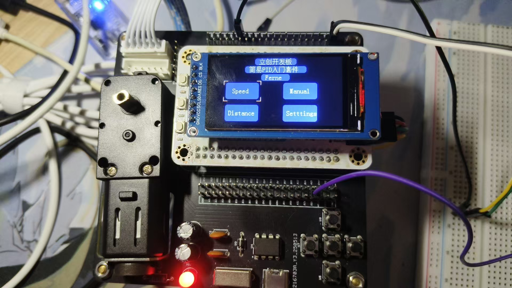
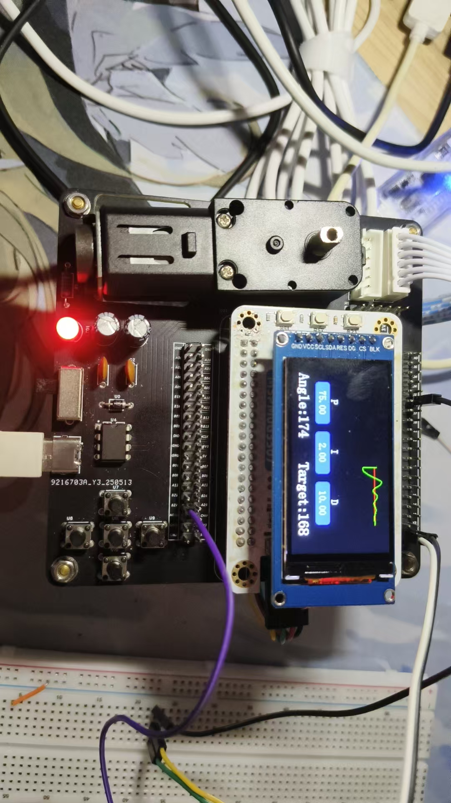
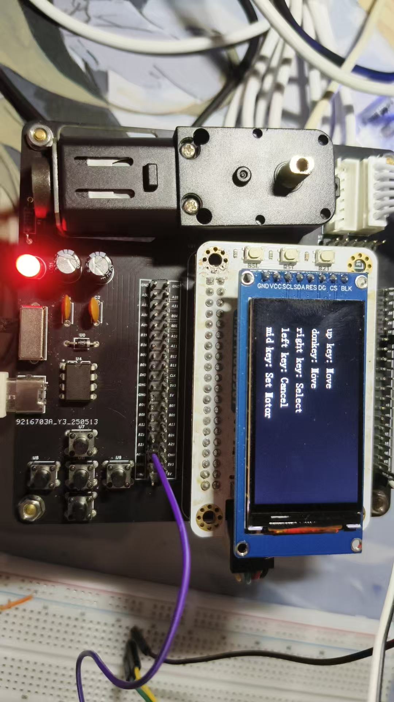
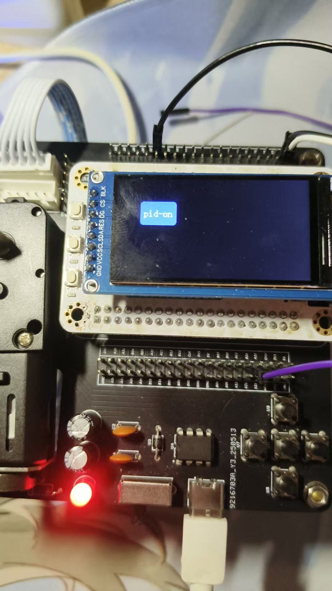
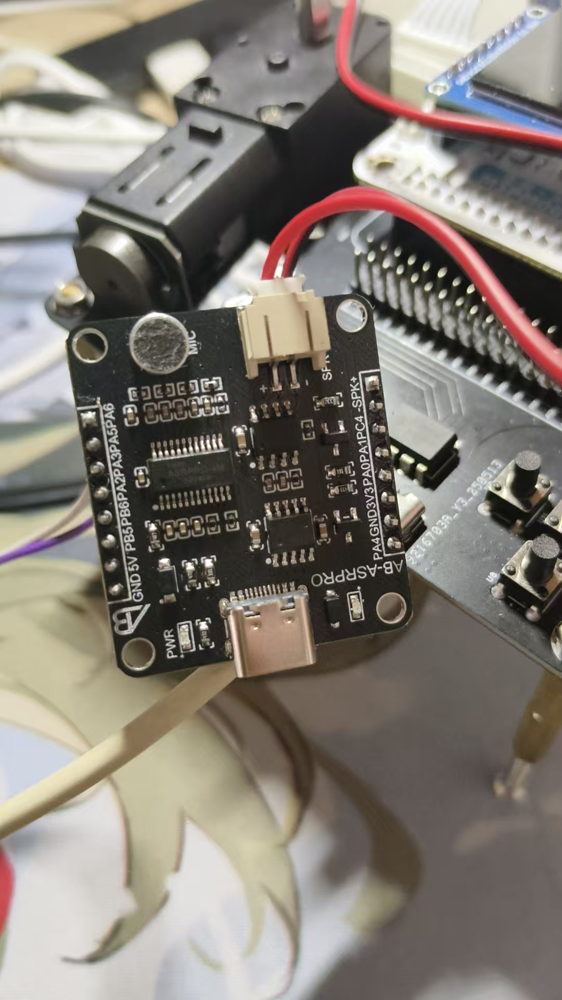
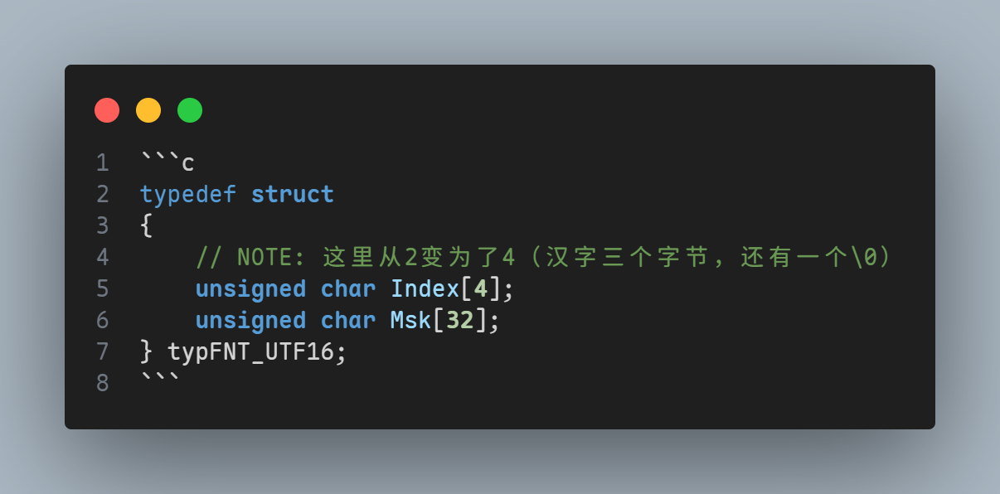
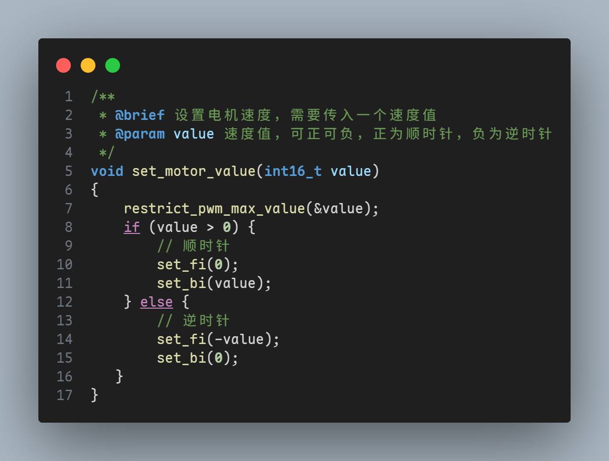
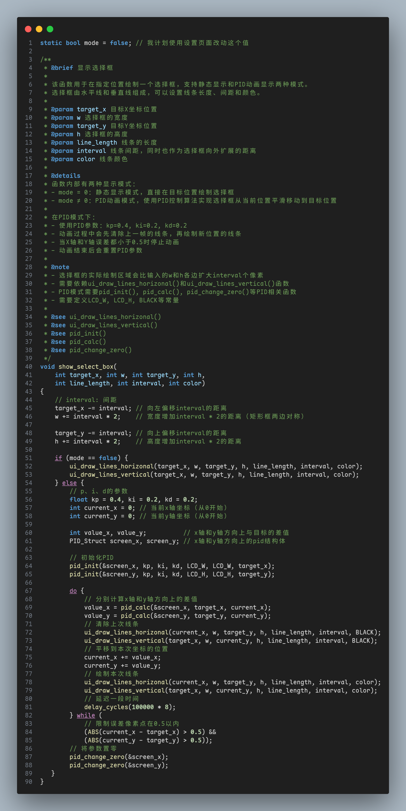
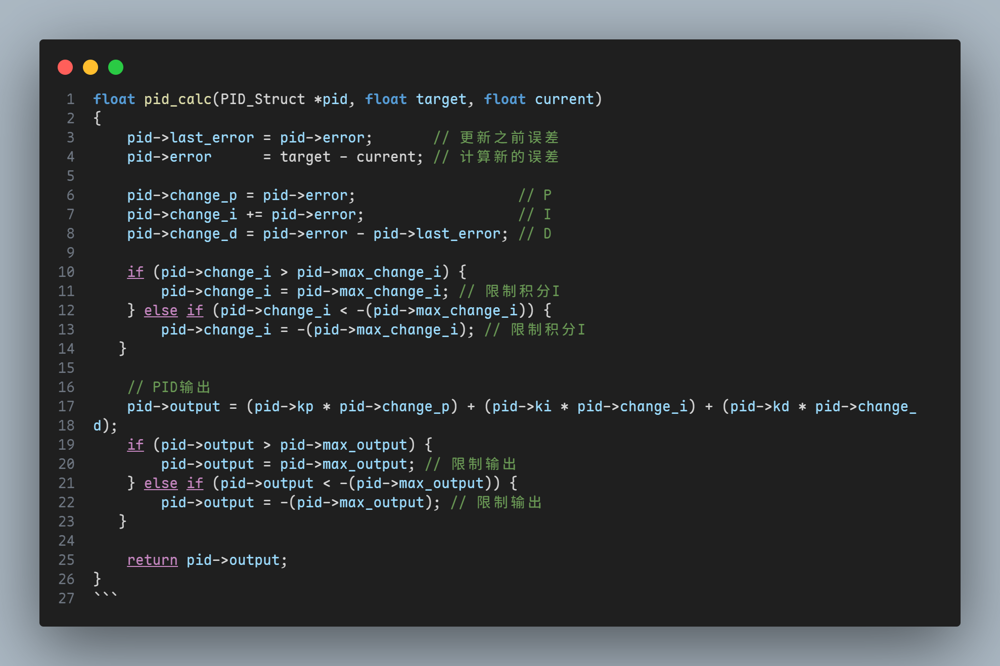

> @所有人  小伙伴们，现在PID训练营项目已经进入到自主完成阶段
> 【截止时间】6月11号之前
> 
> 【拉黑提醒】领券后必须在规定时间内完成，不然会被拉进黑名单，领券的小伙伴注意规划好时间完成项目并开源
> 
> 【开源提醒】完成项目后要进行开源了。开源审核通过后，把进度改为【已开源】评奖时间：6.5~6.11
> 
> 【开源工程写得越好，越容易拿奖】：
> 1. 封面图：验证好的实物图；
> 2. 描述：完整的工程描述（简介、功能介绍、原理图说明、实物图、pcb设计说明、关键程序说明、重要物料购买、装配说明）
> 3. 视频：功能演示视频；
> 4. 附件：工程的源码或相关外壳文件等附件； 
> 例子：https://oshwhub.com/li-chuang-kai-fa-ban/cw32-shu-zi-dian-ya-dian-liu-biao-kai-fa-ban-tao-jian

# 立创·天猛星MSPM0G3507简易PID电机驱动项目

## 零、设计背景

PID（Proportional-Integral-Derivative）控制器是一种经典的控制系统，它通过调整 比例（P）、积分（I）、微分（D）三个参数 来实现自动控制，核心是根据系统当前的误差值计算出合适的控制量，使系统输出稳定在目标值附近。由于PID的控制特性，它常被用在电赛的小车类项目，如平衡小车等。

学习PID控制器，可以让我们更好地理解控制系统的工作原理，提高我们的编程能力，并掌握通往电赛和其他类型的控制项目的关键秘诀。而这也是本项目的意义所在。

## 一、项目简介

本项目基于立创天猛星开发板，使用MSPM0G3507微型处理器，实现了一个简易的PID电机驱动项目。通过调节PID参数，可以实现对电机的精确控制，包括速度控制和位置控制。项目特点如下：

### 硬件架构

#### 主控芯片

- **型号**：TI MSPM0G3507
- **平台**：立创天猛星开发板
- **架构**：ARM Cortex-M0+

#### 外设配置

- **电机驱动**：PWM控制，支持正反转
- **编码器**：正交编码器，用于位置和速度反馈
- **显示屏**：SPI接口TFT彩屏
- **按键**：5个独立按键 + 1个摇杆按键
- **串口**：UART调试和命令接口

### 软件功能

#### 1. 可视化用户界面

- **TFT彩屏显示**：提供直观的参数显示和控制界面
- **实时PID曲线**：动态显示PID控制效果和系统响应
- **多页面UI管理**：包括主页、定速页、定距页和参数设置页

#### 2. 双模式PID控制

- **定速控制**：基于编码器反馈的速度闭环控制
- **定距控制**：基于位置反馈的角度定位控制
- **实时参数调节**：支持在线调整P、I、D参数

#### 3. 多样化交互方式

- **五向按键**：上/下/左/右/中间按键，支持短按和长按
- **模拟摇杆**：提供模拟量输入控制
- **串口通信**：支持外部指令控制

#### 4. 扩展功能（规划中）

- **语音识别**：基于天问ASRPro芯片的TTS服务
- **Q弹UI效果**：基于PID算法的动态交互效果
- **LVGL移植**：更丰富的图形界面库

## 二、功能介绍

1. [x] 电机速度控制：通过调节PID参数和目标速度参数，实现对电机的精确速度控制
2. [x] 电机位置控制：通过调节PID参数和目标角度参数，实现对电机的精确位置控制
3. [x] 摇杆控制：通过摇杆控制电机速度和方向
4. [x] UI动效：将PID融入UI中，使得UI界面更加生动有趣
5. [ ] 语音控制：通过语音控制电机速度和方向

## 三、原理图说明

电源电路采用一个 TYPE-C 接口输入 5V 电源，通过开关进行控制。其中有两个电源信号：MOTOR_VCC 和 +5V。

- MOTOR_VCC 是直接将TYPE-C的电源接入电机正负极。
- +5V 是由 MOTOR_VCC 经过一个防倒灌二极管 U0 后的电源，该电源接入到开发板的5V上，为开发板供电。

电机驱动芯片U4采用巴丁微电子生产的BDR6126D，这款芯片为大功率直流电机驱动芯片，最大可承受`18V`电压，持续输出电流可达`4.5A`，同时由于电机在启动及快速正反转时会有较大的瞬时电流，因此增加了蓄能电容。

为节约成本，按键电路并未设置硬件消抖措施，需要使用软件消抖。

开发板输入电源为+5V，其本身自带5V降压到3V3的功能，可以直接作为编码器的电源输入，电机控制信号线FI/BI连接到了GPIOA26和GPIOA27（这两个都支持PWM），而AB相信号可以接到开发板上的任意GPIO，只要通过软件+外部中断来采集数据即可，按键则无所谓哪个GPIO，只要配置好上拉电阻即可。

## 四、PCB设计说明

在布局的设计上我和官方案例略有不同，我选择将核心板竖直放置，并多引出了排针，以方便后期想要添加功能的需求和一板用到底的需求。而为了适应布局需要，我将电源线稍微调细了些，此外为了美观和布局方便，我将钽电容放置在同一行、瓷片电容放置在同一行。

## 五、实物图

这部分是实物图的展示和各个页面的展示。

首先是首页，我将原来的排版改了一下，两个大大个的“定速” “定距” 还是太占页面了，于是我改小了一下，再插入了两个功能，顺带加入了自己的标识（Ferne）

然后是定速页，这部分就和官方案例差不多了，很标准的上半部分绘图、下半部分调参

定速页和官方案例也没啥区别

手册页，主要是告诉你按键怎么用的，这部分我就只写了文字，因为觉得加个背景框好像也没啥意义，说来如果一开始显示的不是手册页，还要让用户自己探索按键用法，那不是显得很睿智？😶

设置页，这部分我想用来放开启语音模块和Q弹UI效果的选项，不过因为赶DDL（六月四号）就没有搞完，后面会继续在Github上更新，也欢迎大家关注我的[Github](https://www.github.com/aliferne)😁

这就是那个语音识别模块啦，我用的是在拼多多上一个叫ABrobot的店铺那里买的的ASRPro，语音识别做起来还是很简单的，就和Scratch这种少儿编程没什么区别，推荐去玩。

## 六、关键程序说明

### 1. 彩屏驱动

我移植了官方案例，但需要注意的是，我的开发环境为vscode，因此有些地方并不一样，比如函数 `LCD_Show_Chinese` 中，我所修改的部分如下：

在我提到的 `s += 3;` 那行语句，官方示例采用的是 `s += 2;`，实际上这是 Keil 默认以 GB2312 为编码的结果，而 vscode 默认是 utf-8 编码，自然需要修改。另附上不修改的显示图片：

因此我同时也修改了`lcdfont.h`中的一些结构体定义，这里仅举一例：

### 2. 电机驱动

在电机驱动方面，我新增了一些函数，使得可以在不需要判断PWM正负的情况下直接传入该函数内部（它会帮我们处理好），代码如下：

### 3. UI界面的改动

学习官方案例的过程中我注意到，实际上官方的ui选择框的绘制略显生硬，没有什么动效，因此我就在思考能否将ui绘制与pid结合起来，使选择框变得更加Q弹有活力，并且最终证明了我的思路其实是可行的，核心代码如下：

### 4. PID算法的核心实现

### 5. 按键对应的功能说明

| 按键 | 短按功能          | 长按功能   |
| ---- | ----------------- | ---------- |
| 上键 | 选择上一项/参数加 | 连续加参数 |
| 下键 | 选择下一项/参数减 | 连续减参数 |
| 左键 | 返回上级菜单      | -          |
| 右键 | 进入下级菜单      | -          |
| 中键 | 启动/停止电机     | -          |

### 6. 大大小小的优化

官方的案例存在较多魔法数字和“Repeat Yourself”（尤其是在ui绘制中），因此我针对出现频率较高的，都单独抽象成了函数或者宏的表现形式，然后再去调用，由于改动较多，就不放出代码了。

## 七、重要物料购买

| 序号 | 器件名称        | 型号参数                 | 商城器件编号 | 数量 |
| ---- | --------------- | ------------------------ | ------------ | ---- |
| 1    | 插件电阻        | 1K                       | C2903245     | 1    |
| 2    | 二极管          | D7G-T                    | C7435972     | 1    |
| 3    | USB连接器       | KH-TYPE-C-2P             | C2919656     | 1    |
| 4    | DIP-8芯片座     | -                        | C72124       | 1    |
| 5    | 电机驱动芯片    | BDR6126D                 | C7424658     | 1    |
| 6    | 拨动开关        | SK-12E12-G5              | C136720      | 1    |
| 7    | 电源灯          | 红色 XL-502SURD          | C2895492     | 1    |
| 8    | 按键            | ZX-QC66-8.5CJ            | C7470133     | 5    |
| 9    | 瓷片电容        | 100nF 104                | C254085      | 2    |
| 10   | 电解电容        | 22uF                     | C437651      | 2    |
| 11   | XH2.54接口      | 2.54mm-6P ZZ             | C5368779     | 2    |
| 12   | 直插排针        | PZ254V-11-06P            | C492405      | 1    |
| 13   | 直插排母        | 2.54-2*20                | C2977589     | 2    |
| 14   | 开发板          | LCKFB-TMX-MSPM0G3507     | C42378531    | 1    |
| 15   | 显示模块        | 1.9寸 ST7789 SPI 屏幕    | -            | 1    |
| 16   | TTL电机带编码器 | 6V 1:48减速比 霍尔传感器 | -            | 1    |
| 17   | 电机连接线      | XH双头一正一反;6P;150mm  | -            | 1    |
| 18   | 十字沉头螺丝钉  | M3×28[50只]              | -            | 2    |
| 19   | M3铜柱          | M3*18+4[10颗]            | -            | 4    |
| 20   | 螺母            | M3 [304材质/100只]       | -            | 6    |
| 21   | 2x20排针        | 2.54mm-2*20              | -            | 2    |
| 22   | 摇杆模块        | -                        | -            | 1    |
| 22   | 天问ASRPro      | -                        | -            | 1    |

实际上由于购买的时候都是走量批发的，其实也不一定会按照上面的数量来，但我们只需要那么多就行了。

## 八、装配说明

在立创EDA中可以预览3D图的效果，以此来检查是否有焊接错误。

建议从低到高焊接，因此焊接焊接顺序为：

| 焊接顺序 | 器件名称     | 器件参数     | 位号             | 数量 | 备注                                                             |
| -------- | ------------ | ------------ | ---------------- | ---- | ---------------------------------------------------------------- |
| 1        | 插件电阻     | 1kΩ 1/4W     | R1               | 1    |                                                                  |
| 2        | 二极管       | D7G-T        | D1               | 1    |                                                                  |
| 3        | USB连接器    | TYPE-C-2P    | USB1             | 1    |                                                                  |
| 4        | DIP-8芯片座  | DIP-8        | -                | 1    | 焊接在电机驱动芯片处，注意方向                                   |
| 5        | 电机驱动芯片 | BDR6126D     | U4               | 1    | 先焊接DIP-8芯片座再装芯片到座子                                  |
| 6        | 拨动开关     | SK-12E12-G5  | SW1              | 1    |                                                                  |
| 7        | 电源灯       | 5mm 圆形红灯 | LED1             | 1    | 注意正负极，长正短负                                             |
| 8        | 按键         | 6×6×8.5 插件 | U7,U8,U9,U10,U11 | 4    |                                                                  |
| 9        | 瓷片电容     | 104          | C2,C4            | 2    | 不分正负极                                                       |
| 10       | 电解电容     | 22uF         | C1,C3            | 2    | 注意正负极                                                       |
| 11       | XH2.54接口   | 6P           | U5,U6            | 2    |                                                                  |
| 12       | 直插排针     | 2.54mm-6P    | H1               | 1    |                                                                  |
| 13       | 直插排母     | 2.54mm 2×20P | -                | 2    | 焊接在开发板的排针接口处                                         |
| 14       | 开发板       | 天猛星开发板 | -                | 1    | 先焊2×20P排母再安装开发板                                        |
| 15       | 显示模块     | 1.9 寸屏幕   | -                | 1    | 直接安装到开发板上                                               |
| 16       | 电机带编码器 | -            | -                | 1    | 电机转动轴向上，编码器接口向下，通过2根长螺纹柱和2个螺母固定电机 |
| 17       | M3隔离柱     | -            | -                | 4    | 安装在板子四个角落                                               |
