# 前言

开发的是TI的MSPM0G3507芯片，立创开发板，EIDE配置较为麻烦，跟着下面走一遍。

# 开发环境搭建

见[此文](https://wiki.lckfb.com/zh-hans/tmx-mspm0g3507/keil-beginner/install.html)

不过这个教的是Keil上开发，我们要在Vscode上开发

需要修改几处地方

为了确保到时候keil上也能用，需要先按照上面文档的步骤走一遍，然后我们来专门说说怎么配置Vscode，你可以选择EIDE插件，然后修改构建配置中的构建器选项，也可以直接修改 `eide.json`，因为有个步骤需要两个都修改，我们索性就只讲 `eide.json` 的改法：

```json
"beforeBuildTasks": [
    {
        "name": "Linking syscfg",
        "command": "cd \"${projectRoot}\" && cmd.exe /C \"${projectRoot}\\syscfg.bat '${projectRoot}\\empty' empty.syscfg\"",
        "disable": false,
        "abortAfterFailed": true,
        "stopBuildAfterFailed": true
    }
],
```

修改里面的 `command` 属性即可，由于我这个文件夹的工作目录为 `TI-PID`，且 Keil 中表示项目根目录的 `$P` 不适用于 EIDE，所以需要改为 `${projectRoot}`，然后经过我debug发现`syscfg.bat`传入的参数是`empty`这个目录以及里面的`empty.syscfg`，所以需要配置为 `'${projectRoot}\\empty'` 和 `empty.syscfg`。
而你也可以配置一下`name`，从而使得build时显示此名称。

linker里面的misc-controls修改为此路径：

```json
"linker": {
    "output-format": "elf",
    "misc-controls": "source/ti/driverlib/lib/keil/m0p/mspm0g1x0x_g3x0x/driverlib.a"
}
```

（因为我们的 `${projectRoot}` 的子文件夹里面有`source`，不需要像keil里面配置那样子退回到父级的父级文件夹）

然后是GUI界面的配置：

```batch
@echo off

:: Path of TI's nw.exe
set NW_EXECUTOR="E:/TI/sysconfig/nw/nw.exe"
:: Path of TI's sysconfig
set SYSCONF="E:/TI/sysconfig"
:: The path to the syscfg of the project
set SYSCONF_FILE="./empty/empty.syscfg"

:: execute GUI
%NW_EXECUTOR% %SYSCONF% %SYSCONF_FILE%
```

接下来powershell里面运行`./launchGui`就行了，之后配置管脚输出啥的和在Keil里面设置是一样的。

有个究极大坑！！！

**EIDE自带的JLink工具包是V6.90版本的**（它的实用工具里面只有V6.90版本的Jlink），要去 `${userRoot}/.eide/tools/`目录下把JLink删掉！然后再装最新版的JLink，接下来去设置里面配置下JLink的路径就行了。不然V6.90的不支持新版芯片，各种烧录问题能把你脑子干烧🙂。

我这里`${userRoot}`等价于`C:/Users/a3230`

最后我选择装到`C:/Users/a3230/.eide/tools`去，然后Jlink目录就成了JLink_V830（这是JLink驱动自己设置的）

Cortex-Debug插件需要自己去设置一下，首先是在 `settings.json` 里面设置一些工具依赖的路径，比如armToolChain（gcc-arm-none-eabi啥的），这个自己去找教程安装，Keil不提供的。

然后在.vscode文件夹里面创建个`launch.json`文件，内容如下：

```json
{
    "version": "0.2.0",
    "configurations": [
        {
            "name": "Debug (gdbserver)",
            "cwd": "${workspaceFolder}",
            "executable": "${workspaceFolder}/build/empty_LP_MSPM0G3507_nortos_keil/ti-pid.elf",    // Path to the elf file
            // Waring! HEX file can't be assigned for debug!
            "request": "launch",
            "type": "cortex-debug",
            "servertype": "jlink",
            "device": "MSPM0G3507",
            "serverpath": "C:/Users/a3230/.eide/tools/JLink_V830/JLinkGDBServerCL.exe", // Path to JLinkGDBServer
            "interface": "swd", // Use SWD interface
            // NOTE: 建议先烧录再Debug，这个插件对双任务的支持不算很好，build完没flash就开始debug了
            "preLaunchTask": "build and flash" // Build and flash before launch
        }
    ]
}
```

然后最好再次设置一下`.eide.json`的一些信息，你可以先在EIDE插件里面随便选一个芯片型号，然后再去文件里面改成这块芯片的型号（因为EIDE可能更新频率不太经常，没办法涵盖所有芯片）

```json
"cpuInfo": {
    "vendor": "TI", // manufactor
    "cpuName": "MSPM0G3507" // chip name
},
```

**配置完之后会更方便一些，就不用再每次都设置一下芯片型号了**（烧录时JLink驱动会打开，让你设置芯片型号）。

实际上只要你给EIDE配好了最新的JLink驱动，那其实也可以直接可视化配置，不用去改`eide.json`，这是我新近发现的。

然后就可以愉快的调试了！

# 英文名词缩写的含义

这个章节主要是因为库函数里面太多以前学51时完全没接触过的名词了，特地增加这个章节，方便查阅。

## 串口通信的缩写

1. **NVIC**是Nested Vectored Interrupt Controller的缩写，它**是一种中断控制器，用于管理微控制器的中断请求**

2. **IRQ**是Interrupt Request的缩写，它**是一种硬件中断信号，用于通知处理器有外部设备需要处理**（就是中断位）。当外部设备需要处理器注意时，它会发送IRQ信号，处理器会暂停当前的任务，处理中断请求，然后再继续执行之前的任务。在计算机系统中，IRQ通常用于处理键盘、鼠标、硬盘等外部设备的输入和输出操作。

3. **IRQN**是Interrupt Request Number的缩写，它**表示中断请求的编号**。在计算机系统中，每个外部设备都会分配一个唯一的IRQ编号，以便处理器能够区分和处理不同的中断请求。当外部设备需要处理器注意时，它会发送IRQ信号，并附带相应的IRQ编号，处理器根据IRQ编号确定需要处理的中断请求。

4. **IIDX** 是 Interrupt Identifier Index 的缩写。在嵌入式系统和微控制器编程中，**IIDX 通常用于表示中断标识符的索引**（就是我们学51时学到的中断号 `interrupt 1`）。这个索引用于在**中断向量表**（概念和51相同，本质是一块内存区域，用于存储中断服务例程的地址和其他相关信息）**中查找和识别特定的中断服务例程**（ISR）。每个中断源都会分配一个唯一的 IIDX，以便系统可以正确地处理相应的中断请求。

5. **中断向量表**（Interrupt Vector Table）是计算机系统中用于存储中断服务例程（Interrupt Service Routine, ISR）地址的表格。当处理器接收到一个中断请求时，它会查找中断向量表以确定应该执行哪个中断服务例程。
 
**中断向量表通常包含以下信息**：
**中断号**（Interrupt Number）：唯一标识每个中断源。
**中断服务例程地址**（ISR Address）：指向处理该中断的中断服务例程的内存地址。
当某个外部设备或内部事件触发中断时，处理器会根据中断号查找中断向量表，然后跳转到相应的中断服务例程地址执行中断处理代码。处理完成后，处理器会返回到之前被中断的程序继续执行。

中断向量表在系统启动时被初始化，并且通常存储在内存的一个固定位置。不同的处理器架构和操作系统可能会有不同的中断向量表实现方式。

6. **IOMUX**是Input/Output Multiplexer的缩写，**意为输入/输出多路复用器**。它在芯片设计中用于将有限的引脚资源复用为多种功能，以实现尽可能多的功能。每个引脚可以通过IOMUX单元（I/O复用选择器）设置为多种功能，如GPIO、UART、IIC、SPI等.

# 扩展知识

## 单片机编程和更新的名词

***ISP***（In-System Programming）和 ***IAP***（In-Application Programming）**都是用于微控制器和嵌入式系统编程和更新的技术**。它们允许在设备已经安装在实际系统中的情况下进行编程和更新，而无需从系统中移除设备。

1. ISP(In-System-Programming)：**ISP技术允许开发者通过外部编程器或调试器连接到目标设备，对设备内部的闪存进行编程或更新**。这意味着开发者可以在设备安装在现场的情况下对设备进行重新编程，而无需拆开设备或移除芯片。ISP通常用于生产过程中的编程，以及在设备已经部署后进行现场更新。

简单点说就是我们现在正在做的，用J-Link烧录代码到芯片上。

2. IAP(In-Application-Programming)：**IAP技术允许设备在运行其应用程序的同时对自身的闪存进行编程或更新**。这意味着**设备可以在不需要外部编程器的情况下进行现场更新**。IAP通常用于需要远程更新固件的设备，如远程传感器节点、工业控制系统等。

简单点说就是我们带的智能手表的系统更新之类的。

# 简单的延时函数

延时函数是编程中常用的函数，用于让程序暂停执行一段时间。在嵌入式系统中，延时函数通常用于等待硬件设备完成某个操作，或者实现用户交互中的延迟效果。

# 点亮LED

点LED原理还需要废话吗？制造电势差。

开发板PB22引脚接了LED的正极（小样输出能力还挺彪悍）。

工程已经搞定了，powershell切到根目录跑一下 `./launchGui.bat`，然后配置下GPIO啥的，再把 `ti_msp_dl_config.h` 头文件和 `ti_msp_dl_config.c` 源文件的代码用GUI生成的文件覆盖即可（可以直接在GUI里面选择到这里的empty文件夹，然后一键保存），具体的看立创文档。

## 控制引脚状态的dl库函数

在`dl_gpio.h`库函数文件中，有三个函数可以控制引脚状态

**相关函数说明**

> `__STATIC_INLINE void DL_GPIO_setPins(GPIO_Regs* gpio, uint32_t pins)`

该函数**为控制引脚输出高电平**，按照本例程中LED的引脚，则可以写为 `DL_GPIO_setPins(LED1_PORT,LED1_PIN_22_PIN);`

> `__STATIC_INLINE void DL_GPIO_clearPins(GPIO_Regs* gpio, uint32_t pins)`

该函数**为控制引脚输出低电平**，按照本例程中LED的引脚，则可以写为 `DL_GPIO_clearPins(LED1_PORT,LED1_PIN_22_PIN);`

> `__STATIC_INLINE void DL_GPIO_togglePins(GPIO_Regs* gpio, uint32_t pins)`

该函数**为控制引脚的电平翻转**，如果原来是高电平则变为低电平，如果原来是低电平则变为高电平。按照本例程中LED的引脚，则可以写为`DL_GPIO_togglePins(LED1_PORT,LED1_PIN_22_PIN);`

```c
#include "ti_msp_dl_config.h"
#include "type.h"

void delay(uint ms)
{
    uint i, j;
    /*
     * 下面的嵌套循环次数是由主控频率和编译器生成的指令周期大致计算出来的
     * 实际开发需要通过测试调整来达到所需时间。
     */
    for (i = 0; i < ms; i++) {
        for (j = 0; j < 8000; j++) {
            __asm__("nop"); // NOP指令，空操作
        }
    }
}

int main(void)
{
    SYSCFG_DL_init();   // 这一步会初始化所有的必要系统设置

    while (1) {
        DL_GPIO_clearPins(GREEN_PORT, GREEN_PIN_22_PIN);
        delay(1000);    // 延时大体1s
        DL_GPIO_setPins(GREEN_PORT, GREEN_PIN_22_PIN);
        delay(1000);

        /*
            * 或写成
            DL_GPIO_togglePins(GREEN_PORT, GREEN_PIN_22_PIN);
            delay(1000);
         */
    }
}
```

对了，**TI里面只能是`int main()` 声明，哪怕并没有`return 0;`**，应该存在什么特殊的机制。

- 引脚名称命名规则：`GUI设置的引脚名_PORT`
- 引脚编号命名规则：`GUI设置的引脚名_GUI设置的引脚编号_PIN`

# 系统延时

## 延时的作用

在MSPM0或其他微控制器的编程中，延时被广泛使用，主要有以下一些原因：

1. **处理硬件**：**许多硬件都需要一些时间来响应某个命令**。例如，如果在一个程序中你启动一个电动机然后立即检查其状态，你可能会得到一个错误的读数，因为电动机可能还没有足够的时间开始旋转。此时你需要使用 `delay()` 函数让系统等待一段时间，使得电动机有足够的时间响应。
2. **用户交互**：我们常常**需要在用户交互中实现延迟效果**。例如，在蜂鸣器播放音乐时，音符之间需要一段沉默的时间。或者，在闪烁LED灯的情况下，"开"和"关"状态之间需要延时以控制闪烁的速度。
3. **节省能源**：在一些应用中，比如电池供电的系统，如果不在需要的时候长期保持系统的高速运转，那么电池的寿命会大大缩短。在此情况下，我们可以让系统在一段时间后进入待机或低功耗模式，直到下一个理周期到来。
4. **定时操作**：在许多项目中，我们常常需要实现一些特定时间点的操作。例如，在自动灌溉系统中，我们可能需要在每天的特定时间点进行灌溉。在间隔测量中，我们可能每隔一段时间采集一次数据。

尽管**延时函数在很多情况下非常有用，但也需要注意其阻塞性质**。

**过度依赖阻塞延时可能会导致程序对其他事件的响应不及时**。为了更好的在MSPM0上进行多任务编程，我们**还可以学习一些非阻塞延时的编程技术**。

> ❓什么是阻塞延时？
> **阻塞延时是在程序执行过程中，当某个操作或函数需要一定时间才能完成时，程序会暂停执行直至该操作完成，这段时间程序被阻塞了**。阻塞延时可能会导致程序运行速度变慢或出现**假死**现象。 举个例子，假设你想要煮开水来泡茶。通常情况下，你会将水壶放在炉灶上加热，等待水烧开后才能用。在这个过程中，存在阻塞延时。 当你将水壶放在火上时，程序可以看作是“等待”水烧开的操作。在这个等待过程中，你不能立即得到热水来泡茶，需要耐心等待水煮沸。期间，你可能无法做他与烧水无关的事情，因为你需要留意水壶，并等待时机。即便家里着火了，你也还是在等待烧水。

## 实现延时的方式

有很多，但只介绍三种：`空代码延时`，`TI工程自带的延时`，`使用滴答定时器`

### 空代码延时

又名NOP延时，就是个机器指令，表示不执行任何操作，但是会消耗时钟周期。

应用场景有以下几个：

1. **时序延时**，在SPI或者I2C通信中会用到NOP，在某些硬件相关的编程中（E2PROM等），精确的时序控制非常重要。通过插入NOP指令，可以确保其他硬件操作有足够的时间来完成。
2. **调试**：在调试程序时，开发者可能会插入NOP指令来暂时“冻结”程序，以便观察程序的某个特定状态。
3. 占位符：在开发过程中，开发者可能暂时不知道要在某个位置放置什么代码，此时可以用NOP作为占位符（这个太难绷了，还不如Python的`pass`呢）

简单空延时如下：

```c
void delay(void)
{
    for (int i = 0; i < 1000; i++) {
        // 不执行任何操作
        // 你也可以放一个 __asm__("nop");
    }
}
```

优点是能用，缺点是不准。

### TI工程自带的延时

提供的函数API为`delay_cycles(cycles)`，一个可以根据主控频率进行计算时间的延时函数。

源代码：

```c
/**
 * @brief Alias for DL_Common_delayCycles
 */
#define delay_cycles(cycles) DL_Common_delayCycles(cycles)

/**
 * @brief   Consumes the number of CPU cycles specified.
 *
 * @param[in] cycles  Floor number of cycles to delay.
 *                    Specifying zero will result in the maximum
 *                    possible delay. Note that guarantees at least
 *                    this number of cycles will be delayed,
 *                    not that exactly this number of cycles will be
 *                    delayed. If a more precise number of cycle delay value
 *                    is needed, GPTimer is recommended.
 *
 *                    Typical variance from this function is 10 cycles or
 *                    less assuming that the function is located in flash and
 *                    that caching is enabled. Disabling caching may result in
 *                    wait-states when fetching from flash.
 *                    Other variance occurs due:
 *                      - Amount of register stacking/unstacking around API entry/exit
 *                      - Value of cycles relative to 4-cycle loop counter
 *                      - Placement of code on a 2- or 4-byte aligned boundary
 */
void DL_Common_delayCycles(uint32_t cycles);

void DL_Common_delayCycles(uint32_t cycles)
{
    /* this is a scratch register for the compiler to use */
    uint32_t scratch;

    /* There will be a 2 cycle delay here to fetch & decode instructions
     * if branch and linking to this function */

    /* Subtract 2 net cycles for constant offset: +2 cycles for entry jump,
     * +2 cycles for exit, -1 cycle for a shorter loop cycle on the last loop,
     * -1 for this instruction */

    __asm volatile(
#ifdef __GNUC__
        ".syntax unified\n\t"
#endif
        "SUBS %0, %[numCycles], #2; \n"
        "%=: \n\t"
        "SUBS %0, %0, #4; \n\t"
        "NOP; \n\t"
        "BHS  %=b;" /* branches back to the label defined above if number > 0 */
        /* Return: 2 cycles */
        : "=&r"(scratch)
        : [ numCycles ] "r"(cycles));
}
```

**通过汇编语言的NOP指令，通过主频计算执行代码的时间周期，去实现的延时。而时间周期TI团队也已经为大家计算好了，可以直接在工程中调用`delay_cycles(主频hz);`函数即可**。

实现一秒延时： 

```c
// 我们工程模板设为32Mhz
// 有修改则另说
delay_cycles(32000000);
``` 

实现一毫秒延时：

```c
// 同上
delay_cycles(32000000/1000);
```

### 使用滴答定时器

**基本所有arm内核芯片都有的功能，可以精准延时**

#### 什么是滴答定时器

**`SysTick`定时器可用作标准的下行计数器，是一个24位向下计数器，有自动重新装载能力，可屏蔽系统中断发生器**。

Cortex-M0处理器内部包含了一个简单的定时器，所有基于M0内核的控制器都带有`SysTick`定时器,这样就**方便了程序在不同的器件之间的移植**。**`SysTick`定时器可用于操作系统，提供系统必要的时钟节拍，为操作系统的任务调度提供一个有节奏的“心跳”**。正因为所有的M0内核的芯片都有`SysTick`定时器，这在移植的时候不像普通定时器那样难以移植。

学51的时候学过了，本质就是个计数器，但这里直接就能重装了，不需要像51一样配几个寄存器才能计时。

RCU 通过 `MCLK` 作为 Cortex 系统定时器（`SysTick`）的外部时钟，即使用`MCLK`计时，MCLK默认为32MHz。通过对 `SysTick` 控制和状态寄存器的设置，即可控制或读取。关于系统时钟的介绍可参考用户手册的第128页。

**`SysTick`定时器设定初值并使能之后，每经过1个系统时钟周期，计数值就减1，减到0时，SysTick计数器自动重新装载初值并继续计数，同时内部的COUNTFLAG标志位被置位，触发中断**（前提是开启中断）。

#### 配置 `SysTick`

[教程](https://wiki.lckfb.com/zh-hans/tmx-mspm0g3507/keil-beginner/delay.html#_4-3-2-%E5%BC%80%E5%90%AFsysconfig%E9%85%8D%E7%BD%AE%E5%B7%A5%E5%85%B7)

很简单，就是去SysTick那一栏开个初始化定时器周期，然后设置周期计数值，然后设置下中断优先级（可以不设置），和开启定时器并启动。

设置周期为32000就可以做到定时1ms。

然后一个简单的使用代码大体如此：

```c
#include "ti_msp_dl_config.h"

volatile uint32_t delay_times = 0;

// 和SysTick一起实现精准ms计时
void delay_ms(uint32_t ms) {
    delay_times = ms;
    while(delay_times); // > 0 时卡死在这里
}

int main(void) {
    SYSCFG_DL_init();

    while (1) {
        // 暂时为空循环
    }
}

// 滴答定时器中断服务函数
void SysTick_Handler(void) {
    if (delay_times) {
        delay_times--;
    }
}
```

> 🔅C语言扩展
> **在C语言中，`volatile` 是一个关键字，用来告诉编译器不要对它所修饰的变量做任何优化，因为这个变量的值可能会随时被意想不到的因素改变，比如硬件中断、多线程操作等**。`volatile` **告诉编译器不要将对这个变量的读写操作优化掉，每次访问都要从变量地址中读取或写入**。在多线程或与硬件相关的编程中，**`volatile` 经常用来声明那些程序之外其他实体可能会修改的变量，以确保每次访问都能获取最新的值，避免编译器优化导致的意想不到的问题**。

上面的代码 `SysTick_Handler` 和我们之前学51的时候写的 `void Interrupt_ISR() interrupt 1` 是一样的，就是在系统触发中断之后就会进入这个函数，然后执行函数内的代码。简单点的逻辑就是，先设置好一个初始值（ms），然后定时1ms，每次都去减这个值，最后就定时完毕。

#### LED灯闪烁实验

相当简单，间隔1s闪烁即可

```c
#include "ti_msp_dl_config.h"
#include "type.h"

// 和提供的例程略有不同
// volatile 依然不能少
// 但为了避免 delay_times 定义为 uint时
// 减到0后还往下减，导致未定义行为
// 这里设置为有符号的int
volatile int delay_times = 0;

void delay_ms(int ms)
{
    delay_times = ms;
    while (delay_times >= 0);
}

int main(void)
{
    SYSCFG_DL_init();

    while (1) {
        // 每1s反转一次电平
        DL_GPIO_togglePins(LED1_PORT, LED1_PIN_22_PIN);
        delay_ms(1000);
    }
}

void SysTick_Handler(void)
{
    if (delay_times >= 0) {
        delay_times--;
    } else {
        delay_times = 0; // 小于0则归0
    }
}
```

或者如此，这种风格类似于我们学51时宋老师（《手把手教你学51单片机》の作者）的风格：

```c
#include "ti_msp_dl_config.h"

// 在这里 volatile 依然是有必要的，
// 因为该值的修改情况不确定（中断函数和主函数均对其访问了），
// 编译器无法产生正确的优化
// THINK：请思考——我只要把`flag1s = 0;`放到中断函数里去就可以省略volatile了？
volatile uint8_t flag1s = 0; 

int main()
{
    SYSCFG_DL_init();

	
    while (1) {	
        if (flag100ms) {
            flag100ms = 0;
            DL_GPIO_togglePins(LED1_PORT, LED1_PIN_22_PIN);
        }
    }
}

void SysTick_Handler()
{
    // delay for 1s
    // 这里的volatile反而不是必须的，
    // 因为它在中断函数内部更改，值的改变情况是可预测的
    // 请你重新回顾 volatile 关键字的作用，十分重要！🤗
    static volatile uint16_t counter = 0;
	
    if (counter < 1000) {
        counter++;
    } else {
        counter   = 0;
        flag100ms = 1;
    }
}
```

上面有个`THINK`，**Answer是No**，因为主函数依然访问了变量`flag1s`，不信邪的话可以改一下试试。

# 按键

## 结构、原理

独立按键的主要结构组成包括：按钮、外壳、弹簧、触点、导电片和引脚。**当按下按键时，导电片触碰到触点，从而形成一个闭合电路**。

独立按键原理主要是基于机械触点和电气触点之间的关系。**当按键未被按下时，通常触点是分开的，电路是断开的**。当用户**按下按键时，触点在弹簧和导电片的作用下形成闭合，这时电路连通，微控制器能够读取到该按键触发的信号**。

## 消抖

按键消抖分为硬件消抖和软件消抖

软件消抖就是加延时（延后检测）和多次检测，确保确实是按下的。

板子上三个按键，RST，BSL，B21

- RST是芯片复位功能按键，不能通过软件的方式去控制该按键
- BSL是特殊按键，它接到了PA18引脚，该引脚是用于进入升级模式进行串口下载等操作的特殊引脚，不建议使用
- B21按键就是用户的可以操控的按键，将PB21引脚接入了一个按键，通过按键接到GND

[原理图](https://wiki.lckfb.com/zh-hans/tmx-mspm0g3507/keil-beginner/key.html#_5-6-%E7%8B%AC%E7%AB%8B%E6%8C%89%E9%94%AE%E5%8E%9F%E7%90%86%E5%9B%BE)

B21由于内部上拉电阻的存在，是高电平的，按键按下后会变成低电平。

> `PA18`引脚为MSPM0G3507芯片的BSL引脚，**用于启动芯片的BootLoader模式**，非特殊情况，**请确保在给开发板通电时，PA18引脚为低电平，否则将会启动BootLoader模式**，导致**无法正常执行之前所下载的代码**。

## 按键点灯实验

在打开GUI界面配置时，需要注意把PB21配置成**输入模式**（检测外部电压变化）和**上拉电阻**（确保高电平）

我们要借助函数 `DL_GPIO_readPins`，它的原型是：

`__STATIC_INLINE uint32_t DL_GPIO_readPins(GPIO_Regs* gpio, uint32_t pins)`

也就是说它会返回一个 `uint32_t`（`static`的），也就是对应引脚的状态位，所以需要查数据手册，比如以PA18为例。当PA18引脚检测到低电平时，返回的值是0；当PA18引脚检测到高电平时，对应的32位寄存器中PA18的位将会被置1，返回的值为0x40000，换为2进制就是：100 0000 0000 0000 0000。

因此，我们有种简单的方法——只要判断引脚电平是不是为0就行，这样子就不用去找数据手册数数了。

最简单的示例如下：

```c
#include "ti_msp_dl_config.h"

int main() {
    // static可加可不加、你也可以使用volatile来避免编译器优化
    uint32_t last_state = 0;
    while (1) {
        last_state = DL_GPIO_readPins(BTN_PORT, BTN_PIN_21_PIN);
        if (last_state == 0) {
            // 按下就亮，松开就灭
            DL_GPIO_setPins(LED1_PORT, LED1_PIN_22_PIN);
        } else {
            DL_GPIO_clearPins(LED1_PORT, LED1_PIN_22_PIN);
        }
    }
}
```

然后让我们引入消抖，从简单的NOP到复杂点的中断：

NOP:

```c
#include "ti_msp_dl_config.h"

void delay_ms(uint16_t ms) {
    for (uint16_t i = 0; i < ms; i++) {
        __NOP();    // 还是NOP，和__asm__那个等效
    }
}

int main()
{
    uint32_t onPressed = 0; // 检测是否按下按键（0为按下）
    SYSCFG_DL_init();

    while (1) {
        // 我们等会把它抽象成一个函数，叫 `Btn_Detector`
        onPressed = DL_GPIO_readPins(BTN_PORT, BTN_PIN_21_PIN);
        if (onPressed == 0) {
            delay_ms(100);
            onPressed = DL_GPIO_readPins(BTN_PORT, BTN_PIN_21_PIN);
            if (onPressed == 0) {
                DL_GPIO_togglePins(LED_PORT, LED_PIN_22_PIN);
            }
        }
    }
}
```

中断：

```c
#include "ti_msp_dl_config.h"

volatile uint8_t time_10ms = 10; // 刚开始的时候定时10ms

void delay_ms(uint8_t ms)
{
    time_10ms = ms; // 设置
}

int main()
{
    SYSCFG_DL_init();

    while (1) {
        // do other things
    }
}

void Btn_Detector()
{
    uint32_t onPressed = 0;
    onPressed          = DL_GPIO_readPins(BTN_PORT, BTN_PIN_21_PIN);
    if (onPressed == 0) {
        onPressed = DL_GPIO_readPins(BTN_PORT, BTN_PIN_21_PIN);
        if (onPressed == 0) {
            DL_GPIO_togglePins(LED_PORT, LED_PIN_22_PIN);
        }
    }
}

void SysTick_Handler()
{
    // 定时完10ms之后继续定时
    if (time_10ms > 0) {
        time_10ms--;
    } else {
        time_10ms = 10;
    }
    Btn_Detector(); // 我们丢到这里去检测按键，每10ms轮询一下
}
```

# 中断

## 中断的概念

中断的概念我们在51的时候已经学过了

简单点说就是在芯片中突然出现了某件事情，使得芯片需要暂时放下正在执行的任务，而去处理这个突发事件，导致突发事件的就是中断，芯片处理的就是中断函数。举个例子，比如你在切菜，突然水壶烧开了，这个时候你就会先停下切菜，去把水壶关了，这就是典型的中断。在CPU处理中断之前，会执行一系列的操作，比如保存当前堆栈变量、保存计数器的值（放下菜刀，擦干手），然后才会处理中断函数。处理完中断函数之后，CPU会恢复之前的状态，继续执行被中断的任务（继续切菜）。

## 中断的类型

中断有两种类型：硬件中断；软件中断

1. 硬件中断：通常由外部设备的物理事件引发，如按下按钮、达到定时器的时间、或数据到达串行端口。当这些事件发生时，微处理器会立即暂停其当前的任务，并跳转到一个预先定义的中断服务程序（ISR）来响应该事件。
2. 软件中断：由软件指令引发，通常用于更复杂的处理任务。像操作系统的系统调用就使用了软件中断。

正好在这里插入一句——**中断函数的名称是定死了的**，**名称**可以见[这个文件](./empty/keil/startup_mspm0g350x_uvision.s)，**在大概90多行的时候有名称的汇总**。

# 中断的一个小demo

我们上面检测按键时给了两个例子，**使用延时的属于阻塞代码，这玩意会强行让CPU睡大觉，不准干活，实际上是个不好的实践**，之后我又给了个使用中断的例子，这属于**非阻塞代码，CPU不会睡大觉，可以继续执行其他任务**。

```c
#include "ti_msp_dl_config.h"

void delay_ms(uint32_t ms) {
    for (uint32_t i = 0; i < ms; i++) {
        __NOP();    // 还是NOP，和__asm__那个等效
    }
}

int main()
{
    uint32_t onPressed = 0;
    SYSCFG_DL_init();

    while (1) {	        
        onPressed = DL_GPIO_readPins(BTN_PORT, BTN_PIN_21_PIN);
        if (onPressed == 0) {
            delay_ms(100);         // 一般情况
            // 一个比较极端的情况，此时会彻底卡死，
            // 只有板子上的LED会亮
            // delay_ms(100000);
            onPressed = DL_GPIO_readPins(BTN_PORT, BTN_PIN_21_PIN);
            if (onPressed == 0) {
                DL_GPIO_setPins(LED_PORT, LED_PIN_22_PIN);
            }
        }
        // 让面包板上的LED亮
        DL_GPIO_setPins(LED2_PORT, LED2_PIN_3_PIN);
    }
}
```

上面我们整了一个用延时的情况，我会插入一个视频，第一个场景是一开始就按下按键，然后两个LED和板子上的LED都亮了，第二个场景是晚点再按下按键，两个LED不亮，板子上的LED亮。

<video demo1>
   <source src="./demo/video/一个使用延时的不良影响的例子.mp4" type="video/mp4">
</video>

接下来我们再使用中断看下情况：

```c
#include "ti_msp_dl_config.h"

volatile uint8_t time_10ms = 10; // 刚开始的时候定时10ms

void delay_ms(uint8_t ms)
{
    time_10ms = ms; // 设置
}

int main()
{
    SYSCFG_DL_init();

    while (1) {
        // 翻转面包板上的LED
        DL_GPIO_togglePins(LED2_PORT, LED2_PIN_3_PIN);
    }
}

void Btn_Detector()
{
    uint32_t onPressed = 0;
    onPressed          = DL_GPIO_readPins(BTN_PORT, BTN_PIN_21_PIN);
    if (onPressed == 0) {
        onPressed = DL_GPIO_readPins(BTN_PORT, BTN_PIN_21_PIN);
        if (onPressed == 0) {
            DL_GPIO_togglePins(LED_PORT, LED_PIN_22_PIN);
        }
    }
}

void SysTick_Handler()
{
    // 定时完10ms之后继续定时
    if (time_10ms > 0) {
        time_10ms--;
    } else {
        time_10ms = 10;
    }
    Btn_Detector(); // 我们丢到这里去检测按键，每10ms轮询一下
}
```

这个非阻塞的例子（使用中断）就很完美，我们既做到了让面包板上的两个LED亮，又做到了按下按键后板子上的LED也亮。

现象如该视频所示：

<video demo2>
   <source src="./demo/video/一个使用中断的非阻塞例子.mp4" type="video/mp4">
</video>


中断在这里的作用呢，是让CPU在必要时才执行一些操作，比如上面的例子中，**我们把检测按键的操作丢到中断函数里面去，这样就保证了CPU不会一直轮询和按键相关的任务**（CPU不知道啥时候会按按键，所以我们还不如让CPU不时去看看情况，而不是让它一直盯梢），**转而去处理一些比较重要的任务**。这大大节省了CPU的资源，因此中断在实际项目中应用非常普遍。

# 外部中断

**外部中断是硬件中断的一种，它由微控制器外部的事件引发**。
**微控制器的某些引脚被设计为对特定事件的发生做出响应**，例如按钮的按压、传感器的信号改变等。**这些指定的引脚通常被称为“外部中断引脚”**。
**在发生外部中断事件时，当前的程序执行会被立即停止，并跳转到对应的中断服务程序（ISR）进行处理。处理完毕后，程序会返回到被中断的地方继续执行**。
对于嵌入式系统、实时系统来说，外部中断的使用是非常重要的，能帮助系统对外部事件进行即时响应，大大提高了系统的**效率和实时性**。提供了许多引脚作为可用的外部中断引脚，可以通过配置这些引脚来进行外部中断实验。

## 事件驱动型中断

> MSPM0系列把**CPU中断，DMA触发，以及外设触发外设**，都统称为**事件**（Event），**触发源称为事件发布者**（Event Publisher），**相应中断的外设被称为事件订阅者**（Event Subscriber）。

这段实在太像前端和Qt里面的 `EventDriven` 的思想了，所以我管这个叫做事件驱动型中断（自创名词）

事件管理器传输的事件有：

- **作为中断请求 (IRQ) 传输到 CPU 的外设事件（静态事件）** —— 示例：GPIO 中断会发送到 CPU
- **作为 DMA 触发器传输到 DMA 的外设事件（DMA 事件）** —— 示例：传输到 DMA、请求 DMA 传输的 UART 数据接收触发器
- **传输到另一个外设以直接触发硬件中操作的外设事件（通用事件）** —— 示例：TIMx 计时器外设将周期性事件发布到 ADC 订阅者端口，ADC 使用该事件触发采样开始（ADC触发采样）

下图为MSPM0系列的事件安排表。其中绿色表示事件发布者（发送），将外设上发生的事件告诉总线；红色为事件订阅者（接收），接收总线上的事件情况。

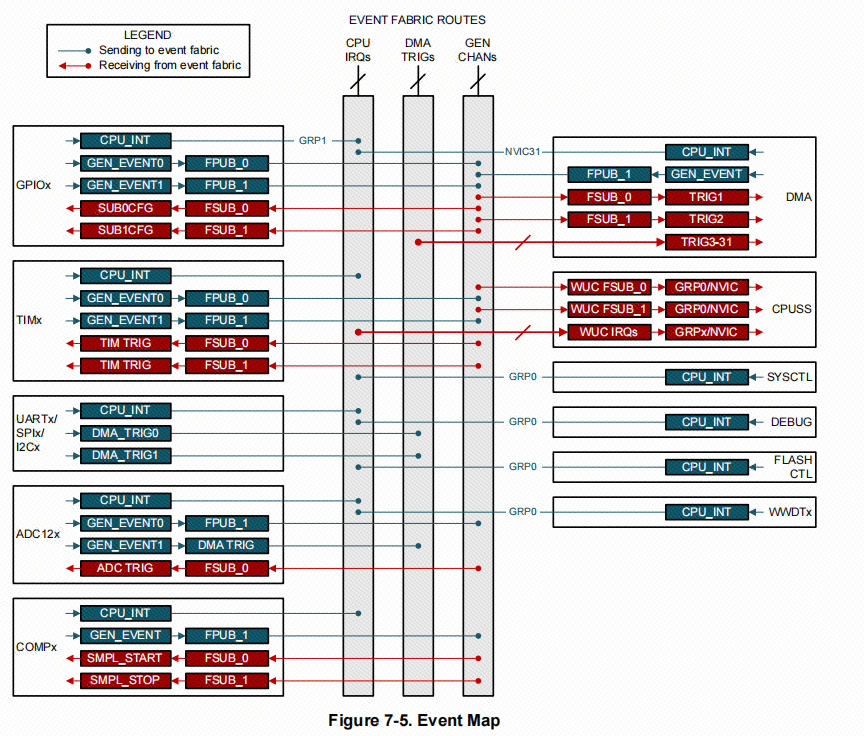

## 外部中断的作用和优势

外部中断功能在开发中具有以下作用和优势：

1. **实时响应外部事件**：外部中断功能可以让你**在检测到外部事件触发时立即作出响应**。这些外部事件可以是来自传感器、按钮、开关、接收到的信号等等。通过外部中断，就可以实时地捕捉到这些事件并执行相应的操作，而无需频繁地轮询或等待。
2. **节省计算资源**：外部中断**允许你将处理外部事件的任务转移给芯片的硬件，从而节省了处理器的计算资源**。相比于软件轮询方式，外部中断可以降低对处理器的负担，使其可以更有效地利用其他资源进行更复杂的任务。
3. **精确的事件捕捉**：外部中断功能**能够以非常精确的方式捕捉外部事件的触发**。你可以通过配置中断触发方式（如上升沿、下降沿、任意电平等）来适应不同的外部事件，并在事件发生时立即中断当前程序的执行，转而执行中断服务函数。
4. **高优先级处理**：外部中断**可以设置为高优先级处理，优先于当前正在执行的程序。这对于需要立即响应的重要事件非常有用，如紧急通知、传感器检测等**。当外部事件触发时，处理器将立即转移到中断服务函数执行，确保及时、准确地处理相关操作，避免对处理程序的延迟。
5. **多路中断处理**：支持多路外部中断，你**可以将多个外部事件与不同的中断引脚相连，从而实现对多个事件的并行处理。这使得你可以处理多个传感器、开关等外部事件**，提高系统的灵活性和扩展性。

总之，外部中断功能提供了实时响应、节省计算资源、精确事件捕捉、高优先级处理和多路中断处理等优势。它为我们提供了更加灵活、高效的方式来处理外部事件，并帮助构建更强大、可靠的应用。

## 配置外部中断

我们还是以点亮LED灯为例子，但这次不再使用定时消抖而是直接使用按键的外部中断功能。

需要重新配置下B21按键的一些参数，就是**设置一下开启中断**，**在GUI界面的 Interrupts/Events 里面**，参数分别为：

- Enable Interrupts：**是否开启中断**
- Interrupt Polarity：**设置中断优先级**
- Trigger Polarity：**设置触发方式**（上升沿/下降沿/两个沿都触发）
- Event Publishing Channel：**设置事件发布通道**

我们设置为：是；默认；上升沿触发（按下后回弹比较准一些，此时一整个按键按下的操作都执行完了）；不设置

**此外顺带说一下，芯片上所有引出的GPIO端口均可设置外部中断功能**。

**在上面的那张图上，GPIO属于GROUP1的**（看左侧第一个`GPIOx`），**所以我们下面的中断函数是**`GPOUP1_IRQHandler`。以及读取中断位开启按键的中断，都要看看官方SDK。

代码如下：

```c
#include "ti_msp_dl_config.h"

int main()
{
    SYSCFG_DL_init();
    // 设置开启按键引脚的GPIOB端口中断
    NVIC_EnableIRQ(BTN_INT_IRQN);

    while (1) {
        DL_GPIO_togglePins(LED2_PORT, LED2_PIN_3_PIN); // Set LED to ON
    }
}

void GROUP1_IRQHandler()
{
    // 读取Group1的中断寄存器，并清除中断标志位
    switch (DL_Interrupt_getPendingGroup(DL_INTERRUPT_GROUP_1)) {
        // 检查是否为BTN的中断，注意是INT_IIDX
        case BTN_INT_IIDX:
            // 如果按键按下变为高电平
            if (DL_GPIO_readPins(BTN_PORT, BTN_PIN_21_PIN) > 0) {
                // 翻转板子上的LED
                DL_GPIO_togglePins(LED_PORT, LED_PIN_22_PIN);
            }
            break;

        default:
            break;
    }
}
```

一些上面我们没见过的名词，如*NVIC*，*IIDX* 等，[转名词缩写的串口通信部分](#串口通信的缩写)

这个比我们的用定时器的好太多了，按下必然点亮，不会莫名其妙的按下后又熄灭和按下好几次才触发了。

# 串口通信

**串口是指外设和处理器之间通过数据信号线、地线和控制线等，按位进行传输数据的一种通讯方式**。尽管**传输速度比并行传输低**。但**串口可以在使用一根线发送数据的同时用另一根线接收数据**。 **这种通信方式使用的数据线少**，**在远距离通信中可以节约通信成本**。**串口通信最重要的参数是波特率、数据位、停止位和奇偶校验位**，这些**参数在两个通信端口之间必须一致**。

## 参数介绍

### 波特率

衡量通信速度的参数，它表示每秒钟发送的bit的个数

### 数据位

衡量通信中实际数据位的参数，表示一个信息包里包含的数据位的个数

### 停止位

**用于表示单个信息包的最后位，典型值为 1、1.5 和 2 位**。由于数据是在传输线上传输的，每个设备都有自己的时钟，很有可能在通信过程中出现不同步，**停止位不仅仅表示传输的结束，还能提供校正时钟同步的机会**。**停止位的位数越多，不同时钟同步的容忍程度越大，但是数据传输率也越慢**。

### 奇偶检验位

表示一种简单的检查错误的方式

## 串口工作模式

- 单工：在通信的任意时刻只能有一个发送方（A -> B 或 B -> A）（如电报）
- 半双工：在通信的任意时刻可以有不同的发送方和接收方，但时间需要错开（如对讲机）
- 全双工：在通信的任意时刻双方均可作为发送方（如微信）

## 串口通信协议

**串口通信协议定义了在串口上进行数据交换的规则和格式**。

常见的串口通信协议包括ASCII协议、Modbus协议、RS-232协议等。协议规定了数据的帧结构、数据格式、校验方式等，确保发送和接收双方按照相同的规则进行数据交换，从而实现数据的正确传输和解析。

### USART协议规则

**一位一位地传输，每传输一个字符总是以起始位开始，以停止位结束**，
**字符之间没有固定的时间间隔要求**。
**每一个字符的前面都有一位起始位（低电平）**，
**后面由 7 位数据位组成，接着是一位校验位，最后是停止位**。
**停止位后面是不定长的空闲位**，
**停止位和空闲位都规定为高电平**。

## 串口通信的作用及优势

串口是计算机和外部设备之间最常见的通信接口之一，具有重要的作用和广泛的应用。在计算机领域，串口的重要性体现在以下几个方面：

1. 数据传输：串口是一种常用的数据传输接口。通过串口，计算机可以与各种外部设备进行数据交换和通信。无论是传感器、执行器、显示器、打印机还是其他外部设备，串口通信都可以实现数据的传输和控制。
2. 远程控制和监控：串口通信被广泛应用于远程控制和监控领域。通过串口，计算机可以远程控制设备的动作，并实时监测设备的状态和数据信息。这在工业控制、自动化系统、远程监控等场景中具有重要的作用。
3. 调试和故障排查：串口通信是调试和故障排查的重要工具。通过串口，计算机可以与嵌入式系统、单片机等进行通信，实时监控和调试程序，输出调试信息，进行错误定位和排查，并对系统进行状态监测和故障诊断。
4. 硬件连接：串口可以作为计算机与各种外部设备之间的连接桥梁。通过串口，可以连接和控制各类外部设备，如传感器、执行器、外围设备等。串口能够提供稳定的数据传输和双向通信功能。
5. 通信协议：串口通信协议是计算机与外部设备之间数据传输的规范和约定。通过定义不同的协议，可以实现不同设备之间的数据交互和通信。常见的串口通信协议有UART、RS-232、RS-485等。

总之，串口对于计算机和外部设备之间的通信具有重要的作用。它是数据传输、远程控制和监控、调试和故障排查的关键工具，是计算机与外部设备连接和通信的桥梁。通过串口通信，可以实现与各种外部设备的数据交互，提高系统的功能和性能。具体到串口通信的作用和优势，可以总结如下：

1. 数据传输：串口通信可以实现双向数据的可靠传输，包括发送和接收各种类型的数据。
2. 远程控制和监控：通过串口通信，可以实现远程控制设备的动作，并实时监测设备的状态和数据信息。
3. 调试和故障排查：串口通信是调试和故障排查的重要工具，可以实时监控和调试程序，输出调试信息，进行错误定位和排查。
4. 灵活性和实时性：串口通信具有较高的灵活性和实时性，可以根据需求调整波特率和参数，并及时处理数据和响应外部事件。
5. 成本效益：串口通信使用简单、成本低廉的硬件，并且广泛应用于各个领域，是一种经济实用的通信方式。

总之，串口通信在数据传输、远程控制与监控、调试和故障排查等方面具有重要的作用和诸多优势，是实现设备间数据交互和系统功能的重要手段。

## M0G350X系列的串口说明

只有四个串口——UART0到UART3，支持功能丰富（见[数据手册](./mspm0g3507.pdf)第67页或看下图）

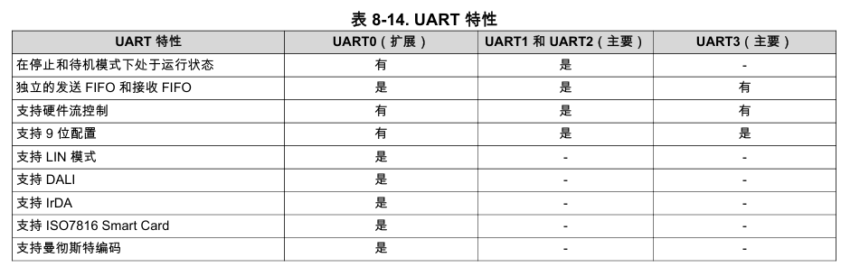


并非所有引脚都支持串口，可以看立创总结好的外设功能图，买他们的板子有送的。也可以看下面的图片：


## 串口通信的配置

### 串口通信的硬件连接

在开发板上有集成了一块 *CH340E*，**CH340E 是一款流行的 *USB 转串口芯片*，广泛用于各种需要串口通信的设备中**。它提供了一种低成本、便捷的方式将 USB 接口转换成标准的串口（RS232/RS485/TTL），广泛应用于单片机开发、嵌入式系统、通信设备等多个领域。

**在开发板上，我们可以通过一个数据线，接入到开发板的TYPE-C接口上，即可与开发板进行串口通信**。 而**CH340E接入到了`PA10`(UART0_TX)与`PA11`(UART0_RX)引脚**。这两个引脚是串口0引脚，此外我顺带列举一下其他串口的引脚吧（[数据手册](./mspm0g3507.pdf)第12页往下）：

1. 串口1： `PB4`(UART1_TX)和`PB5`(UART1_RX)
2. 串口2： `PB15`(UART2_TX)和`PB16`(UART2_RX)
3. 串口3： `PB12`(UART3_TX)和`PB13`(UART3_RX)

此外其实这里只是其中一部分引脚，还有些引脚也支持串口通信，更详细的还是需要去看[数据手册](./mspm0g3507.pdf)。

### 串口时钟的配置

串口时钟来源有三个：

1. BUSCLK：**由内部高频振荡器提供的CPU时钟**，通常芯片**默认设置为了`32MHz`**
2. MFCLK：**只能使用固定的`4MHz`时钟**(参考用户手册132页)。**开启的话需要配置时钟树的`SYSOSC_4M`分支**，才能够正常开启
3. LFCLK：**由内部的低频振荡器提供时钟**（`32KHz`）。**在运行、睡眠、停止和待机模式下有效，使用该时钟可以实现更低的功耗**。

更详细的配置教程见[这里](https://wiki.lckfb.com/zh-hans/tmx-mspm0g3507/keil-beginner/uart.html#_7-8-3-%E4%B8%B2%E5%8F%A3%E6%97%B6%E9%92%9F%E7%9A%84%E9%85%8D%E7%BD%AE)

然后我们的示例：

```c
#include "ti_msp_dl_config.h"

// 使用dl库内置的 `delay_cycles` 函数来延时
#define delay_ms(X) delay_cycles((CPUCLK_FREQ / 1000) * (X));

// 需要注意使用 volatile
volatile uint8_t uart_data    = 0; // uart数据

void Uart0_Transmit_Char(char ch);      // 发送字符
void Uart0_Transmit_String(char *data); // 发送字符串
void Uart0_Receive_String(void);

int main()
{
    SYSCFG_DL_init();
    // 清除串口中断标志
    NVIC_ClearPendingIRQ(UART_0_INST_INT_IRQN);
    // 串口中断使能
    NVIC_EnableIRQ(UART_0_INST_INT_IRQN);

    while (1) {
        // LED引脚高电平
        DL_GPIO_setPins(LED_PORT, LED_PIN_22_PIN); // 点亮LED
        delay_ms(500);
        // LED引脚低电平
        DL_GPIO_clearPins(LED_PORT, LED_PIN_22_PIN); // 点亮LED
        delay_ms(500);
    }
}

void Uart0_Transmit_Char(char ch)
{
    // 等待串口空闲
    while (DL_UART_isBusy(UART_0_INST) == true);
    DL_UART_Main_transmitData(UART_0_INST, ch); // 发送数据
}

void Uart0_Transmit_String(char *data)
{
    // 字符串为空时不发送
    while (*data) {
        Uart0_Transmit_Char(*data++); // 发送数据
    }
}

void UART_0_INST_IRQHandler()
{
    switch (DL_UART_getPendingInterrupt(UART_0_INST)) {
        case DL_UART_IIDX_RX: // 如果是接收中断
            // 将发送过来的数据保存在变量中
            uart_data = DL_UART_Main_receiveData(UART_0_INST);
            // 然后再发出去
            Uart0_Transmit_Char(uart_data);
            break;
        default: // 其他串口中断不管
            break;
    }
}
```

备注一下，**软件用sscom调试串口通信**，别用stc-isp，这个对51支持好，其他的都不太行。

对了，TI库的代码风格还是很好的，有兴趣的话可以看看，想研究下DL库是怎么写成的话就看看，顺带就当学习别人的分层架构思想了😁。

#### 相关代码的一些说明

1. **串口中断必须手动开启**。通过**函数 `NVIC_EnableIRQ`指定开启某一个中断**。
**开启之前要先清除中断标志位，否则开启中断后将会自动进入中断**。

2. **串口发送数据。可以通过函数 `DL_UART_Main_transmitData` 将字符数据发出**。
**但为了确保不会阻塞发送通道的数据，需要增加忙判断**。例如，你在发送ABCD时，刚刚准备发A，A还没有发送出去，芯片就要发送B了，这样就导致了数据丢失。

3. 串口接收数据。接收数据本案例是通过串口中断接收的方式，一有数据过来就马上中断接收，非特殊情况不会有阻塞。

4. **如需要使用C语言中的`printf`函数，需要进行以下操作。 在`.s`文件中修改堆栈的大小。此处我将堆大小修改为`0x100`**。

**之后还需要重定义 `fputc` 以支持 `printf` 通过串口0输出，使用时需要加上 `stdio.h` 头文件**。

```c
int fputc(int ch, FILE *stream)
{
  while( DL_UART_isBusy(UART_0_INST) == true );
  DL_UART_Main_transmitData(UART_0_INST, ch);
  return ch;
}
```

这个相对麻烦些，还有一个宏需要定义

```h
#if !defined(__MICROLIB)
//不使用微库的话就需要添加下面的函数
#if (__ARMCLIB_VERSION <= 6000000)
//如果编译器是AC5  就定义下面这个结构体
struct __FILE
{
        int handle;
};
#endif

FILE __stdout;
//定义_sys_exit()以避免使用半主机模式
void _sys_exit(int x)
{
        x = x;
}
#endif
```

# 定时器

定时器是单片机内部集成，可以通过编程控制。单片机的定时功能是通过计数来实现的，当单片机每一个机器周期产生一个脉冲时，计数器就加一。定时器的主要功能是用来计时，时间到达之后可以产生中断，提醒计时时间到，然后可以在中断函数中去执行功能。

**MSPM0G系列一共有7个定时器，可以分为2种类型，通用计时器（TIMG）和高级控制计时器（TIMA）。不同类型的定时器所拥有的功能数量不同，一般高级定时器的功能最多，通用定时器次之**。具体功能对照可以查看[用户手册](./mspm0g3507.pdf)的P70。

## 高级控制定时器

**TIMA模块由一个16位自动重载计数器组成**，由可编程预调节器驱动，最多四个捕获/比较（CC）块用于多个捕获/比较，带死区插入的PWM输出和间隔定时。TIMA具有广泛的事件生成功能，它们来自不同的计数器事件，如溢出、重载，以及来自每个捕获/比较寄存器。它还具有硬件设计来处理由内部或外部电路产生的故障信号，以指示系统中的故障。

## 通用定时器

**TIMG模块由16位和32位自动重新加载计数器组成**，由可编程预计算器驱动，具有两个捕获/比较（CC）块，用于多个捕获/比较、PWM输出和间隔定时。TIMG还具有广泛的事件生成功能，包括计数器溢出、重加载和针对各种用例的捕获/比较操作。

## 基本参数

### 预分频

**预分频器可以将定时器的时钟(TIMCLK)频率按1到256之间的任意值分频**（1到256是基于定时器分频器是8位），**TIMG可以选择BUSCLK、MFCLK、LFCLK作为时钟源，可以最大8分频时钟**，**再经过一个8位的预分频器，最终称为定时器的计数时钟**。

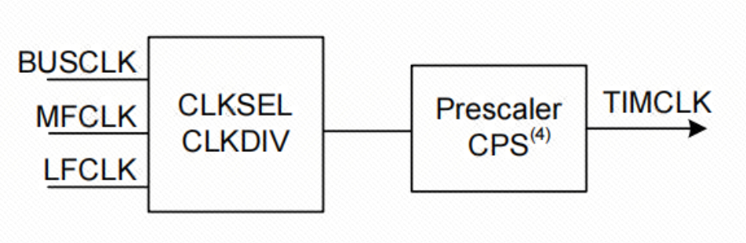

### 向上或向下计数模式

**向上计数指的是计数器从0开始向上连续计数到自动加载值**，
一旦计数器计数到自动加载值，会**重新从0开始向上计数并产生上溢事件**。

**向下计数指的是计数器从自动加载值开始向下连续计数到0**，
一旦计数器计数到0，会**重新从自动加载值开始向下计数并产生下溢事件**。

### 更新事件

**更新事件是当计数器上溢或者下溢而开始新的计数周期时触发的**。
**更新事件可以触发DMA请求，以用于在下一个计数周期开始时及时更新定时器的运行参数**，特别适合用于实时控制。

## 配置定时器

这个还挺重要的，务必掌握

左侧功能栏选中 TIMER，然后如下配置：

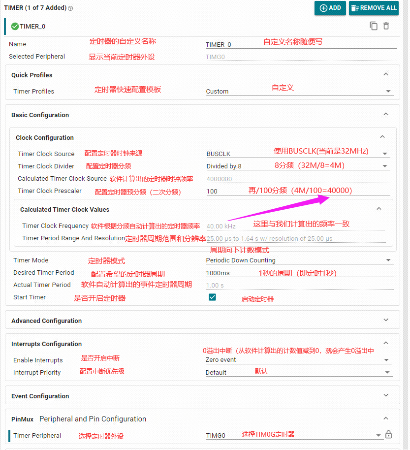

本例程中的实际参数如下： 定时器时钟选择BUSCLK-32MHz，进行8分频，再100预分频，得到定时器的频率为40KHz。设置定时器周期为1S，周期向下计数模式，开启0溢出中断。

然后我们还是控制 LED 以1s的周期闪烁

```c
#include "ti_msp_dl_config.h"

int main()
{
    SYSCFG_DL_init();
    // 清除定时器中断标志
    NVIC_ClearPendingIRQ(TIMER_0_INST_INT_IRQN);
    // 使能定时器中断
    NVIC_EnableIRQ(TIMER_0_INST_INT_IRQN);
    while (1);
}

// 定时器的中断服务函数 已配置为1秒的周期
void TIMER_0_INST_IRQHandler()
{
    // 如果产生了定时器中断
    switch (DL_TimerG_getPendingInterrupt(TIMER_0_INST)) {
        case DL_TIMER_IIDX_ZERO: // 如果是0溢出中断
            // 将LED灯的状态翻转
            DL_GPIO_togglePins(LED_PORT, LED_PIN_22_PIN);
            break;
        default: // 其他的定时器中断
            break;
    }
}
```

# PWM

PWM（Pulse Width Modulation 脉宽调制）是利用微处理器的数字输出来对模拟电路进行控制的一种非常有效的技术。它是一种对模拟信号电平进行数字编码的方法。**是指在一定时间内波形的高电平（即 1 状态）所占用的时间比例**。通过高分辨率计数器的使用，方波占空比被调制用来对一个模拟信号的电平进行编码。**PWM 信号依然是数字的，因为在给定的任何时刻，满幅值的直流供电要么完全有，要么完全无**。比如我们的电压输出是 5V的，**那么经过改变 PWM 的占空比，可以达到在一定时间内输出 3.3V 或者 1.3V 的效果**。

举个例子

想象你有一个LED和一个开关，你以肉眼看不清的速度，快速反复地开关一次，这样LED灯就会亮一半时间，暗一半时间。如果你快速地进行这个操作，对于观察者来说，LED就像是以半亮度持续亮着。这就是PWM的基本原理。

如果你把大部分时间保持开关为关闭状态，那么LED会显得更暗；相反，如果你把开关大部分时间保持为打开状态，LED会显得更亮。这就是PWM调节占空比来控制亮度的过程。

## PWM在MSPM0G上的实现

借助定时器来实现（和51一样了属于是）

PWM一共有两种模式。

1. **一个是边缘对齐PWM，指的是定时器使用的向下计数模式**，输出通道在定时器计数开始的时候会输出高电平， 当计数值与输出通道的比较值（图中的CC0和CCP0，CC1和CCP1）相同的时候， 输出通道会输出低电平，一直到定时器的计数值计数到0，就完成了一个周期的脉冲输出。
2. **另一个模式是中心对齐模式，指的是定时器的上下计数模式**，输出通道会在定时器开始的时候输出低电平，在定时器向上计数和向下计数两次到达输出通道的比较值相等的时候各翻转一次电平。

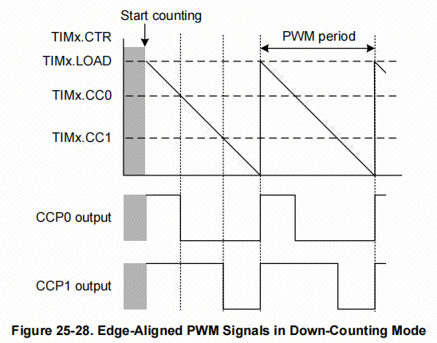

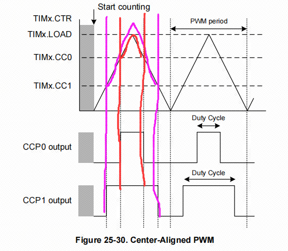

## PWM基本参数

PWM是脉冲宽度调制，具有两个非常重要的参数：频率和占空比。

- 频率：PWM的频率是整个周期的倒数。
- 占空比：占空比是指一个周期内高电平所占的比例。

## 控制方法

**采样控制理论中有一个重要结论：冲量相等而形状不同的窄脉冲加在具有惯性的环节上时，其效果基本相同**。PWM控制技术就是以该结论为理论基础，对半导体开关器件的导通和关断进行控制，使输出端得到一系列幅值相等而宽度不相等的脉冲，用这些脉冲来代替正弦波或其他所需要的波形。**按一定的规则对各脉冲的宽度进行调制，即可改变逆变电路输出电压的大小，也可改变输出频率**。

**控制方式就是对逆变电路开关器件的通断进行控制，使输出端得到一系列幅值相等但宽度不一致的脉冲，用这些脉冲来代替正弦波或所需要的波形**。也就是在输出波形的半个周期中产生多个脉冲，使个脉冲的等值电压为正弦波形，所获得的输出平滑且低次谐波少。按一定的规则对各脉冲的宽度进行调制，即可改变逆变电路输出电压的大小，也可改变输出频率。

嘶……某种意义上来说可以理解成另一种形式的傅里叶变换，只不过这次成方波了（笑）。

## PWM优点

**PWM的一个优点是从处理器到被控制系统信号都是数字形式，无需进行数模转换**。让信号保持为数字形式可将噪声影响降到最小。噪声只有在强到足以将逻辑1改变为逻辑0或将逻辑0改变为逻辑1时，才能对数字信号产生影响。对噪声抵抗能力的增强是PWM相对于模拟控制的另一个优点，而且这也是在某些时候将PWM用于通信的主要原因。

## PWM的应用

**PWM可应用于电机调速、功率调制、PID调节、通信等，配置简单、抗干扰能力强**。可以通过PWM来控制LED灯的亮暗变化，可以通过PWM信号来控制无源蜂鸣器发出简单的声音以及实现功率继电器的线圈节能等。PWM用来驱动电机和调节电机转速是非常重要的内容。

## 配置PWM

左边功能栏切换到 TIMER-PWM，然后会有如下页面：

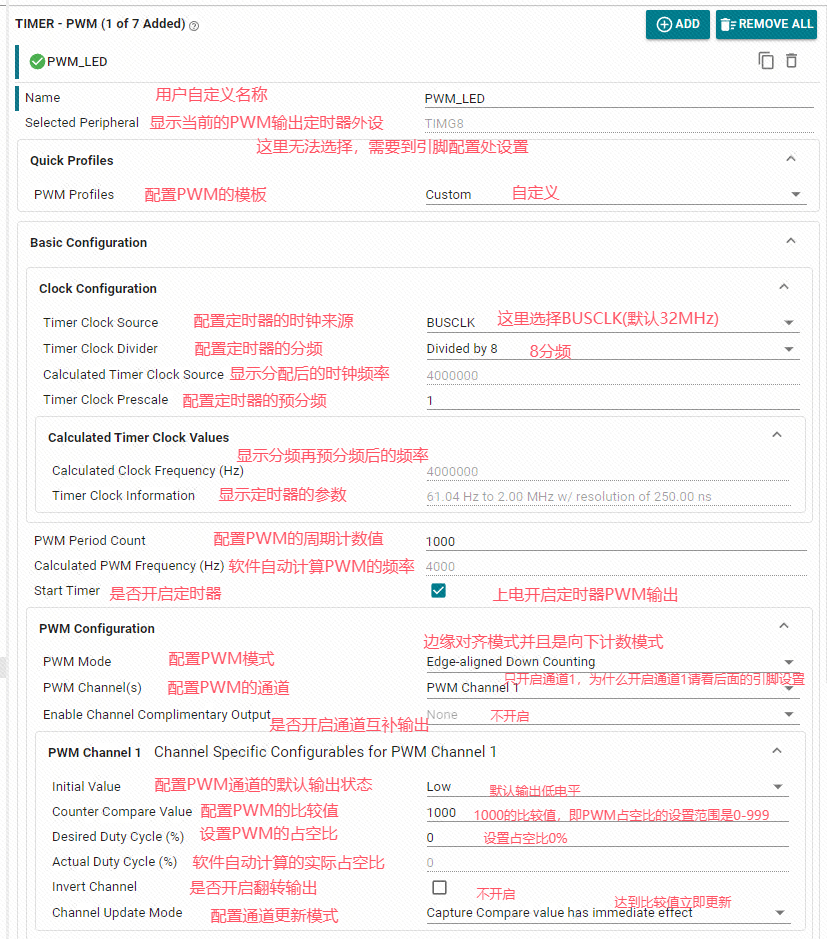

这里设置通道1为100Hz的频率，0%占空比的PWM，周期计数值为1000，比较值也设置为1000，这样的话从1000开始向下计数，每遇到一次1000，PWM的状态就翻转一次。引脚的设置。将LED的PB22引脚修改为PWM的输出引脚。而PB22支持TIMG8的通道1输出

管脚等设置需要去PinMux那里设置。

数据手册上PB22对应 TIMG8_C1（TIMG8的Channel 1），因此Timer Peripheral 配TIMG8，然后Capture/Compare Pin 1就应该是PB22/21

```c
#include "ti_msp_dl_config.h"

#define delay_ms(x) delay_cycles((CPUCLK_FREQ / 1000) * (x))

int main()
{
	int i =0;
	SYSCFG_DL_init();
	while (1)
	{
		for (i = 0; i <= 999; i++){
			DL_TimerG_setCaptureCompareValue(PWM_LED_INST,i,GPIO_PWM_LED_C1_IDX);
			delay_ms(1);
		}
		for (i = 999; i > 0; i--){
			DL_TimerG_setCaptureCompareValue(PWM_LED_INST,i,GPIO_PWM_LED_C1_IDX);
			delay_ms(1);
		}
	}
}
```

可以**通过函数 `DL_TimerG_setCaptureCompareValue` 设置定时器PWM的比较值，通过修改比较值看可以实现修改PWM的占空比**。
为什么for循环中`i`的范围是`0-999`？因为**我们设置的PWM的周期是计数1000个值，所以我们的比较值只能在0-999**。

控制舵机的教程转[这里](https://wiki.lckfb.com/zh-hans/tmx-mspm0g3507/module/control/sg90-steering-engine.html)

# ADC

**ADC全称模拟-数字转换器，是一种用于将模拟信号转换为数字信号的模拟数字转换器**。我们知道，模拟信号是连续的，其取值可以在一定范围内任意变化，如声音、光信号等。而数字信号则是离散的二进制信号，如计算机中的数据0和1，仅能取有限的值。

**ADC的工作原理是将模拟信号通过采样转换为离散的数字信号，然后再通过量化、编码等处理，最终得到对应的数字表示**。ADC**采样的频率越高，得到的数字信号就越接近原来的模拟信号**，也就是**保真度越高**，**但是需要更多的资源和计算功耗**。

**ADC 通常用于从外部模拟传感器中读取模拟信号，并将其转换为数字信号供嵌入式系统或计算机进行处理**，例如测量温度、湿度、压力等物理量。

**MSPM0G3507采用的是逐次逼近型的12位ADC，它有 17个多路复用通道可以转换。17个外部通道，都对应单片机的某个引脚，这个引脚不是固定的**，详情请参考引脚图或者数据手册。

各种通道的 A/D 转换可以配置成 **单次、序列转换** 模式。

1. **单次转换模式**： 每次进行一次ADC转换后，ADC会自动停止，并将结果存储在ADC数据寄存器中。
2. **重复单次转换模式**： 当ADC完成一次转换后，它会自动启动另一次转换，持续的进行转换，直到外部触发或者软件触发的方式停止连续转换。
3. **多通道顺序单次转换模式**： 用于对多个输入通道进行依次转换。在该模式下，ADC会根据配置的通道采集顺序，对多个通道进行单次采样并转换。
4. **多通道顺序重复转换模式**： 用于对多个输入通道进行依次重复转换。在该模式下，ADC会根据配置的通道采集顺序，对多个通道进行重复采样并转换。

## ADC基本参数

1. **分辨率**： 表示**ADC转换器的输出精度，通常以位数（bit）表示**，比如8位、10位、12位等，**位数越高，精度越高**。MSPM0L1306支持8、10、12位的分辨率。
2. **采样率**： **表示ADC对模拟输入信号进行采样的速率，通常以每秒采样次数**（samples per second，SPS）**表示，也称为转换速率**，表示ADC能够进行多少次模拟到数字的转换。MSPM0G3507的SPS为4Msps。
3. **电压基准**： **ADC的电压基准是用于与模拟输入信号进行比较，从而实现模拟信号到数字信号的转换的一个参考电压。这个基准电压的准确性和稳定性对ADC的转换精度有着决定性的影响**。而MSPM0G3507可以支持软件选择三种基准：
    （1）1.4V 和 2.5V 的可配置内部专用 ADC 基准电压 (VREF)
    （2）MCU 电源电压 (VDD) 
    （3）通过 VREF+和 VREF- 引脚为 ADC 提供外部基准。如未配置电压基准则默认使用MCU电源电压作为ADC电压基准。
4. **采样范围**： 指ADC可以采集到的模拟输入信号的电压范围，范围见下：
    `VREF- ≤ ADC ≤ VREF+`
其中`VREF-` 为设置的电压基准负，通常为0V。`VREF+` 为电压基准正，根据软件的配置确定范围。

## 基本原理

MSPM0G3507采用的是**逐次逼近型**的ADC，逐次逼近型ADC是一种常见的ADC工作原理，

**它的思想是通过比较模拟信号与参考电压之间的大小关系来逐步逼近输入信号的数字表示**。在逐次逼近型ADC中，输入信号和参考电压被加入一个差分放大器中，产生一个差分电压。然后，这个差分电压被输入到一个逐步逼近的数字量化器中，该量化器以逐步递减的方式将其与一系列参考电压进行比较。具体来说，在每个逼近阶段，量化器将输入信号与一个中间电压点进行比较，将该电压点上方或下方的参考电压作为下一个逼近阶段的参考电压。这个过程一直持续到量化器逼近到最终的数字输出值为止。

## ADC优点

- 数字信号具有良好的抗干扰性。数字信号是由一系列离散的数字表示，因此可以抵抗模拟信号受到的各种干扰，如噪声、漂移等。
- 方便数字信号的存储、处理和传输。由于数字信号是离散的，因此它们可以轻松存储在计算机内存或其他数字设备中，方便进行处理和传输。
- 具有可编程性。现代的ADC出现了很多可编程的功能，例如可编程增益、采样率和滤波器等，可以根据不同的应用场景进行优化。
- 适用性广泛。ADC被广泛应用于工业、通信、医疗、电子测量、音频、视频等领域，可转换各种不同类型的模拟信号，包括电压、电流、声音、光信号等。

## ADC配置

本案例将以采集3.3V和GND的电压作为实验案例。通过ADC采集其电压变化，实现判断电压情况。

左边功能栏选择ADC12

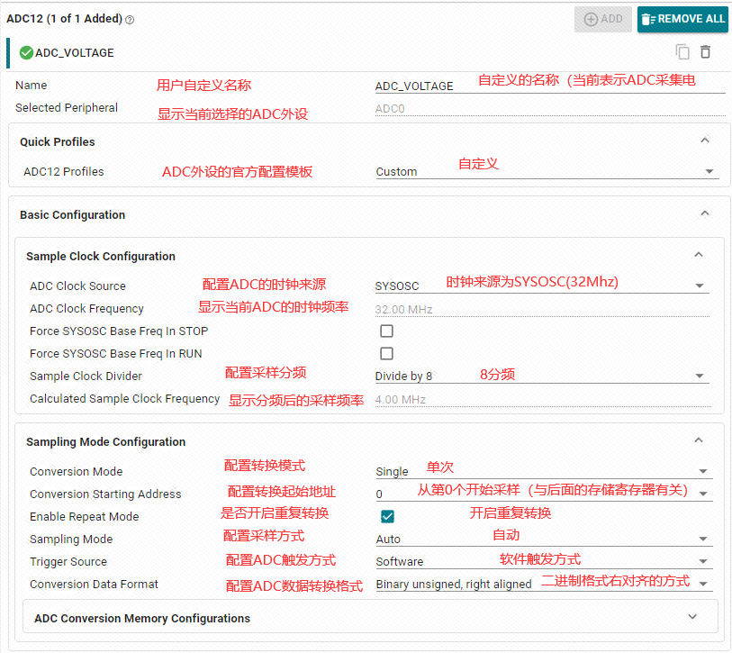

MSPM0G3507的ADC支持各种数据对齐方式以适应不同的应用场景。**常见的数据对齐方式包括左对齐和右对齐**。

**在右对齐模式下，ADC的数据在转换结束后被右对齐到最低位，不足的位数在高位填充0**。
右对齐模式允许实现**在没有精度的损失下更好的动态范围**。

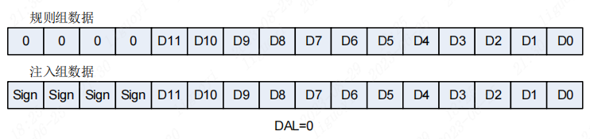

**在左对齐模式下，ADC的数据被左对齐到最高位，不足的位数在低位填充0**。左对齐模式**可以提高分辨率**，但**会导致动态范围降低**。

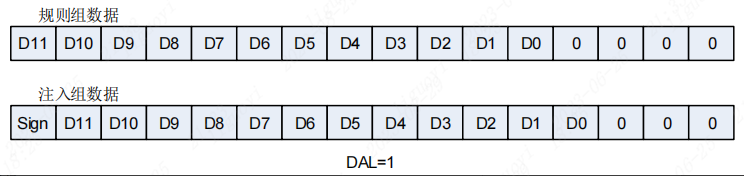

接下来是配置ADC采集通道

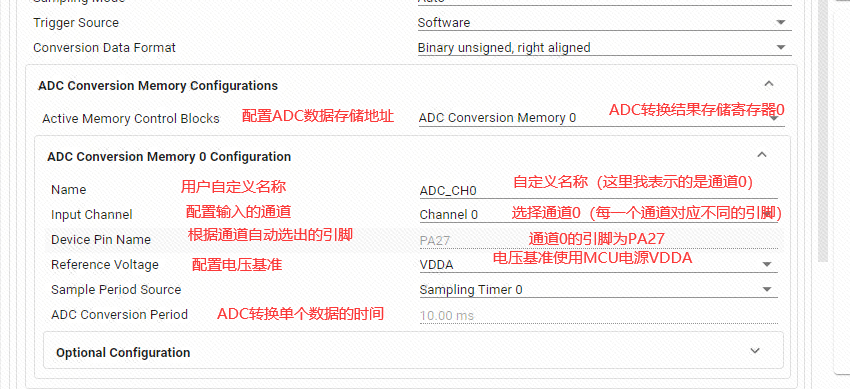

这里A0_0（ADC_CH0）对应PA27，我们再配置分辨率啥的：

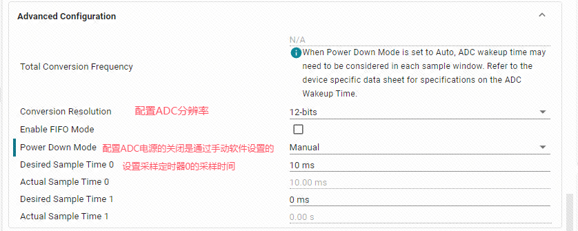

然后是开启中断（Interrupt Configuration），当ADC采集完成时触发中断，然后我们数据处理

然后我们还需要配一下UART啥的（默认配置即可），之后就可以把这一段代码烧进去了：

```c
#include "ti_msp_dl_config.h"
#include "stdio.h"

#define delay_ms(X) delay_cycles((CPUCLK_FREQ / 1000) * (X))

void uart0_send_string(char *str); // 串口发送数据
volatile bool gCheckADC;           // ADC采集成功标志位
unsigned int adc_getValue(void);   // 读取ADC的数据

int main(void)
{
    char show_buff[100]    = {0};
    unsigned int adc_value = 0;
    float voltage_value    = 0;

    SYSCFG_DL_init();

    // 开启ADC中断
    NVIC_EnableIRQ(ADC_VOLTAGE_INST_INT_IRQN);

    uart0_send_string("adc Demo start\r\n");
    while (1) {
        // 获取ADC数据
        adc_value = adc_getValue();
        sprintf(show_buff, "adc value:%d\r\n", adc_value);
        uart0_send_string(show_buff);

        // 将ADC采集的数据换算为电压
        voltage_value = adc_value / 4095.0 * 3.3;

        sprintf(show_buff, "voltage value:%.2f\r\n", voltage_value);
        uart0_send_string(show_buff);
        delay_ms(1000);
    }
}

// 串口发送字符串
void uart0_send_string(char *str)
{
    // 当前字符串地址不在结尾 并且 字符串首地址不为空
    while (*str != 0 && str != 0) {
        // 发送字符串首地址中的字符，并且在发送完成之后首地址自增
        DL_UART_transmitDataBlocking(UART_0_INST, *str++);
    }
}

// 读取ADC的数据
unsigned int adc_getValue(void)
{
    unsigned int gAdcResult = 0;

    // 软件触发ADC开始转换
    DL_ADC12_startConversion(ADC_VOLTAGE_INST);
    // 如果当前状态为正在转换中则等待转换结束
    while (false == gCheckADC) {
        __WFE();
    }
    // 获取数据
    gAdcResult = DL_ADC12_getMemResult(ADC_VOLTAGE_INST, ADC_VOLTAGE_ADCMEM_ADC_CH0);

    // 清除标志位
    gCheckADC = false;

    return gAdcResult;
}

// ADC中断服务函数
void ADC_VOLTAGE_INST_IRQHandler(void)
{
    // 查询并清除ADC中断
    switch (DL_ADC12_getPendingInterrupt(ADC_VOLTAGE_INST)) {
        // 检查是否完成数据采集
        case DL_ADC12_IIDX_MEM0_RESULT_LOADED:
            gCheckADC = true; // 将标志位置1
            break;
        default:
            break;
    }
}
```

顺带我们用了个`sprintf`，

函数原型为：`int sprintf(char *str, const char *format, ...);`

- `str`：指向字符数组的指针，该数组将用来存储格式化后的字符串。
- `format`：指向格式化字符串的指针，它指定了输出格式。
- `...`：可变参数列表，根据 format 中指定的格式占位符，可以是任意类型的数据。

实际示例为：

```c
#include <stdio.h>

int main() {
    char buffer[50];
    int num = 123;
    sprintf(buffer, "The number is: %d", num);
    printf("%s\n", buffer); // 输出: The number is: 123
    return 0;
}
```

# DMA

## 什么是DMA

**DMA（Direct Memory Access）控制器提供了一种硬件的方式在外设和存储器之间或者存储器和存储器之间传输数据，而无需CPU的介入，避免了CPU多次进入中断进行大规模的数据拷贝，最终提高整体的系统性能**。

DMA是一种能够在无需CPU参与的情况下，将数据块在内存和外设之间高效传输的硬件机制。**实现这种功能的集成电路单元叫做DMA Controller，即DMA控制器**。

**DMA控制器在没有CPU参与的情况下从一个地址向另一个地址传输数据，它支持多种数据宽度，突发类型，地址生成算法，优先级和传输模式，可以灵活的配置以满足应用的需求**。

## 数据传输方式

**一般情况下实现存储器和外设之间的数据传输，有三种常用的方法**：
轮询法（polling），中断法(interrupt)以及DMA。

- **轮询法**（polling）: **在主循环中，CPU不断检查外设的相关标志位，来判断其是否需要进行数据的传输**，**如果需要，则CPU将数据在外设和内存之间搬运，实现数据传输**。**当数据传输服务请求频繁或者传输的数据量很大时，会影响其他任务的实时性**。
- **中断法**（interrupt）： **当外设需要传输数据时，会触发中断，CPU会暂停正在处理的任务，转而去执行中断服务函数，接着处理外设的数据传输任务**。**CPU无需反复检查外设的标志位，中断机制会指示CPU何时去处理外设数据，但是依然需要CPU去完成数据搬运和传输过程**。当外设数据**传输服务不频繁且数据量不大时，中断法也是不错的选择。当中断连续不断且频繁发生时，中断法变得不再高效**，因为在恢复主流程的执行和中断相应的上下文切换会占用大量的CPU时间。
- **DMA**： DMA控制器是单片机中的硬件单元，**它在存储器和外设之间有专用的通道，允许外设和存储器之间高效传输数据，且传输过程无需CPU参与**。

综上可见DMA是一种高效的数据传输方式。

## MSPM0G的DMA介绍

MSPM0G3507的DMA控制器具有以下特点：

- 7个独立的传输通道；
- 可以配置的DMA通道优先级；
- 支持8位(byte)，16位(short word)、32位(word)和64位(long word)或者混合大小(byte 和 word)传输；
- 支持最大可达64K任意数据类型的数据块传输；
- 可配置的DMA传输触发源；
- 6种灵活的寻址模式；
- 单次或者块传输模式； 它共有7个DMA通道，各个通道可以独立配置，多种多样的数据传输模式可以适应不同应用场景的数据传输需要。

通过查看TI的数据手册，DMA功能除了常见的内存与外设间的地址寻址方式，还提供了Fill Mode和Table Mode两种拓展模式，DMA通道分为基本类型和全功能类型两种。只有全功能类型的DMA通道支持重复传输、提前中断以及拓展模式，基本功能的DMA通道支持基本的数据传输和中断，但是足够满足简单的数据传输要求。

## MSPM0G的DMA传输方式

MSPM0G3507的DMA支持四种传输模式，每个通道可单独配置其传输模式。例如，通道 0 可配置为单字或单字节传输模式，而通道 1 配置为块传输模式，通道 2 采用重复块传输模式。 传输模式独立于寻址模式进行配置。 任何寻址模式都可以与任何传输模式一同使用。可以传输三种类型的数据，可以通过 .srcWidth 和 .destWidth 控制位进行选择。源位置和目标位置可以是字节、短字或字数据。也支持以字节到字节、短字到短字、字到字或任何组合的方式进行传输。如下：

1. 单字或单字节传输：每次传输都需要一个单独的触发。当 DMAxSZ 传输已经生成时 DMA 会被自动关闭。
2. 块传输：一个整块将会在一个触发后传输。在块传输结束时 DMA 会被自动关闭。
重复单字或单字节传输：每次传输都需要一个单独的触发，DMA保持启用状态。
重复块传输：一个整块将会在一个触发后传输，DMA保持启用状态。

基于这三种模式，MSPM0G3507提供了6种寻址方式，如下：

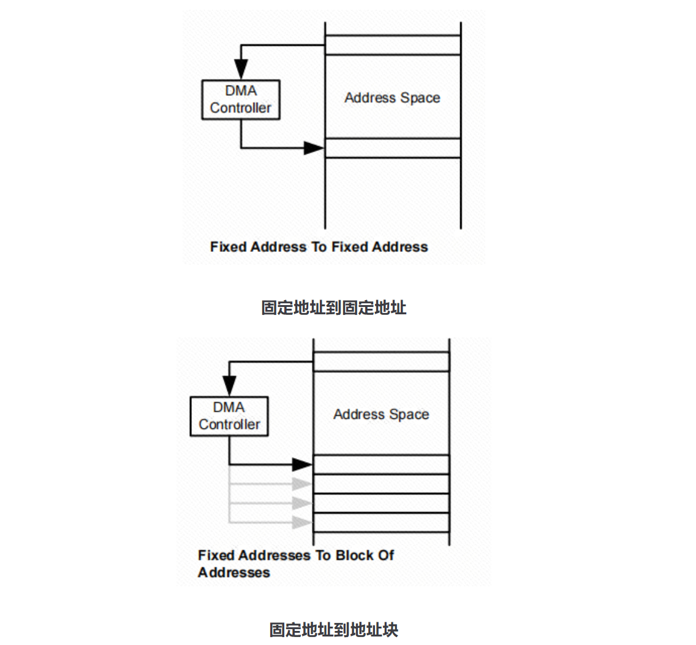

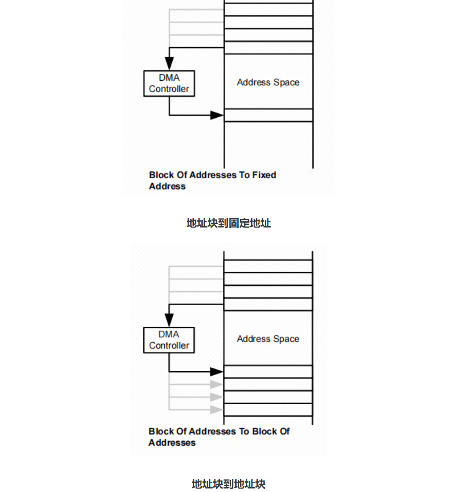

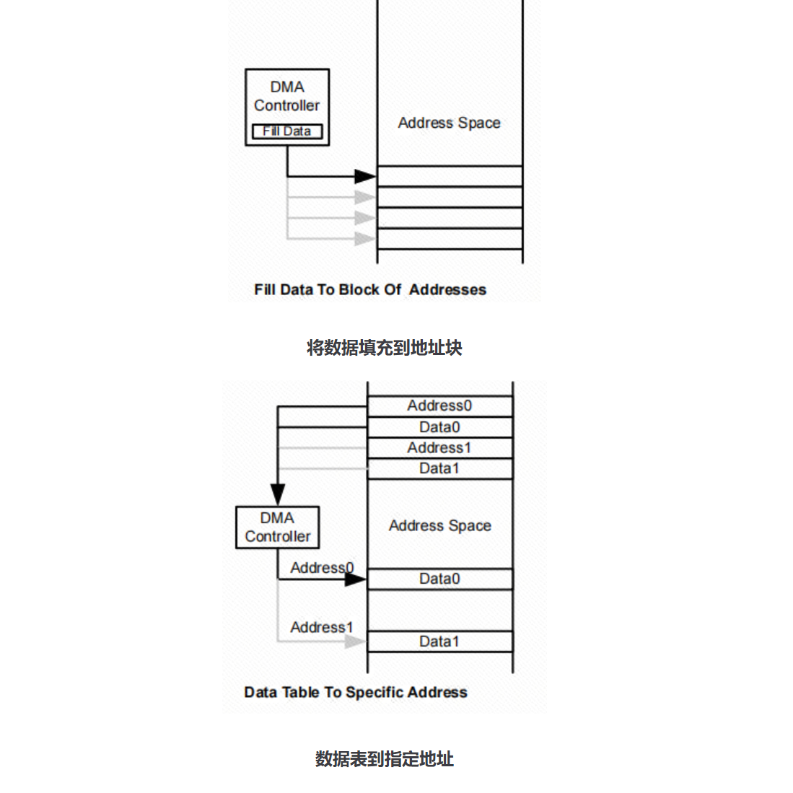

## 配置DMA

本案例将使用ADC采集3.3V和GND的电压，通过DMA将ADC采集的数据直接搬运到指定地址中作为实验案例。

ADC配置与之前相同，我们主要看看DMA配置

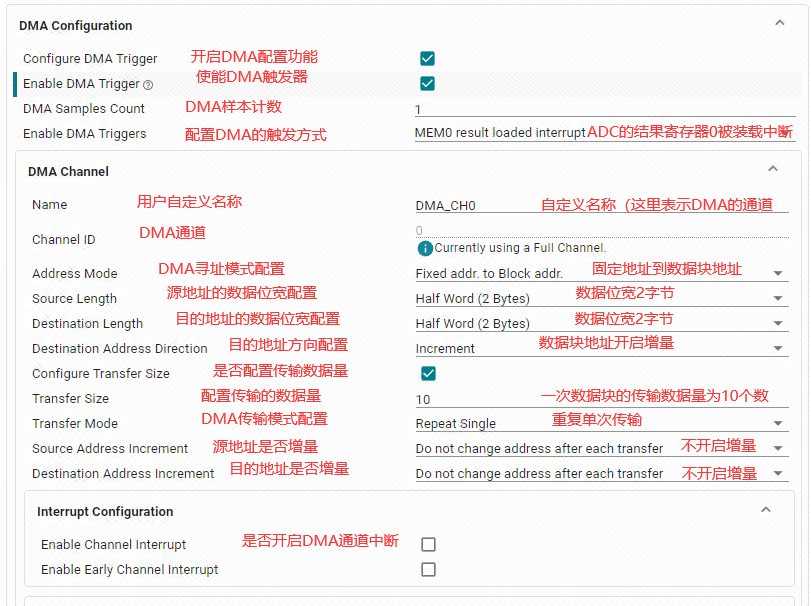

然后再配一个UART就好，和之前是一样的。

```c
#include "ti_msp_dl_config.h"
#include "stdio.h"

#define delay_ms(x) delay_cycles((CPUCLK_FREQ / 1000) * (x))

volatile uint16_t ADC_VALUE[20];

uint32_t adc_getValue(uint32_t number);

/* ******************************************************************* */
#if !defined(__MICROLIB)
// 不使用微库的话就需要添加下面的函数
/* ********** 我们用的是AC6，不过也可以加上 ********** */
#if (__ARMCLIB_VERSION <= 6000000)
// 如果编译器是AC5  就定义下面这个结构体
struct __FILE {
    int handle;
};
#endif
/* ********** 我们用的是AC6，不过也可以加上 ********** */

FILE __stdout;
// 定义_sys_exit()以避免使用半主机模式
void _sys_exit(int x)
{
    x = x;
}
#endif

// printf函数重定义
int fputc(int ch, FILE *stream)
{
    // 当串口0忙的时候等待，不忙的时候再发送传进来的字符
    while (DL_UART_isBusy(UART_0_INST) == true);
    DL_UART_Main_transmitData(UART_0_INST, ch);
    return ch;
}
/* ******************************************************************* */

int main()
{
    uint32_t adc_value     = 0;
    uint32_t voltage_value = 0;
    int i                  = 0;

    SYSCFG_DL_init();

    // 设置DMA搬运起始地址
    DL_DMA_setSrcAddr(DMA, DMA_CH0_CHAN_ID, (uint32_t)&ADC0->ULLMEM.MEMRES[0]);
    // 设置DMA搬运目的地址
    DL_DMA_setDestAddr(DMA, DMA_CH0_CHAN_ID, (uint32_t)&ADC_VALUE[0]);
    // 开启DMA
    DL_DMA_enableChannel(DMA, DMA_CH0_CHAN_ID);
    // 开启ADC转换
    DL_ADC12_startConversion(ADC_VOLTAGE_INST);
    printf("ADC_VOLTAGE_INST_IRQHandler\r\n");

    while (1) {
        // 获取ADC数据
        adc_value = adc_getValue(10);
        printf("adc_value = %d\r\n", adc_value);
        // 将ADC数据转为电压
        voltage_value = (int)((adc_value / 4095.0 * 3.3) * 1000);
        printf("voltage_value = %d.%d%d\r\n",
               voltage_value / 100,
               voltage_value / 10 % 10,
               voltage_value % 10);

        delay_ms(1000);
    }
}

uint32_t adc_getValue(uint32_t number)
{
    uint32_t gAdcResult = 0;
    uint8_t i           = 0;

    // 采集数据多次累加
    for (i = 0; i < number; i++) {
        gAdcResult += ADC_VALUE[i];
    }
    // 均值滤波
    gAdcResult /= number;
    return gAdcResult;
}
```

然后打开SSCOM，就可以接收到发送过来的数据了（记得把type-c连到电脑，然后选那个端口去监听）

# I2C

这一章节需要用到其他的元器件（例程给的温度传感器，我也有，但型号不一样）。

我手上这个是AHT10，数据手册可以在立创商城找到，注意**VIN是3V3**，别接到5V去了

## I2C 介绍

IIC（Inter-Integrated Circuit）协议也称为I2C总线，是一种串行通信协议，通常用于连接低速外设。它由Philips（现在的NXP Semiconductors）公司于1980年代初开发，现在已经成为一个标准。**IIC总线只需要两条数据线，分别是串行数据线（SDA）和串行时钟线（SCL）**，这使得它成为一种非常简单的接口。它适用基于芯片的通信，例如连接传感器、存储器或数字信号处理器等。

在IIC协议中，**总线上有一个主设备和多个从设备**。**主设备掌控着总线上的通信过程，负责发起、控制、停止通信。而从设备则需要等待主设备的请求，接收或发送数据**。主设备和从设备之间的**数据交换采用帧格式，每个帧通常包含地址、数据和控制信息**。主设备根据从设备的地址来选中要通信的设备，从设备则根据控制信息进行相应的操作。IIC协议可以支持多个从设备连接到同一个主设备，为系统设计提供了更大的灵活性。

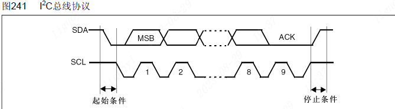

## I2C的硬件实现

I2C总线通常使用两种电压电平，即高电平（VH）和低电平（VL）。高电平为2.5V至5.5V，低电平为0V至0.3V；这些电压电平范围是根据I2C规范确定的。I2C总线有不同的传输速率可选，包括标准模式（100 kbps）、快速模式（400 kbps）以及高速模式。传输速率的选择取决于应用的需求和设备的支持能力。为避免信号冲突，微处理器(MCU）必须只能驱动SDA和 SCL在低电平，即开漏输出。设置为开漏模式主要是为了保护器件和防止干扰。

- 防止干扰：多个器件共享同一条数据线（SDA）和同一条时钟线（SCL），如果采用推挽输出模式，多个器件的输出将会叠加在数据线上，造成信号干扰，严重时会损坏器件或导致通信错误。而采用开漏输出模式，则各个器件的输出只有拉低数据线的部分，不会干扰彼此，从而提高了总线的可靠性和抗干扰能力。
- 防止短路：在开漏输出模式下，由于器件的输出只有拉低数据线的部分，如果两个或多个器件同时输出，也不会造成短路。而如果采用推挽输出模式，两个或多个器件同时输出时，可能会形成短路。比如主设备输出高电平，从设备输出低电平。
- 因设置为开漏模式，需要连接一个外部的上拉电阻（例如:10k)将信号提拉至高电平。故I2C总线中的SDA（数据线）和SCL（时钟线）通常都连接了上拉电阻，以确保逻辑高电平的稳定性。上拉电阻的阻值通常在2.2kΩ至10kΩ之间，具体取决于总线的电容负载和通信距离。

I2C总线的最大线缆长度和传输容量受到一定限制。在标准模式下，最大线缆长度大约在1米左右，而在快速模式下，最大线缆长度约为0.3米。此外，线缆上的总线容量也会对传输速率产生影响。

采用线与结构。

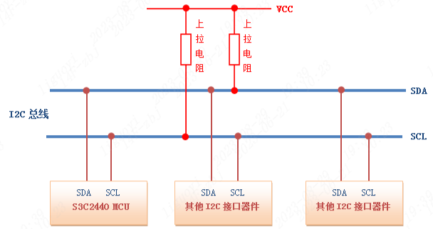

## I2C数据传输

一些预定义宏函数

```c
#include "ti_msp_dl_config.h"
// Set SDA to output
#define SDA_OUT()                                    \
    {                                                \
        DL_GPIO_initDigitalOutput(I2C_SDA_IOMUX);    \
        DL_GPIO_setPins(I2C_PORT, I2C_SDA_PIN);      \
        DL_GPIO_enableOutput(I2C_PORT, I2C_SDA_PIN); \
    }

// Set SDA to input
#define SDA_IN()                                 \
    {                                            \
        DL_GPIO_initDigitalInput(I2C_SDA_IOMUX); \
    }
// Get SDA status
#define SDA_GET() {((DL_GPIO_readPins(I2C_PORT, I2C_SDA_PIN) & I2C_SDA_PIN) > 0) ? 1 : 0}
// SDA and SCL output
#define SDA(x)    ((x) ? DL_GPIO_setPins(I2C_PORT, I2C_SDA_PIN) : (DL_GPIO_clearPins(I2C_PORT, I2C_SDA_PIN)))
#define SCL(x)    ((x) ? DL_GPIO_setPins(I2C_PORT, I2C_SCL_PIN) : (DL_GPIO_clearPins(I2C_PORT, I2C_SCL_PIN)))
```

你也可以用内联函数（`inline`）实现它们，我个人觉得内联函数可能更好一点，上面的宏函数是项目文档给的示例

```c
#include "ti_msp_dl_config.h"
// 比如：
inline void SDA_OUT(){
    DL_GPIO_initDigitalOutput(I2C_SDA_IOMUX);
    DL_GPIO_setPins(I2C_PORT, I2C_SDA_PIN);
    DL_GPIO_enableOutput(I2C_PORT, I2C_SDA_PIN);
}
```

### 起始信号

SCL在高电平的状态下，SDA的电平由高转低，表示开始一次通信。

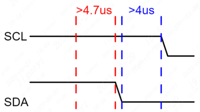

```c
void I2C_Start()
{
    SDA_OUT(); // 设置SDA为输出模式
    // 先确保都是高电平
    SCL(1);
    SDA(1);
    // 等待5us
    delay_us(5);
    // 在SCL=1时拉低SDA
    SDA(0);
    delay_us(5);
    // 开始传输数据
    SCL(0);
    delay_us(5);
}
```

### 停止信号

SCL在高电平的状态下，SDA的电平由低转高，表示结束这次通信。主设备在发送停止信号后不能再向从设备发送任何数据，除非再次发送起始信号。

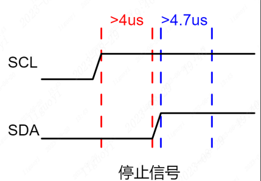

```c
void I2C_Stop()
{
    SDA_OUT();
    SCL(0);
    SDA(0);
    // 这里可以加入 delay_us(5);
    // 以保证过了 5us
    // 不过你要是确定两个机器周期能满足5us的话也行
    SCL(1);
    delay_us(5);
    SDA(1);
    delay_us(5);
}
```

### 数据传输

SCL在高电平的时候，SDA的电平由低转高表示0，由高转低表示1。

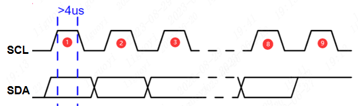

```c
void I2C_SendByte(uint8_t byte)
{
    uint8_t mask;  // 掩码
    SDA_OUT();     // SDA输出模式
    SCL(0);
    // 数据从高到低
    for (mask = 0x80; mask; mask >>= 1) {
        if (byte & mask) {
            SDA(1);
        } else {
            SDA(0);
        }
        delay_us(1);
        SCL(1);
        delay_us(5);
        SCL(0);
        delay_us(5);
    }
}

uint8_t I2C_ReadByte()
{
    uint8_t mask;
    uint8_t data = 0;
    SDA_IN();
    // 数据从高到低
    for (mask = 0x80; mask; mask >>= 1) {
        SCL(0);
        delay_us(5);
        SCL(1);
        delay_us(5);
        if (SDA_READ()) {
            data |= mask;
        }
    }
    SCL(0);
    return data;
}
```

### ACK/NACK

I2C还提供了一种称为“ACK/NACK”（应答/非应答）的确认机制。如果一个设备接收到数据，它将通过在SDA线上拉低电平来发送一个应答信号以通知发送方数据已被接收。相反，如果数据被损坏或未接收，接收设备将发送非应答信号。（在SDA上保持高电平）。

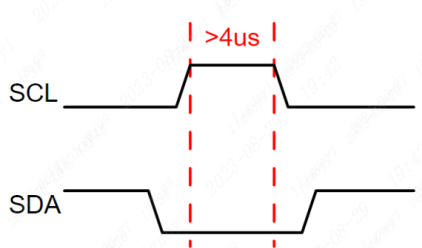

```c
/// @brief 主机发送ACK
void I2C_SendACK()
{
    SDA_OUT();
    SCL(0);
    SDA(1);
    SDA(0);
    SCL(1);
    delay_us(5);
    SCL(0);
    SDA(1);
}
```

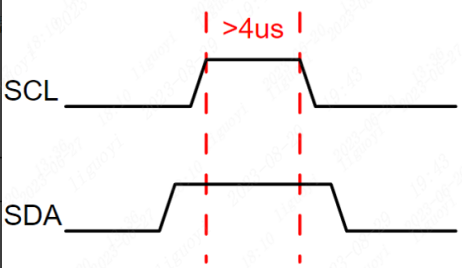

```c
/// @brief 主机发送NACK
void I2C_SendNACK()
{
    SDA_OUT();
    SCL(0);
    SDA(0);
    SDA(1);
    SCL(1);
    delay_us(5);
    SCL(0);
    SDA(0);
}
```

上面的两个函数可以简并成一个：

```c
void I2C_SendACK(uint8_t ack)
{
    SDA_OUT();
    SCL(0);
    SDA(0);
    if (ack)    // 如果ack为true（不应答）
        SDA(1); // 发送 1
    else        // 应答
        SDA(0); // 发送 0
    SCL(1);
    delay_us(5);
    SCL(0);
    SDA(0);
}
```

```c
/// @brief 主机接收ACK/NACK
/// @returns 1=无应答   0=有应答
char I2C_Wait_Ack()
{
    char ack = 0; // ack接收位
    // ack在第9个字节，多设置一个字节
    uint8_t ack_flag = 10;
    SDA_IN();
    SCL(0);
    delay_us(5);
    SCL(1);
    delay_us(5);

    while ((SDA_GET()==1) && (ack_flag) ){
        ack_flag--;
        delay_us(5);
    }
    // 无应答
    if (ack_flag == 0) {
        IIC_Stop();
        return 1;
    } else {    // 有应答
        SCL(0);
        SDA_OUT();
    }
    return ack;
}
```

在IIC总线中，时钟线由主设备控制，每个数据位在时钟边沿更新，传输的最高速率取决于总线上最慢的设备。一般来讲，**IIC总线的通信速率比较慢**，通常在几百kbps的范围内。如果需要更高的传输速率，可以采用其他通信协议，如SPI协议、CAN协议等。

## 通信流程

I2C通信流程按照以下步骤进行：

1. 主控向总线发送开始信号。
2. 主控将要通信的设备地址和读写位（R/W）发送到总线上。
3. 设备接收到地址后发送应答信号，主控接收到应答信号后发送数据或继续发送地址。
4. 设备接收到数据后发送应答信号，主控接收到应答信号后可以继续发送数据或者停止通信。
5. 主控向总线发送停止信号。

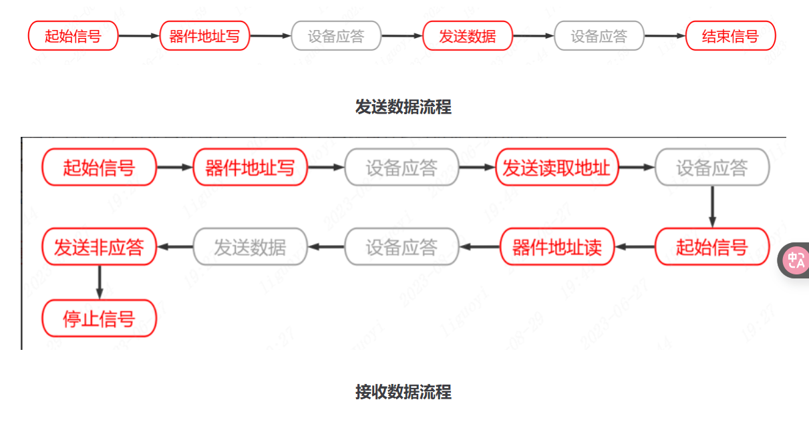

## IIC基本参数

**速率**：I2C总线有标准模式（100 kbit/s）和快速模式（400 kbit/s）两种传输模式，还有更快的扩展模式和高速模式可供选择。
**器件地址**：每个设备都有唯一的7位或10位地址，可以通过地址选择来确定与谁进行通信。
**总线状态**：I2C总线有五种状态，分别是空闲状态、起始信号、结束信号、响应信号、数据传输。
**数据格式**：I2C总线有两种数据格式，标准格式和快速格式。标准格式是8位数据字节加上1位ack/nack（应答/非应答）位，快速格式允许两个字节同时传输。

由于SCL和SDA线是双向的，它们也可能会由于外部原因（比如线路中的电容等）出现电平误差，而从而导致通信出错。因此，在IIC总线中，**通常使用上拉电阻来保证信号线在空闲状态下的电平为高电平**。

## 硬件I2C

MSPM0G系列的I2C支持主从模式，有7位地址位可以设置，支持 100kbps、400kbps、1Mbps 的 I2C 标准传输速率，并支持 SMBUS。 无论是主机或者从机，发送和接收都有独立的8个字节FIFO。MSPM0 I2C 具有 8 字节 FIFO，对于控制器和目标模式会生成独立的中断，并支持 DMA。

## 软件I2C与硬件I2C

I2C协议可以通过软件实现或者硬件实现。这两种方式的区别在于实现的方法和所需的硬件资源。

### 软件I2C

软件I2C是指通过在程序中编写代码来实现I2C通信协议。它利用通用输入输出（GPIO）引脚来模拟I2C的数据线（SDA）和时钟线（SCL），通过软件控制引脚的电平变化来传输数据和生成时序信号。与硬件I2C相比，软件I2C的优势在于不需要特定的硬件支持，可以在任何支持GPIO功能的微控制器上实现。它利用了微控制器的通用IO引脚来实现I2C通信协议。

软件I2C的实现通过编程方式来模拟I2C的主机和从机设备。通过逐位地读取和写入GPIO引脚的状态，并根据I2C协议的时序要求进行相应的操作，实现数据的传输和通信。软件I2C的灵活性较高，可以根据应用需求进行定制和扩展。它可以处理多个从机设备，并支持多主机环境。因此，软件I2C广泛应用于资源受限的MCU系统，特别是那些需要与多个外部设备进行通信的应用。

尽管软件I2C的性能相对于硬件I2C较低，但在一些低速通信和简单通信需求的场景下，软件I2C是一种经济实用的解决方案。

### 硬件I2C

硬件I2C是指通过专门的硬件模块来处理I2C通信协议。大多数现代微控制器和一些外部设备已经集成了硬件I2C模块，这些硬件模块负责处理I2C通信的细节，包括生成正确的时序信号、自动处理信号冲突、数据传输和错误检测等。可以直接使用硬件引脚连接，无需编写时序的代码。

使用硬件I2C通常相对简单，开发者无需编写复杂的代码来处理通信协议的细节。硬件模块可以直接与外部设备连接，通过专用的引脚进行数据和时钟传输，从而实现高效且可靠的通信。

在选择软件I2C还是硬件I2C时，需要考虑应用需求和硬件资源。软件I2C适用于资源受限的系统，可以在任何支持GPIO的微控制器上实现，但相对性能较低。硬件I2C通常性能更好，但需要硬件支持，并且可能占据一些特定的引脚资源。

## IIC优缺点

### 优点

- 双向传输：I2C总线支持双向传输，可以通过SDA线同时传输主设备和从设备之间的数据，节约了总线的资源。
- 系统集成：I2C总线可以快速集成到芯片中，减少系统实现的逻辑复杂性，提高了设计效率。
- 多设备共享：I2C总线可以通过地址传输实现多个设备与主控器的通信，使得多个设备可以共享总线，并直接交互。
- 高可靠性：I2C总线使用逻辑层次的代替电气信号来表示数据传输，具有更高的传输可靠性。

### 缺点

- 带宽不高：I2C总线的传输速度限制在400 kbps，相比较于SPI总线和CAN总线，带宽相对较低。
- 时序要求严格：I2C总线传输数据需要严格遵循时序要求，特别是在高速传输过程，时序容易受到干扰，造成通信失败。
- 最长电缆长度有限：虽然I2C总线可以通过中继器扩展总线长度，但是由于信号线受到干扰，信号衰减和时序要求等问题，电缆最长长度一般限制在1~2米之间。

总之，I2C总线具有双向传输、系统集成、多设备共享等优点，但传输速度相对较低，时序要求严格且最长电缆长度有限等缺点。

## I2C应用

I2C总线是应用最广泛的通信接口之一，以下是几个常见的应用例子：

1. 温度计传感器：常见的温度计传感器，如SHT31、LM75等，都采用I2C接口，其通过I2C总线将温度数据传输到主控器进行处理。
2. LED驱动器：LED驱动器，如PCA9685，常用于控制LED灯的亮度和颜色，其通过I2C总线和主控器通信，可实现快速和精确定时。
3. OLED显示屏：OLED显示屏通过I2C总线与主控器通信，可实现高清晰度的图形显示，应用于像表盘、智能手表、电子血压计等低功耗设备之中。
4. 触摸屏控制器：常见的15寸及以下触摸屏控制器，如STMPE610，都采用I2C接口，这些控制器可提供触摸检测和X/Y坐标的读取等功能。
5. 电流电压采集：电流或电压采集芯片，如INA219，可通过I2C总线和主控器通信，实现精确高速的电流电压数据采集，应用于电源管理和工业自动化等领域。
上述只是常见的应用例子之一，I2C总线在许多领域都有广泛的应用，具有性价比高、易于移植等优点。

## I2C配置

## AHT10数据手册关键信息

首先是电气属性，之前就说过了，最大3V6，VIN**建议3V3**。

遵循I2C通信。**上电后，传感器最多需要20毫秒时间**（此时SCL为高电平）**以达到空闲状态**，即做好准备接收由主机（MCU）发送的命令。

启动/停止时序不需要说，我们代码里面配好了

### 发送命令

**在启动传输后，随后传输的 2 IC 首字节包括7位的 2 IC 设备地址`0x38`和一个SDA方向位**
（读R：‘1’，写W： ‘0’）。

**在第8个SCL时钟下降沿之后，通过拉低 SDA 引脚（ACK位），指示传感器数据接收正常**。

**在发出初始化命令之后**（‘1110’0001’代表初始化，‘1010’1100’代表温湿度测量）， **MCU必须等待测量完成**。

**基本的命令**在下表中进行概述。

| 命令       | 释义     | 二进制数据 | 十六进制数据（写入代码） |
| ---------- | -------- | ---------- | ------------------------ |
| 初始化命令 | 保持主机 | 1110 0001  | 0xE1                     |
| 触发测量   | 保持主机 | 1010 1100  | 0xAC                     |
| 软复位     |          | 1011 1010  | 0xBA                     |

下表为**从机返回的状态位**说明

| 比特位   | 意义                      | 描述                                                             |
| -------- | ------------------------- | ---------------------------------------------------------------- |
| Bit[7]   | 忙闲指示(Busy indication) | 1 -- 设备忙，处于测量状态; 0 -- 设备闲，处于休眠状态             |
| Bit[6:5] | 当前工作模式(Mode Status) | 00 当前处于 NOR mode; 01 当前处于 CYC mode; 1x 当前处于 CMD mode |
| Bit[4]   | 保留                      | 保留                                                             |
| Bit[3]   | 校准使能位 CAL Enable     | 1 -- 已校准; 0 -- 未校准                                         |
| Bit[2:0] | 保留                      | 保留                                                             |

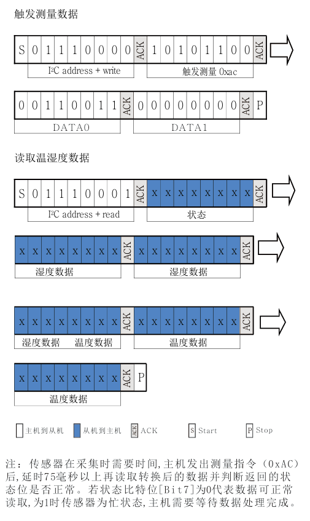

信号转换：

相对湿度转换

相对湿度 RH 都可以根据 SDA 输出的相对湿度信号 \(S_{RH}\) 通过如下公式计算获得（结果以 %RH 表示）。

$$
RH[\%] = \left( \frac{S_{RH}}{2^{20}} \right) * 100\%
$$

温度转换

温度 T 都可以通过将温度输出信号 \(S_{T}\) 代入到下面的公式计算得到（结果以温度 \(^{\circ}C\) 表示）：

$$
T(^{\circ}C) = \left( \frac{S_{T}}{2^{20}} \right) * 200 - 50
$$

湿度已经没啥问题了，但是温度的问题还是很大，读不出来。

```c
/* ******************** AHT10.H ******************** */
#include "bsp_i2c.h"

#ifndef __AHT10_H__
#define __AHT10_H__

// WRITE MODE
#define WRITE 0
// READ MODE
#define READ 1
// Addr of AHT10
#define AHT10_ADDR 0x70
// AHT10 WRITE MODE
#define WRITEMODE (AHT10_ADDR | WRITE)
// AHT10 READ MODE
#define READMODE (AHT10_ADDR | READ)

// 指示初始化
#define INIT_CMD 0xE1 // 初始化命令
// 指示读取温度
#define READ_TEMP 0xAC // 首先发送以指示读取温度
#define PARA0     0x33 // 再发送以指示读取温度
#define PARA1     0x00 // 最后发送以指示读取温度
// 指示软复位
#define SOFT_REBOOT 0xBA
// AHT10总共会传入6个字节的数据
// 其中5个字节是湿度和温度
#define DATA_BYTES 6
// 2^20 的值为 1,048,576(1024 * 1024)
#define BASE 0x100000

/// @brief Start I2C
void I2C_Start();

/// @brief Stop I2C
void I2C_Stop();

/// @brief Send a bit signal(ACK/NACK) to I2C
/// @param ack the signal to Slaver, 1: NACK; 0: ACK
void I2C_Send_Ack(uint8_t ack);

/// @brief Wait for an ACK signal from I2C
/// @return ack the signal from Slaver, 1: NACK; 0: ACK
char I2C_Wait_Ack();

/// @brief Send a byte to I2C
/// @param byte the byte to send
void I2C_Send_Byte(uint8_t byte);

/// @brief Read a byte from I2C
/// @return the byte from I2C Slaver
uint8_t I2C_Read_Byte();

/// @brief Initialize AHT10
static void AHT10_Init();

/// @brief Initialize AHT10 for reading temperature and humidity
static void AHT10_Init_Read_Mode();

/// @brief Read data from AHT10 and write into recvBuffer
/// @param recvBuffer the buffer to store the data
static void AHT10_Write_recvBuffer(uint8_t *recvBuffer);

/// @brief
void AHT10_readTemperature();

/// @brief Soft Reset
void AHT10_Soft_Reset();

#endif
/* ******************** AHT10.H ******************** */
```

```c
/* ******************** AHT10.C ******************** */
#include "aht10.h"
#include "bsp_i2c.h"

#define delay_us(X) delay_cycles((CPUCLK_FREQ / 1000000) * (X))

void I2C_Start()
{
    SDA_OUT(); // 设置SDA为输出模式
    // 先确保都是高电平
    SCL(1);
    SDA(1);
    // 等待5us
    delay_us(5);
    // 在SCL=1时拉低SDA
    SDA(0);
    delay_us(5);
    // 开始传输数据
    SCL(0);
    delay_us(5);
}

void I2C_Stop()
{
    SDA_OUT();
    SCL(0);
    SDA(0);
    // 这里可以加入 delay_us(5);
    // 以保证过了 5us
    // 不过你要是确定两个机器周期能满足5us的话也行
    SCL(1);
    delay_us(5);
    SDA(1);
    delay_us(5);
}

void I2C_Send_Ack(uint8_t ack)
{
    SDA_OUT();
    SCL(0);
    SDA(0);
    delay_us(5);
    if (!ack)
        SDA(0);
    else
        SDA(1);
    SCL(1);
    delay_us(5);
    SCL(0);
    SDA(0);
}

char I2C_Wait_Ack()
{
    char ack = 0; // ack接收位
    // ack在第9个字节
    uint8_t ack_flag = 9;
    SDA_IN();
    SDA(1);
    delay_us(5);
    SCL(1);
    delay_us(5);

    while ((SDA_GET()) && (ack_flag)) {
        ack_flag--;
        delay_us(5);
    }
    // 无应答
    if (ack_flag == 0) {
        I2C_Stop();
        return 1;
    } else { // 有应答
        SCL(0);
        SDA_OUT();
    }
    return ack;
}

void I2C_Send_Byte(uint8_t byte)
{
    uint8_t mask; // 掩码
    SDA_OUT();    // SDA输出模式
    SCL(0);
    // 数据从高到低
    for (mask = 0x80; mask; mask >>= 1) {
        if (byte & mask) {
            SDA(1);
        } else {
            SDA(0);
        }
        delay_us(1);
        SCL(1);
        delay_us(5);
        SCL(0);
        delay_us(5);
    }
}

uint8_t I2C_Read_Byte()
{
    uint8_t mask;
    uint8_t data = 0;
    SDA_IN();
    // 数据从高到低
    for (mask = 0x80; mask; mask >>= 1) {
        SCL(0);
        delay_us(5);
        SCL(1);
        delay_us(5);
        if (SDA_GET() == 1) {
            data |= mask;
        }
    }
    SCL(0);
    return data;
}

/// @brief Initialize AHT10
static void AHT10_Init()
{

    delay_us(50000);
    I2C_Start();

    I2C_Send_Byte(WRITEMODE);
    I2C_Send_Byte(INIT_CMD);
    I2C_Send_Byte(0x08);
    I2C_Send_Byte(0x00);

    delay_us(50000);
    I2C_Stop();
}

/// @brief Initialize AHT10 for reading temperature and humidity
static void AHT10_Init_Read_Mode()
{
    I2C_Start();

    I2C_Send_Byte(WRITEMODE);
    I2C_Wait_Ack();
    // See Datasheet for details
    I2C_Send_Byte(READ_TEMP);
    I2C_Wait_Ack();
    // actually PARA0 and PARA1 are useless
    I2C_Send_Byte(PARA0);
    I2C_Wait_Ack();
    I2C_Send_Byte(PARA1);
    I2C_Wait_Ack();

    I2C_Stop();
}

/// @brief Write data into recvBuffer
/// @param recvBuffer the buffer to store the data
static void AHT10_Write_recvBuffer(uint8_t *recvBuffer)
{
    uint8_t i = 0;

    // Waiting for measuring and keep asking if finished
    do {
        delay_us(8000); // Waiting for sensor
        I2C_Start();
        I2C_Send_Byte(READMODE);
    } while (I2C_Wait_Ack()); // Keep query till not busy

    for (i = 0; i < DATA_BYTES; i++) {
        recvBuffer[i] = I2C_Read_Byte();
        // When last time read, send NACK to end this session
        I2C_Send_Ack((i == (DATA_BYTES - 1)) ? 1 : 0);
    }
    I2C_Stop(); // End this session
}

void AHT10_readTemperature()
{
    uint8_t status;
    // Store data here
    uint8_t recvBuffer[DATA_BYTES] = {0x00};

    AHT10_Init();
    AHT10_Init_Read_Mode();             // Initialize read mode
    AHT10_Write_recvBuffer(recvBuffer); // Write into recvBuffer

    uint32_t humidity    = ((recvBuffer[0] << 12) | (recvBuffer[1] << 4) | (recvBuffer[2] >> 4));
    uint32_t temperature = (((recvBuffer[2] & 0x0F) << 16) | (recvBuffer[3] << 8) | (recvBuffer[4]));
    printf("\r\n");
    printf("--> %x, %x, %x\n", recvBuffer[0], recvBuffer[1], recvBuffer[2]);
    // FIXME: 温度不显示
    printf("--> %x, %x, %x\n", recvBuffer[2], recvBuffer[3], recvBuffer[4]);
    printf("-> HUMI: %d\r\n", (uint32_t)(humidity * 100.0 / BASE));
    printf("-> TEMP: %d\r\n", (int)(temperature * 200.0 / BASE - 50.0));

    AHT10_Soft_Reset();
}

void AHT10_Soft_Reset()
{
    I2C_Start();
    I2C_Send_Byte(AHT10_ADDR << 1 | WRITE);
    I2C_Wait_Ack();
    I2C_Send_Byte(SOFT_REBOOT);
    I2C_Wait_Ack();
    I2C_Stop();
}
/* ******************** AHT10.C ******************** */
```

```c
/* ******************** BSP_I2C.H ******************** */
#ifndef __BSP_I2C_H__
#define __BSP_I2C_H__

#include "../ti_msp_dl_config.h"
#include "stdio.h"

// Set SDA to output
void SDA_OUT();
// Set SDA to input
void SDA_IN();
// Get SDA status
uint8_t SDA_GET();

// SDA and SCL output
#define SDA(x) ((x) ? DL_GPIO_setPins(I2C_PORT, I2C_SDA_PIN) : (DL_GPIO_clearPins(I2C_PORT, I2C_SDA_PIN)))
#define SCL(x) ((x) ? DL_GPIO_setPins(I2C_PORT, I2C_SCL_PIN) : (DL_GPIO_clearPins(I2C_PORT, I2C_SCL_PIN)))

#endif
/* ******************** BSP_I2C.H ******************** */
```

```c
/* ******************** BSP_I2C.C ******************** */
#include "bsp_i2c.h"

// Set SDA to output
void SDA_OUT()
{
    DL_GPIO_initDigitalOutput(I2C_SDA_IOMUX);
    DL_GPIO_setPins(I2C_PORT, I2C_SDA_PIN);
    DL_GPIO_enableOutput(I2C_PORT, I2C_SDA_PIN);
}

// Set SDA to input
void SDA_IN()
{
    DL_GPIO_initDigitalInput(I2C_SDA_IOMUX);
}
// Get SDA status
uint8_t SDA_GET()
{
    return (DL_GPIO_readPins(I2C_PORT, I2C_SDA_PIN) & I2C_SDA_PIN) > 0 ? 1 : 0;
}
/* ******************** BSP_I2C.C ******************** */
```

# SPI

## SPI 介绍

**SPI**（Serial Peripheral Interface）**是一种同步串行通信协议，用于在微控制器和外部设备之间进行数据传输。它由一个主设备**（通常是微控制器MCU）**和一个或多个从设备组成，即一主多从模式**。它**通常用于短距离、高速、全双工的通信**，它在许多嵌入式系统和电子设备中被广泛应用，如存储器芯片、传感器、显示器驱动器、无线模块等。

在SPI协议中，主设备是通信的发起方和控制方，而从设备则是被动接收和响应主设备的命令和数据。主设备通过时钟信号来同步数据传输，同时使用多个双向数据线来实现数据的传输和接收。

**SPI协议是一种全双工通信方式，意味着主设备和从设备可以同时发送和接收数据**。它还使用一种选择信号（通常称为片选或使能信号），用于选择与主设备进行通信的特定从设备。

1. 主设备通过MOSI线向从设备发送数据。在每个时钟周期中，主设备将一个位发送到MOSI线上，从设备在下一个时钟周期中读取该位。
2. 从设备通过MISO线向主设备发送数据。在每个时钟周期中，从设备将一个位发送到MISO线上，主设备在下一个时钟周期中读取该位。
3. 数据传输可以是全双工的，即主设备和从设备可以同时发送和接收数据。
4. 数据传输的长度可以是可变的，通常以字节为单位。
5. 数据传输可以是单向的，即主设备只发送数据或只接收数据。
6. 数据传输可以是多主设备的，即多个主设备可以与多个从设备进行通信。

（MOSI应该是Master Output Slave Input）

## SPI 的硬件接口

SPI主要使用4根线，时钟线（SCLK），主输出从输入线（MOSI），主输入从输出线（MISO）和片选线（CS）。

| 通信线 | 说明                                                                                                                  |
| ------ | --------------------------------------------------------------------------------------------------------------------- |
| SCLK   | 时钟线，也叫做SCK。由主机产生时钟信号。                                                                               |
| MOSI   | 主设备输出从设备输入线，也叫做SDO。意为主机向从机发送数据。                                                           |
| MISO   | 主设备输入从设备输出线，也叫做SDI。意为主机接收从机的数据。                                                           |
| CS     | 片选线，也叫做NSS。从机使能信号，由主机控制。当我们的主机控制某个从机时，需要将从机对应的片选引脚电平拉低或者是拉高。 |


**主设备是通过片选线选择要与之通信的从设备**。**每个从设备都有一个片选线，当片选线为低电平时，表示该从设备被选中**。（也有一些设备以高电平有效，**需要根据其数据手册确定**）。**主设备通过控制时钟线的电平来同步数据传输**。时钟线的**上升沿和下降沿用于控制数据的传输和采样**。SPI的主从接线方式需要对应，**主从机设定后身份固定**。

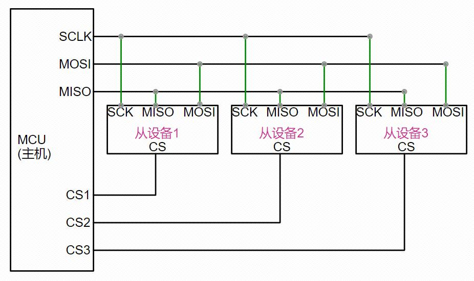

## SPI 的模式选择

SPI协议定义了多种传输模式，也称为SPI模式或时序模式，用于控制数据在时钟信号下的传输顺序和数据采样方式。SPI的传输模式主要由两个参数决定：时钟极性 (CKPL) 和相位 (CKPH)。 时钟极性 (CKPL)：**时钟极性定义了时钟信号在空闲状态时的电平**。

### 各信号说明
- `CKPL = 0`：时钟信号在空闲状态时为低电平。
- `CKPL = 1`：时钟信号在空闲状态时为高电平。

时钟相位（`CKPH`）：相位定义了数据采样和更新发生在时钟信号的哪个边沿上。
- `CKPH = 0`：数据采样发生在时钟的第一个边沿，数据更新发生在第二个边沿。
- `CKPH = 1`：数据采样发生在时钟的第二个边沿，数据更新发生在第一个边沿。

以下是常见的SPI模式：
1. **模式0（`CKPL=0`，`CKPH=0`）**：
    - 时钟极性（Clock Polarity）为0，表示时钟空闲状态为低电平。
    - 时钟相位（Clock Phase）为0，表示数据在时钟信号的第一个边沿（时钟上升沿）进行采样和稳定。
2. **模式1（`CKPL=0`，`CKPH=1`）**：
    - 时钟极性为0，时钟空闲状态为低电平。
    - 时钟相位为1，数据在时钟信号的第二个边沿（时钟下降沿）进行采样和稳定。
3. **模式2（`CKPL=1`，`CKPH=0`）**：
    - 时钟极性为1，时钟空闲状态为高电平。
    - 时钟相位为0，数据在时钟信号的第一个边沿（时钟下降沿）进行采样和稳定。
4. **模式3（`CKPL=1`，`CKPH=1`）**：
    - 时钟极性为1，时钟空闲状态为高电平。
    - 时钟相位为1，数据在时钟信号的第二个边沿（时钟上升沿）进行采样和稳定。 

**选择SPI模式的决策通常取决于从设备的规格要求和通信协议**。不同的设备可能采用不同的模式，所以**在与特定从设备通信之前，必须了解从设备所需的SPI模式**。如果没有明确指定SPI模式，**通常可以根据从设备的规格手册或通信协议选择最常见的模式0或模式3进行尝试**。此外，还**需要注意SPI模式时钟的频率限制**，以确保主设备和从设备之间的时钟频率匹配。

## 软件SPI与硬件SPI

SPI与IIC类似，都分有软件SPI和硬件SPI，软件SPI部分不再讲解，本章节着重讲解硬件SPI。

MSPM0G系列中的串行外设接口 (SPI) 外设支持以下主要特性：

- 支持 ULPCLK/2 比特率，最高可达 32Mb/s（在控制器和外设模式下）
- 可配置为控制器或外设（主机和从机）
- 控制器和外设的可配置芯片选择（CS引脚选择）
- 可编程时钟预分频器和比特率
- 可编程数据帧大小从 4 位到 16 位（控制器模式）和 7 位到 16 位（外设模式）
- 支持 PACKEN 功能，允许将 2 个 16 位 FIFO 条目打包为一个 32 位值以提高 CPU 性能
- 发送和接收 FIFO（4 个条目，每个条目 16 位），支持 DMA 数据传输
- 支持 TI 模式、Motorola 模式和 National Microwire 格式

**使用硬件SPI的优势**：
- **支持中断和DMA**：硬件SPI可以与中断控制器和DMA控制器配合使用，实现数据的高效处理和传输。
- **硬件缓冲区**：硬件SPI具有内部缓冲区，可以在主机和外设之间进行数据中转，提高数据的传输效率。
- **高速传输**：硬件SPI使用硬件模块进行数据传输，速度通常比软件实现的SPI更快。

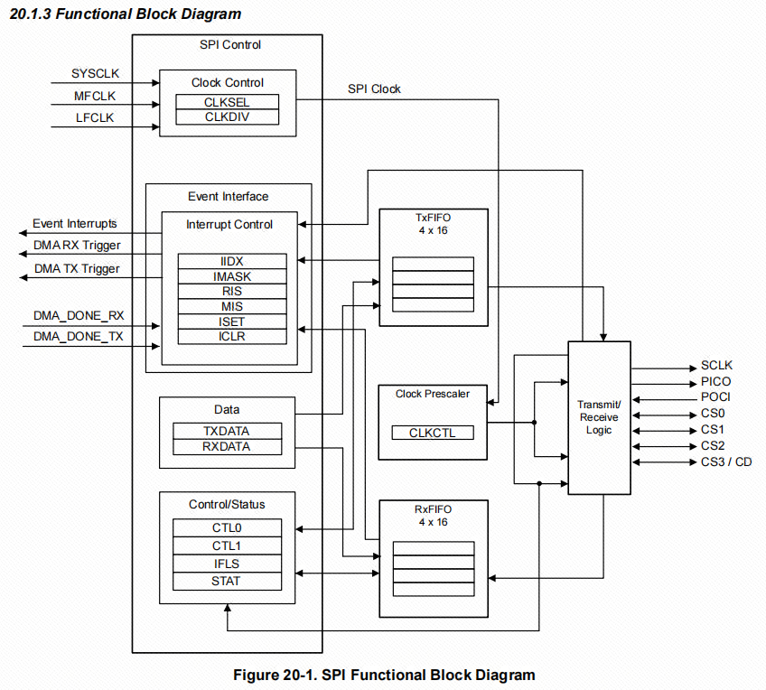

## SPI协议的优劣势

### 优势

- **简单易实现**：SPI协议的硬件和软件实现相对简单，通信过程清晰明了，易于理解和调试。这使得SPI协议在嵌入式系统中得到广泛应用。
- **高速传输**：SPI协议可以实现高速的数据传输。由于SPI是点对点的通信协议，数据直接在主设备和从设备之间传输，无需地址和冲突检测，发送与接收分别在不同的信号线上，因此具有较高的传输速度。 
- **灵活性强**：SPI协议允许主设备与多个从设备进行通信。主设备可以通过选择从设备的片选信号来与特定设备通信，从而实现多设备的串行通信。

### 劣势

- **信号线长度有限**：由于SPI协议没有特定的规范限制信号线的长度，较长的信号线可能会引入稳定性和传输速度方面的问题。在长距离通信时需要考虑信号传输的可靠性。 
- **信号线数量多**：SPI协议在每个从设备之间都需要一条单独的控制线，因此对于连接大量设备的系统来说，所需的信号线数量会相对较多。 
- **无手握通信**：SPI协议没有提供像I2C协议那样的“握手”机制，即从设备无法主动向主设备发送数据请求。因此，对于需要主动主设备交互的应用场景来说，SPI可能不太适合。 


## SPI协议的应用领域

SPI是一种常见的串行通信接口，广泛应用于数字和模拟电子设备之间的通信。它具有简单、高效和灵活的特点，因此与I2C一样，在各种领域都被广泛采用。

在存储器和闪存芯片领域，SPI协议被用于与存储器芯片（如EEPROM、SRAM）和闪存芯片（如SD卡、SPI Flash）进行通信。通过SPI协议，这些芯片可以与主控制器进行数据交换，实现数据的高速读写和存储。

SPI协议在显示器和液晶屏领域也有广泛的应用。许多液晶显示器和OLED显示器使用SPI协议传输图像数据和控制信号。

还有传感器领域、通信领域等，需要注意的是，SPI协议是一种点对点的通信协议，一般通过主从架构进行通信，其中一个设备充当主设备，其他设备充当从设备。

## SPI实验介绍

以W25Q128-FLASH存储模块作为实验案例。通过硬件SPI的方式与其进行通信，实现数据的读写。

### W25Q128介绍

W25Q128是一种常见的串行闪存器件，它采用SPI（Serial Peripheral Interface）接口协议，具有高速读写和擦除功能，可用于存储和读取数据。W25Q128芯片容量为**128 Mbit（16 MB）**，其中名称后的数字代表不同的容量选项。不同的型号和容量选项可以满足不同应用的需求，比如W25Q16、W25Q64、W25Q128等。通常被用于嵌入式设备、存储设备、路由器等高性能电子设备中。 **W25Q128闪存芯片的内存分配是按照扇区（Sector）和块（Block）进行的，每个扇区的大小为4KB，每个块包含16个扇区，即一个块的大小为64KB**。

### W25Q128引脚功能说明

| 引脚 | 功能描述                                                                                                                                         |
| ---- | ------------------------------------------------------------------------------------------------------------------------------------------------ |
| CLK  | 从外部获取时间，为输入输出功能提供时钟                                                                                                           |
| DI   | 标准SPI使用单向的DI，来串行的写入指令、地址，或者数据到FLASH中，在时钟的上升沿。                                                                 |
| DO   | 标准SPI使用单向的DO，来从处于下降边沿时钟的设备，读取数据或者状态。                                                                              |
| WP   | 防止状态寄存器被写入                                                                                                                             |
| HOLD | 当它有效时允许设备暂停，低电平：DO引脚高阻态，DI、CLK引脚的信号被忽略。高电平：设备重新开始，当多个设备共享相同的SPI信号的时候该功能可能会被用到 |
| CS   | CS高电平时其他引脚成高阻态，处于低电平时，可以读写数据                                                                                           |

### 开发板（主机）与W25Q128（从机）连接关系

| 开发板（主机）引脚 | W25Q128（从机）引脚 | 说明               |
| ------------------ | ------------------- | ------------------ |
| PB6                | CS(NSS)             | 片选线             |
| PB9                | CLK                 | 时钟线             |
| PB7                | DO(IO1)(MISO)       | 主机输入从机输出线 |
| PB8                | DI(IO0)(MOSI)       | 主机输出从机输入线 |
| GND                | GND                 | 电源线             |
| VCC                | 3V3                 | 电源线             |

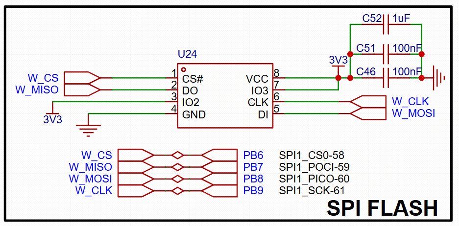

需要注意的是，**我们使用的是硬件SPI方式驱动W25Q128，因此我们需要确定我们设置的引脚是否有硬件SPI外设接口**。在数据手册中，**PB6~PB9可以复用为SPI1的4根通信线**。

这里需要注意的是**PICO，表示的是外设输入控制器输出**，即**对应SPI中的MOSI**。**POCI表示外设输出控制器输入，即对应MISO**。

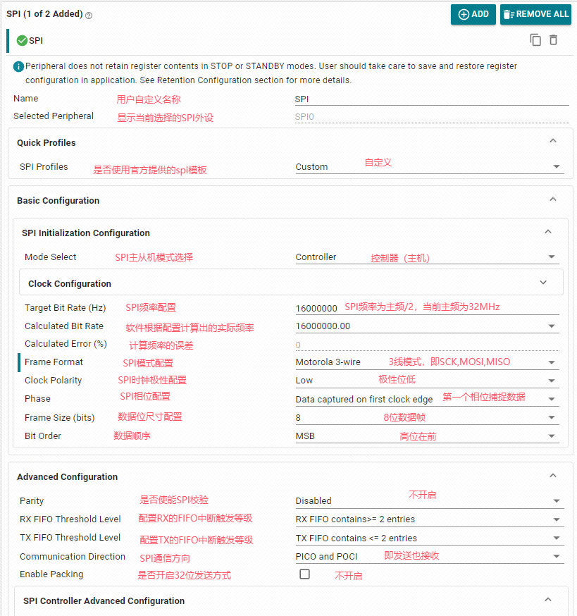

这里**需要注意，由于大多数的SPI协议中，整个时序里在发送接收时片选是要一直拉低的，而SPI外设的片选在每次发送和接收完一帧后会拉高**，
**所以CS片选线需要用MCU的IO口独立控制，没有办法使用SPI外设的CS管脚**。这里使用GPIO的方式（**软件方式**）去控制CS引脚的输出。

新建一个GPIO。命名为CS，引脚选择我们现在接入模块CS的引脚PB6。其配置如下：

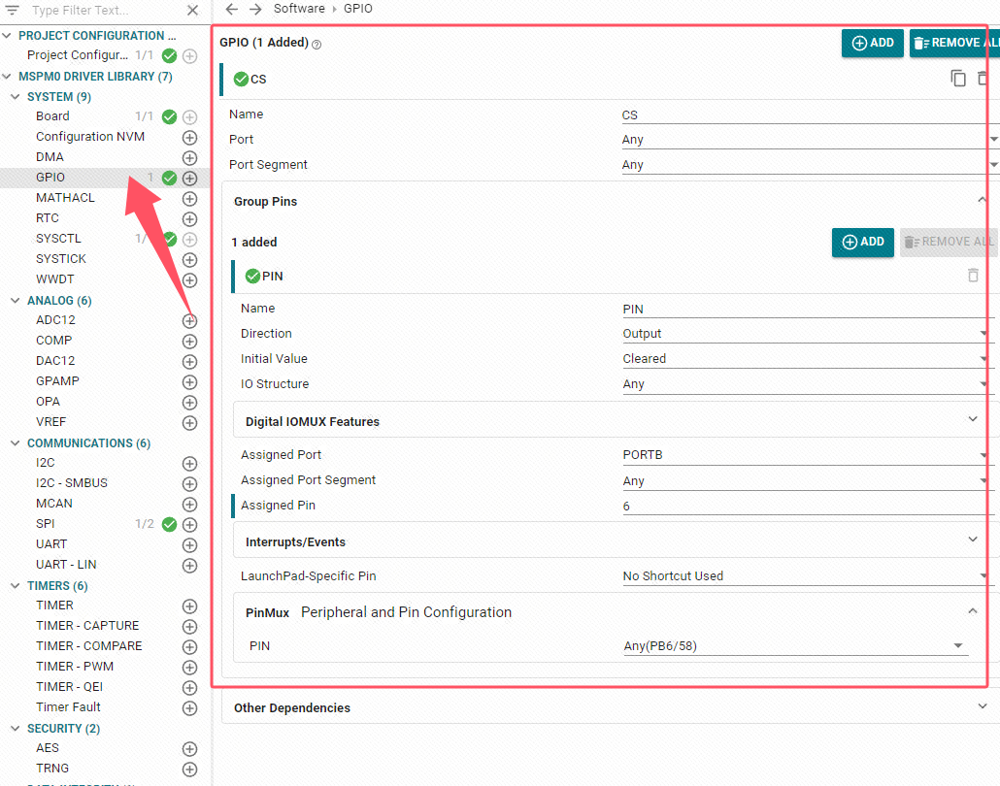

串口配置采用和之前一样的配置即可（我们要看串口数据）

### W25Q128的代码讲解

#### SPI协议的使用

```c
#ifndef _BSP_W25Q128_H__
#define _BSP_W25Q128_H__

#include "ti_msp_dl_config.h"

// CS引脚的输出控制
// x = 0时输出低电平
// x = 1时输出高电平
#define SPI_CS(x)  ( (x) ? DL_GPIO_setPins(CS_PORT,CS_PIN_PIN) : DL_GPIO_clearPins(CS_PORT,CS_PIN_PIN) )

uint16_t W25Q128_readID(void); // 读取W25Q128的ID
void W25Q128_write(uint8_t* buffer, uint32_t addr, uint16_t numbyte);      // W25Q128写数据
void W25Q128_read(uint8_t* buffer,uint32_t read_addr,uint16_t read_length);// W25Q128读数据
#endif
```

SPI的初始化在SYSCONFIG中已经配置完成，但是我们还**需要准备SPI读写步骤**。

**为确保发送和接收数据成功，在发送时，需要确保发送缓冲区里的数据发送完毕，即发送缓冲区为空，才可以进行下一个数据的发送**；**在接收时，需要确保接收缓冲区里有数据才能够进行接收**。

在bsp_w25q128.c中补充以下代码:

```c
uint8_t spi_read_write_byte(uint8_t content)
{
    uint8_t data = 0;

    // 发送数据
    DL_SPI_transmitData8(SPI_INST, content);
    // 等待SPI总线空闲
    while (DL_SPI_isBusy(SPI_INST));
    // 接收数据
    data = DL_SPI_receiveData8(SPI_INST);
    // 等待SPI总线空闲
    while (DL_SPI_isBusy(SPI_INST));

    return data;
}
```

#### 读取设备ID的示例

```c
// 读取芯片ID
// 返回值如下:
// 0XEF13,表示芯片型号为W25Q80
// 0XEF14,表示芯片型号为W25Q16
// 0XEF15,表示芯片型号为W25Q32
// 0XEF16,表示芯片型号为W25Q64
// 0XEF17,表示芯片型号为W25Q128
// 读取设备ID
uint16_t W25Q128_readID()
{
    uint16_t temp = 0;
    // 将CS端拉低为低电平
    SPI_CS(0);
    // 发送指令90h
    spi_read_write_byte(0x90); // 发送读取ID命令
    // 发送地址  000000H
    spi_read_write_byte(0x00);
    spi_read_write_byte(0x00);
    spi_read_write_byte(0x00);

    // 接收数据
    // 接收制造商ID
    temp |= spi_read_write_byte(0xFF) << 8;
    // 接收设备ID
    cc
    // 恢复CS端为高电平
    SPI_CS(1);
    // 返回ID
    return temp;
}
```

至于为什么是 `temp |= spi_read_write_byte(0xFF);`，AI给出的回答是：

> 在SPI（串行外设接口）通信中，0xFF（十六进制）是一个特殊的值，通常用于读取数据。原因如下：
> 1. **全高电平**: 0xFF的二进制表示是11111111，**这意味着所有的数据线在发送时都保持高电平。这可以确保在读取数据时不会对总线上的其他设备产生干扰**。
> 2. **无意义数据**: 在许多SPI设备中，发送0xFF通常被视为无意义的数据，因此设备不会对其进行任何处理。这使得0xFF成为读取操作的理想选择，因为它不会影响设备的正常工作。
> 3. **通用性**: **0xFF是一个通用值，适用于大多数SPI设备**。使用0xFF读取数据可以确保代码的兼容性和可移植性。
> 因此，在读取W25Q128等SPI闪存设备的数据时，通常使用0xFF作为发送的数据，以便从设备中读取数据。

#### 写入数据流程案例

写入数据步骤如下图。**在FLASH存储器中，每次写入数据都要确保其中的数据为`0xFF`**，是**因为FLASH存储器的写入操作是一种擦除-写入操作**。

**擦除操作是将存储单元中的数据全部置为1，也就是`0xFF`**。**然后，只有将要写入的数据位为0的位置才能进行写入操作**，将其改变为0。**这个过程是不可逆的**，所以**在写入数据之前，需要先确保要写入的位置为`0xFF`，然后再写入数据**。

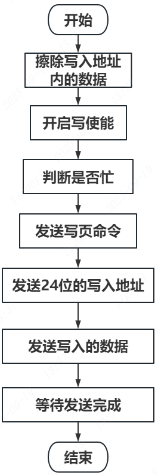

这种擦除-写入的操作是由于FLASH存储器的特殊结构决定的。FLASH存储器中的存储单元是通过电子门的状态进行控制的，每个门可以存储一个二进制位。擦除操作需要将门的状态恢复为初始状态，即全部为1。然后通过改变门的状态，将需要存储的数据位改变为0。所以在写入数据之前，需要确保存储单元的状态为1，以便进行正确的写入操作。

另外，**FLASH存储器的擦除操作是以块为单位进行的，而不是单个存储单元。所以如果要写入数据的位置上已经有数据存在，需要进行擦除操作，将整个块的数据都置为1，然后再写入新的数据**。这也是为什么在FLASH写入数据之前需要确保其中的数据为0xFF的原因。

#### 写使能

**在进行写入操作之前，需要使用到写使能**（Write Enable）命令。**写使能的作用是启用对闪存芯片的写入操作**。

**在默认情况下，闪存芯片处于保护状态，禁止对其进行写入操作**，主要是为了防止误操作对数据的损坏。写使 能命令可以解除这种保护状态，将闪存芯片设置为可以进行写入操作。

**通过发送写使能命令，闪存芯片将进入一个特定的状态，使得后续的写入命令可以被接受和执行**。在写入数据之前，需要发送写使能命令来确保闪存芯片处于可写状态。然后，才能发送写入命令将数据写入指定的存储位置。 使用写使能命令可以有效地保护数据的完整性和安全性，防止误操作对数据进行写入或者修改。同时，也能够确保 数据的一致性，避免写入过程中出现错误或者干扰。因此，在使用W25Q128进行写入操作时，需要先发送写使能命令，以确保闪存芯片处于可写状态，再进行数据的写入操作。

操作步骤：

1. 将CS端拉低为低电平；
2. 发送指令 06H（0000_0110）；
3. 恢复CS端为高电平； 

```c
void W25Q128_write_enable()
{
    SPI_CS(0);  // 拉低CS
    // 写入0x06
    spi_read_write_byte(0x06);
    SPI_CS(1);  // 拉高CS
}
```

#### 忙判断

在W25Q128的数据手册中，有3个状态寄存器，**可以判断当前W25Q128是否正在传输、写入、读取数据等**，我们每一次要对W25Q128进行操作时，**需要先判断W25Q128是否在忙**。如果在忙的状态，我们去操作W25Q128，很可能会导致数据丢失，并且操作失败。**而判断是否忙，是通过`状态寄存器1`的`S0`为进行判断，状态寄存器1的地址为`0X05`**。

读取状态寄存器的步骤为：

1. 拉低CS端为低电平；
2. 发送指令05h（0000_0101）；
3. 接收状态寄存器值；
4. 恢复CS端为高电平；

```c
void W25Q128_wait_busy()
{
    uint8_t byte = 0;
    do {
        SPI_CS(0);                 // 拉低CS
        spi_read_write_byte(0x05); // 发送指令0x05
        // 接收状态寄存器值
        byte = spi_read_write_byte(0xFF);
        SPI_CS(1); // 拉高CS
        // 判断BUSY位是否为1 如果为1说明在忙，重新读写BUSY位直到为0
    } while (byte & 0x01);
}
```

#### 扇区擦除

W25Q128闪存芯片的**内存分配是按照扇区（Sector）和块（Block）进行的，每个扇区的大小为4KB，每个块包含16个扇区，即一个块的大小为64KB**。

W25Q128**闪存芯片的扇区擦除是指将某个特定扇区中的数据全部擦除的操作。擦除操作会将扇区中的所有数据都置为1（即0xFF），恢复到初始状态**。下面是W25Q128扇区擦除的一般流程：

- 扇区擦除流程

  1. **写使能（Write Enable）**：首先，要确保闪存芯片处于可写状态。发送写使能命令，将闪存芯片设置为可写模式，解除写保护。
  2. **扇区擦除设置（Sector Erase Setup）**：向W25Q128发送扇区擦除设置命令，并指定要擦除的扇区地址。W25Q128支持多种扇区擦除命令，可以根据需要选择擦除一个或多个扇区。 
  3. **扇区擦除确认（Sector Erase Confirm）**：等待扇区擦除确认。W25Q128芯片进行擦除操作需要一定的时间，具体时间可参考该芯片的规格书。在擦除操作进行期间，通常会读取状态寄存器忙位的方法来确定擦除是否完成。过早地读取擦除操作中的数据可能会导致不正确的结果。 
  4. **扇区擦除完成**：当扇区擦除成功后，状态寄存器将指示擦除操作完成。此时，该扇区中的数据已经全部被擦除为1。

扇区擦除操作是一种高级操作，需要小心谨慎地使用。在实际应用中，通常会结合编程逻辑和相应的控制器来管理闪存芯片的擦除和写入操作，以确保数据的安全性和完整性。

- 擦除注意事项

在使用扇区擦除操作时，有几个注意事项需要特别关注：

  1. **擦除范围**：要确保擦除的范围是正确的，仅擦除目标扇区，避免误擦除其他扇区中的数据。在执行擦除操作之前，请务必仔细检查要擦除的扇区地址，并确保没有错误。 
  2. **数据备份**：由于扇区擦除操作将数据全部擦除为1（0xFF），在执行擦除之前，应该确保重要数据已经备份。擦除后，数据将无法恢复，因此在执行重要数据的扇区擦除操作之前，请务必做好数据备份的工作。 


扇区擦除的时序图如下：

1. 拉低CS端为低电平；
2. 发送指令20h（0010_0000）；
3. 发送24位的扇区首地址；
4. 恢复CS端为高电平；

下面的代码增加了一些忙等待的操作

```c
void W25Q128_erase_sector(uint32_t addr)
{
    // 计算扇区号，一个扇区4KB=4096
    addr *= 4096;

    W25Q128_write_enable(); // 写使能
    W25Q128_wait_busy();    // 判断忙，如果忙则一直等

    SPI_CS(0);

    spi_read_write_byte(0x20); // 发送指令0x20
                               // 发送24位扇区地址的高8位
    spi_read_write_byte((uint8_t)((addr) >> 16));
    // 发送24位扇区地址的中8位
    spi_read_write_byte((uint8_t)((addr) >> 8));
    // 发送24位扇区地址的低8位
    spi_read_write_byte((uint8_t)addr);

    SPI_CS(1);
    // 等待擦除完成
    W25Q128_wait_busy();
}
```

#### 写入数据

现在写入数据的前置步骤：擦除数据->写使能->判断忙 我们都完成了，只剩下将数据写入到对应地址中保存即可。

```c
void W25Q128_write(uint8_t *buffer, uint32_t write_addr, uint16_t numbyte)
{
    uint32_t i = 0;
    // 擦除扇区
    W25Q128_erase_sector(write_addr / 4096);
    // 写使能
    W25Q128_write_enable();
    // 等待擦除完成
    W25Q128_wait_busy();
    // 拉低CS
    SPI_CS(0);
    // 发送指令0x02
    spi_read_write_byte(0x02);
    // 发送24位扇区地址的高8位
    spi_read_write_byte((uint8_t)((write_addr) >> 16));
    // 发送24位扇区地址的中8位
    spi_read_write_byte((uint8_t)((write_addr) >> 8));
    // 发送24位扇区地址的低8位
    spi_read_write_byte((uint8_t)write_addr);
    // 发送数据
    for (i = 0; i < numbyte; i++) {
        spi_read_write_byte(buffer[i]);
    }
    // 拉高CS
    SPI_CS(1);
    // 等待写入完成
    W25Q128_wait_busy();
}
```


#### 读取数据

读取数据的时序图如下：

1. 拉低CS端为低电平；
2. 发送指令03h（0000_0011）；
3. 发送24位读取数据地址；
4. 接收读取到的数据；
5. 恢复CS端为高电平；

```c
void W25Q128_read(uint8_t *buffer, uint32_t read_addr, uint16_t read_length)
{
    uint16_t i;
    // 拉低CS端为低电平
    SPI_CS(0);
    // 发送指令03h
    spi_read_write_byte(0x03);
    // 发送24位读取数据地址的高8位
    spi_read_write_byte((uint8_t)((read_addr) >> 16));
    // 发送24位读取数据地址的中8位
    spi_read_write_byte((uint8_t)((read_addr) >> 8));
    // 发送24位读取数据地址的低8位
    spi_read_write_byte((uint8_t)read_addr);
    // 根据读取长度读取出地址保存到buffer中
    for (i = 0; i < read_length; i++) {
        buffer[i] = spi_read_write_byte(0XFF);
    }
    // 恢复CS端为高电平
    SPI_CS(1);
}
```

# 有了扩展板之后

## [嘉立创课程](https://wiki.lckfb.com/zh-hans/tmx-mspm0g3507/training/easy-pid-beginner-kit/install.html)

### [配置工程模板](https://wiki.lckfb.com/zh-hans/tmx-mspm0g3507/training/easy-pid-beginner-kit/template-project.html)

嗯……这部分其实参考我的工作区就好

需要的文件和文件夹有：`.metadata`， `source`， `empty`， `syscfg.bat`

这些都要去TI的sdk目录去复制粘贴。

我加入这一章主要是因为它有`debug`的代码，以及初涉及到分层的思想。

文档讲的我都会用下 `#` 来标注，自己的碎碎念就不标注了。

#### 文件管理

分层架构：

为了不让代码变的乱七八糟，文件的管理使用的是三分层架构。

主要分为三层：最高层的应用层、中间层的协议层、底层的硬件层。

1. **硬件层（hardware）**

硬件层主要处理主控外设和外部模块的硬件程序，比如彩屏显示驱动、电机的PWM速度正反转控制、编码器数据获取、按键状态获取等等。

2. **中间层（middle）**

中间层主要是一些协议数据或开源库的处理，比如按键库、PID库等。还有把采集到的信号转换成具体的值，比如把ADC转换成电量。

3. **应用层（app）**

应用层主要是该项目的逻辑程序，比如该项目的UI、任务切换、具体的项目逻辑等。

**分层管理的优点**

- 功能清晰：每层干啥一目了然，改代码不用满世界找。
- 扩展性强：加个新功能？直接在应用层插一块就行，下层不动。
- 复用性高：底层写好了，别的项目也能拿来用。

**使用分层架构时，尽量做到每层只跟旁边的层打交道，互不越界。做着做着代码能力就提升了**。

在我们的工程下，新建三个文件夹，`hardware`、`middle`、`app`。

这里可以给我们的工程减一下身，删除掉 `gcc`、`iar`、`ticlang` 文件夹。

#### 调试功能配置

三种调试功能

1. 仿真器+keil的程序仿真功能，实时查看和修改内存、寄存器值，设置断点、单步执行等。这个不需要在代码进行配置，只需要选择一个支持仿真功能的仿真下载器即可。
2. 通过编写代码配置串口（UART）接口，与电脑进行串行通信，将程序运行时的信息、错误代码、调试日志等通过串口发送到电脑上的串口调试助手软件，从而实时监控程序运行状态。
3. 通过编写代码控制LED灯的闪烁频率、模式等，来表示系统的不同状态或错误代码。

需要配置SYSCTL等，具体的看[这里](https://wiki.lckfb.com/zh-hans/tmx-mspm0g3507/training/easy-pid-beginner-kit/template-project.html#%E9%85%8D%E7%BD%AE%E5%B7%A5%E7%A8%8B%E4%B8%BA-80mhz)

LED:

[debug_led_source_file](./empty/middle/mid_debug_led.c)

[debug_led_head_file](./empty/middle/mid_debug_led.h)

UART:

把名称改成UART_DEBUG，中断使能（只要Receive）且优先级设置为最低，RX=>PA11/57; TX=>PA10/56，其他不动

[debug_uart_source_file](./empty/middle/mid_debug_uart.c)

[debug_uart_head_file](./empty/middle/mid_debug_uart.h)

### 彩屏驱动

#### Destination 

- 1️⃣明白如何配置SPI外设；
- 2️⃣能够使用开发板的屏幕接口点亮1.9寸彩屏；

#### 屏幕驱动方式

屏幕从淘宝采购（其他的也行，哪个便宜上哪个）。1.9寸TFT液晶显示屏彩色模块模组屏 驱动ST7789V 分辨率170X320。

直接插上去就行了，屏幕。

通用 TFT 屏幕厂商为了降低开发难度，**一般会在屏幕中内置驱动芯片，同时引出引脚与外界进行通信**，常见的驱动芯片有 ST7735S、ILI9163、ST7789 等等。同时，TFT 屏幕在引出引脚方面，也**分为 SPI 串口引出（四线通信）、以及 8080 并口引出（8位）等方式**。

SPI总线包括四条逻辑线，定义如下：

- MISO：Master Input slave output 主机输入，从机输出（数据来自从机）；
- MOSI：Master output slave input 主机输出，从机输入（数据来自主机）；
- SCLK：Serial Clock 串行时钟信号，由主机产生发送给从机；
- NSS：Slave Select 片选信号，由主机发送，以控制与哪个从机通信，通常是低电平有效信号。

去找商家要资料就完了，屏幕就是SPI接口，使用 ST7789 驱动。

我把[资料](./1_9寸屏幕资料)导入进来了

#### 配置SPI外设

配置流程一般使用TFT屏幕驱动，都需要有以下几个步骤：

- 配置引脚，将TFT屏幕引脚适配SPI和GPIO；
- 配置底层硬件代码，编写SPI发送和接收数据函数；
- 移植厂家驱动，适配厂商屏幕驱动函数；

配置引脚，这个屏幕是用SPI接口进行通信，但是还有其他的引脚，接下来说一下各个引脚的安排：

| 引脚 | 引脚名称 | 功能描述                                                                       |
| ---- | -------- | ------------------------------------------------------------------------------ |
| GND  | GND      | 电源地，不用配置，直接插到开发板上                                             |
| VCC  | 3V3      | 电源VCC，不用配置，直接插到开发板上                                            |
| SCL  | PB9      | SPI接口的SCLK功能，需要配置为硬件SPI，SPI1_SCK                                 |
| SDA  | PB8      | SPI接口的MOSI功能，需要配置为硬件SPI，SPI1_PICO                                |
| RES  | PB10     | 屏幕复位引脚，低电平复位，高电平正常工作。配置为GPIO即可                       |
| DC   | PB11     | 确定发送给屏幕的是命令还是数据引脚，低电平是命令，高电平是数据。配置为GPIO即可 |
| CS   | PB14     | SPI接口的NSS功能，这里我们使用GPIO控制                                         |
| BLK  | PB26     | 屏幕的背光控制，高电平亮，低电平灭，用GPIO控制即可                             |

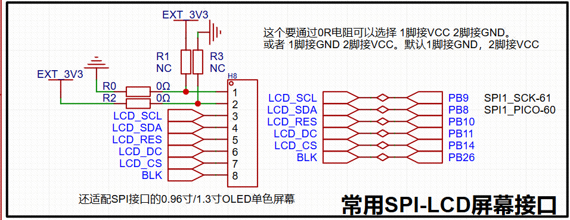

Gui界面配置啥的去[这里](https://wiki.lckfb.com/zh-hans/tmx-mspm0g3507/training/easy-pid-beginner-kit/screen-drives.html)看。代码同理，因为实在是太长了。

对了，此外**有个坑**，我推测这个坑是因为Keil默认GB2312编码，而Vscode默认UTF-8编码导致的。在 `LCD_ShowChinese` 函数中，判断是否为汉字的逻辑 `if (*s >= 128) {...; s+=2; ...;}` **这一句中的 `s += 2;` 是有问题的（如果你用Vscode开发的话），原因在于UTF-8编码中，汉字占用3个字节，而GB2312编码中汉字只占用两个字节**。**需要改成 `s += 3;` 才能让屏幕正常显示**。

TODO: 去学一下Bresham算法。

### 按键驱动 + 开源库

[文档链接](https://wiki.lckfb.com/zh-hans/tmx-mspm0g3507/training/easy-pid-beginner-kit/key-press-drives.html)

教的移植三方库是 FlexibleButton，我们只需要简单地复制粘贴，然后研究下别人的源码，接下来自定义自己的按键回调函数和一些逻辑注册进去就行。里面涉及到的代码去看文档和GitHub上的开源库即可。还有个叫 `memset` 的函数可能需要注意一下。

对了，发现了一个很巧妙的设计方案：

```c
typedef enum {
    BUTTON_UP = 0,
    BUTTON_LEFT,
    BUTTON_RIGHT,
    BUTTON_DOWN,
    BUTTON_MID, // 中间按键 新增加的，用来代替案例中开启电机的方案
    USER_BUTTON_MAX
} user_button_t;

// ...

void user_button_init(void)
{
    int i;

    /* 初始化按键数据结构 */
    memset(&user_button[0], 0x0, sizeof(user_button));

    user_button[BUTTON_UP].usr_button_read = button_up_read;                           // 按键读值回调函数
    user_button[BUTTON_UP].cb              = (flex_button_response_callback)btn_up_cb; // 按键事件回调函数

    user_button[BUTTON_LEFT].usr_button_read = button_left_read;                           // 按键读值回调函数
    user_button[BUTTON_LEFT].cb              = (flex_button_response_callback)btn_left_cb; // 按键事件回调函数
    // ...
}
```

枚举搭配数组，看起来会更加的直观好看，比起不知所云的 0 和 1来说不知道好了多少，虽然宏也能实现，但枚举可以自动+1，更方便些。

> 25/5/23-09:05:12：**我放弃了**，该死的vscode开发按键和彩屏的时候不知道发什么羊癫疯居然会冲突，完了加个 `printf` 居然正常了……各种奇奇怪怪的bug，嘉立创这个项目我用keil做，我受不了了🙂。
> 25/5/23-13:45:12：md keil 类型提示代码补全啥的都没有，我已经是离开了这些东西就会死的飞舞力😭
> 25/5/23-17:15:23：后来发现可以直接导入项目驱动，然后是正常的，推测只能是这里的什么配置污染环境了，那我换个目录好了。
> 25/5/23-19:23:32：然后经过我一番折腾，又搞定力😋，又可以用这个工作区开发力😋
> 25/5/23-19:24:46：**此外发现了一点，有可能是人家用Gui配置的东西你没配好**，有的时候真的是“show me the code”解千愁，Gui虽然舒服，但是太容易忽略小细节了。

官方例程的路径大多都是：

```c
// 哪怕这个头文件根本不在本文件夹内
#include "hw_motor.h"
```

**这个可以通过配置EIDE中`包含目录`（C/C++属性中）和`项目资源`解决**，配到那个文件夹去就行了。

只要你看Vscode的代码补全里面，在你 `#include` 的时候有相关的文件，那就算配成功了。

### [电机驱动](https://wiki.lckfb.com/zh-hans/tmx-mspm0g3507/training/easy-pid-beginner-kit/motor-drives.html)

这个不讲了，官方例程都没啥用，重要的应该只有那个驱动电机的真值表了。

### [编码器驱动](https://wiki.lckfb.com/zh-hans/tmx-mspm0g3507/training/easy-pid-beginner-kit/encoder-drives.html)

这个主要就是要理解通过霍尔传感器发送的A B相的脉冲来判断顺时针/逆时针转动的。

（注意，此时是单片机接收脉冲，要把ENCODER-A和ENCODER-B都配成Input）

然后在此基础上我们优先让A B相作为中断事件，每次A/B上升沿都去检测B/A相的高低电平，从而作为判断依据

文档有张图片，去看看，双向霍尔传感器发送的脉冲和顺逆时针的关系图。

然后我们可以配一个定时器（优先级不需要很高），接着把更新A B相一些参数的代码和按键驱动函数丢进去，美滋滋。

这里需要注意的是要配对定时器的倒计时方式，配成 **Periodic Down Count**！（例程给的是20ms倒计时，不过我觉得正着计时也没啥问题就是了）我一开始当了大傻X配了个 **One-shot Down Count**然后还在代码里面找问题……，我讨厌不带中文的Gui配置……

嗯，我试了一下，确实可以，Enable Interrupts改成Load Event（装载就触发中断），然后计时方式就选Periodic Up Count，最后灾区修改一下识别到中断的条件就行（中断函数改成`if( DL_TimerA_getPendingInterrupt(TIMER_TICK_INST) == DL_TIMER_IIDX_LOAD )`，也就是把最后的`ZERO`变成`LOAD`）。为了保证和官方案例的一致性，我再配回来好了。

### [UI与界面管理](https://wiki.lckfb.com/zh-hans/tmx-mspm0g3507/training/easy-pid-beginner-kit/ui-display.html)

TODO: 这个是扩展选项哦，移植LVGL库，就当熟悉一下LVGL以及为以后用其他芯片做出智能手表打基础力😋

文档教程自己看，我就不抄了（其实理解才是最重要的）

> 代码说明
> 将 X轴居中的圆角矩形字符串、任意位置的圆角矩形字符串、选择框一起使用，绘制首页界面。
> 在显示完成之前是处于熄屏状态（`LCD_BLK_Clear`），当屏幕的内容刷新好后，再打开背光（`LCD_BLK_Set`）。这样在用户看来就是较为丝滑的界面切换。

我说干啥一开始要熄屏呢，没想到是这个原因。

此外还有更新PID参数的一个要点——引入了懒加载机制，只有在数据更新时才会刷新屏幕。

详细的看[这个](https://wiki.lckfb.com/zh-hans/tmx-mspm0g3507/training/easy-pid-beginner-kit/ui-display.html#%E7%BB%98%E5%88%B6%E5%AE%9A%E9%80%9F%E9%A1%B5%E5%8F%82%E6%95%B0%E6%9B%B4%E6%96%B0%E6%98%BE%E7%A4%BA)底下的代码说明。

### [事件与状态机](https://wiki.lckfb.com/zh-hans/tmx-mspm0g3507/training/easy-pid-beginner-kit/event-state.html)

#### 常用的软件架构

1. 轮询

开一个 `while` 循环，管你什么高优先级低优先级，统统塞进来遍历，极其直观但是高优先级任务可能被延迟，CPU效率也低，浪费在了一些低优先的任务。任务数量增多时响应时间线性增长。

```c
// 比方
while(1) {
  if(KEY1按下) 处理按键1;
  if(KEY2按下) 处理按键2;
  延时防抖(10ms);
}
```

常见问题：如果某个任务耗时过长，后续的任务全部延迟。优先级反转，重要任务可能排在循环末尾

2. 中断

比轮询稍微好点，开个中断函数等某个中断事件触发后就去执行对应的任务，实时性强，对CPU的占用（浪费）降低，可以让CPU休息，并且适合一些较为紧急的任务，但是如果涉及到全局变量之类的玩意，那就……（`volatile`：嗨嗨嗨，孩子想我了么😋🫵），并且中断嵌套和中断优先级也容易把人绕晕，时序也不太好看明白。

```c
// 如：
void UART_ISR() {
  if(接收完成) 将数据存入缓冲区;
}
```

常见问题：

- 中断风暴：高频中断导致系统卡死
- 程序过长：如执行复杂运算，阻塞其他中断
- 未清除中断标志：导致反复进入中断

3. 状态机

将任务分解为离散状态，通过事件触发状态迁移，典型实现方式：`switch-case`或查表法。

比中断的逻辑更清晰，省资源（不需要多线程），适用于控制系统，用户界面和不同的模式等（只要涉及到从一个状态到另一个状态的都可以试试），但是只要设计复杂点，状态转移就容易出错，状态太多时代码量会急剧增加（想想你之前做的AIQt，状态机和枚举占掉了快1000行代码，总共才2000多），并且不适合高频率和并发场景。

```c
// 如
switch(state)
{
  case 待机状态:
    低功耗
    break;
  case 发送状态:
    发送数据
    break;
  case 接收状态:
    接收数据
    break;
  // ...其他状态
}
```

```c
// 查表法
typedef enum {
    待机状态=0;
    发送状态;
    接收状态;
    // ...其他状态
    所有状态个数;
} STATES;

typedef void(*State_Handler)(void);

State_Handler[所有状态个数] = {
    待机状态处理函数,
    发送状态处理函数,
    接收状态处理函数,
    // ...其他状态处理函数
}

void 某个处理函数() {
    State_Handler[当前状态]();
}
```

常见问题:

- 状态遗漏：未处理某个迁移条件
- 超时未处理：缺乏超时复位机制
- 全局变量滥用：导致状态耦合

4. 操作系统

通过实时操作系统（如FreeRTOS、uC/OS）管理多任务，提供任务调度、信号量、队列等机制。

优点：

- 真正并行处理，多任务抢占式运行
- 模块化开发，任务间解耦，修改一个任务不影响其他任务
- 任务管理灵活，易于实现复杂功能

缺点：

- 资源消耗大，需额外内存（栈、TCB）
- 学习成本高，需理解调度算法
- 中断优先级需精心设计，需要考虑任务同步和互斥等问题

```c
void Task1() {  // 高优先级任务
  while(1) {
    读取温度传感器();
    vTaskDelay(100);
  }
}
void Task2() {  // 低优先级任务
  while(1) {
    LCD刷新显示();
    vTaskDelay(500);
  }
}
```

常见问题：

- 优先级反转：低优先级任务占用资源阻塞高优先级任务
- 栈溢出：任务栈分配不足导致内存踩踏
- 死锁：信号量使用不当导致任务相互等待

这个项目没用操作系统（可以试试？），其他三个都用了。

[里面](https://wiki.lckfb.com/zh-hans/tmx-mspm0g3507/training/easy-pid-beginner-kit/event-state.html#%E6%9C%AC%E9%A1%B9%E7%9B%AE%E6%9E%B6%E6%9E%84)有UML可以看看

### [PID 定速](https://wiki.lckfb.com/zh-hans/tmx-mspm0g3507/training/easy-pid-beginner-kit/pid-speed.html)

🏆本章⽬标
- 1️⃣了解PID
- 2️⃣实现PID定速

一个相对朴素的想法是缺啥补啥，少速度了我就++，多速度了就--

```
if (speed < target)
    speed++;
else if (speed > target)
    speed--;
```

十分直观，但是速度太慢了，假如说我当前速度为1，目标是10000，那就太慢了，
所以需要一个更为快速的方法，差距较大时就大跨步增加、反之小步幅增加，这时候就需要PID登场了。

#### PID 基本公式

PID 算法就是 比例P - 积分I - 微分D，它通过控制系统的偏差（目标值与实际值之间的差）来调节控制变量，使得系统达到或维持在一个预定的状态。

公式很简单： `Out = (Kp * P) + (Ki * I) + (Kd * D)`

参数有两种类型：

| 静态参数      | 动态参数                        |
| ------------- | ------------------------------- |
| Kp 为比例增益 | P = 设定值与实际值之间的误差e   |
| Ki 为积分增益 | I = 误差e的累加                 |
| Kd 为微分增益 | D = 当前误差e - 之前误差 last_e |

因此我们可以定义一个结构体来存储PID各项参数

```c
typedef struct {
    float kp, ki, kd;       // 三个静态参数
    float p, i, d;          // 三个动态参数
    // 误差、之前误差
    float error, last_error;
    float max_i;  // 最大积分参数
    // 输出、最大输出
    float output, max_output;
    int target; // 目标值
} PID;
```

可以基于上述公式实现 PID 计算：

```c
float pid_calc(PID *pid, float target, float current)
{
    // 更新上次误差
    pid->last_error = pid->error;
    // 计算本次误差
    pid->error = target - current;
    
    float pout = pid->error; // 计算这次的p
    pid->i += pid->error; // 计算这次的i
    float dout = pid->error - pid->last_error;

    // 限制积分参数大小
    if (pid->i > pid->max_i) pid->i = pid->max_i;
    else if (pid->i < -pid->max_i) pid->i = -pid->max_i;

    // 计算PID
    pid->output = (pid->kp * pout) + (pid->ki * pid->i) + (pid->kd * dout);

    // 限制PID输出大小
    if (pid->output > pid->max_out) out = pid->max_out;
    else if (pid->output < -pid->max_out) out = -pid->max_out;

    return pid->output; // 返回最后结果
}
```

不过还有一步初始化要提前做：

```c
void pid_init(PID *pid, float kp, float ki, float kd, float max_output, float max_i, int target)
{
    pid->kp = kp;
    pid->ki = ki;
    pid->kd = kd;
    pid->max_output = max_output;
    pid->max_i = max_i;
    pid->target = target;
}
```

#### PID 静态参数的调节

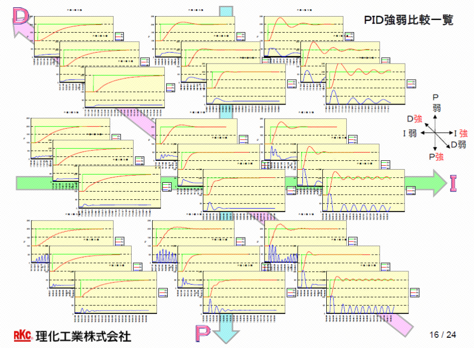

TODO: 可以考虑用Python或者Matlab仿真一下

现在先用用经验法（瞎猜）

> 比较常用的有试错法，这个是一种经验性的方法，通过尝试不同的PID参数值，找到合适的参数设置。基本步骤如下
> TIP
> 1. 首先，将I和D参数设置为0，只保留P参数。
> 2. 增加P参数，直到系统的响应时间变得合适。过高的P参数会导致系统振荡，过低的P参数会导致系统响应慢。
> 3. 接着，增加I参数，以减小稳态误差。适当调整I参数，直到系统达到满意的性能。
> 4. 最后，增加D参数，以降低系统的超调量和提高响应速度。适当调整D参数，直到系统达到满意的性能。


> 假设我们需要控制一个直流减速电机的速度，为了达到某个设定值。我们将使用PID控制器来调节电机的驱动PWM，来达到所需的速度。
> 简要步骤如下：
> 1. 初始化参数：首先将Kp，Ki，Kd全部设置为0，这样PID控制器不产生任何控制作用。
> 2. 调节比例增益Kp：逐渐增加Kp的值，直到系统开始出现持续的振荡（速度在设定值附近上下波动）。此时记录下Kp的值。
> 3. 调节积分增益Ki：将Kp设置为刚刚Kp值的一半，然后逐渐增加Ki的值，直到系统的静态误差（速度与设定值的差距）变得很小。过大的Ki值可能导致系统响应过慢或振荡，此时需要适当减小Ki值。
> 4. 调节微分增益Kd：保持当前的Kp和Ki值不变，逐渐增加Kd的值，直到系统的动态性能满足要求（例如，要求速度在设定值附近的波动范围和响应时间）。过大的Kd值可能导致系统响应过于敏感或噪声敏感，此时需要适当减小Kd值。
> 5. 微调参数：以上步骤得到的Kp，Ki，Kd值可能仍然不是最优解，因此还需要根据实际系统的性能要求进行微调。通常情况下，可以先调整Kp和Ki，然后再调整Kd。在调整过程中，需要关注系统的稳定性、阻尼、响应速度、过冲等性能指标。 

#### 三个静态参数影响了什么？

简单点说，Kp就是一个线性参数，它对速度的影响是线性的，也就是你加一我也就加一，那么这种方法加的速度由Kp和本次误差e决定，所以加起来其实容易震荡，比方说我现在是1，目标是100，然后Kp设置为2，一个过冲给我加了198，我又要回退99，然后又一个过冲给我退回去了，这种有点像弹簧振子的震荡是不稳定的，我们可以调节Kp，但这就比较吃操作，调不好就会起飞。

然后我们引入了积分参数Ki，Ki对速度的影响并不是线性的，它累加了之前的误差，因此加起来的增幅就超级大了，还是拿之前的举例子，我们现在先不管Kp，Ki设置成0.5，这样子的话第一次误差是99，所以这次累加到了50.5，然后下一次误差是49.5，我们累加一下，误差就成了140多，然后以此类推，每次增加的幅度都会比之前大，也就更快到设定点。不过Ki依然需要调节得好，不然的话过冲得效果可能比Kp还严重。

最后我们再引入微分参数Kd，当系统开始震荡的时候，我就将现在的误差和之前的误差相减，然后逐渐让速度趋于稳定，这样子的话，过冲的效果就会小很多，但是Kd的调节
也需要小心，过大依然会导致不稳定。

……讲得有点烂

#### PID定速闭环控制


```mermaid
graph LR
A[目标速度] --> B[PID控制器] --> C[控制信号] --> D[电机]
D --> E[编码器] --> F[反馈当前速度]
F --> B
```

```c
PID pid_speed_control(int target) {
    int PWM;
    // 传入PID静态参数、目标值（目标速度）、
    // 当前值（当前编码器获取的实时速度）
    PWM = pid_calc(&speed_pid, target, get_encoder_count())
    if (PWM >= 0) {
        set_motor(0, PWM); // 顺时针旋转
    } else {
        set_motor(-PWM, 0); // 逆时针旋转
    }
    return speed_pid;
}
```

此外我们已经规定了PWM最大是9999，所以还需要限制下值，`pid_init`函数同上，这里主要是讲讲调用：

`pid_init(&speed_pid, 35, 6, 10, 9999, 9999, 98); // 最大值均为9999`

#### PID 串级控制

此外文档中出现了一个很重要的东西——PID串级控制

其代码如下：

```c
/******************************************************************
 * 函 数 说 明：串级PID的计算函数
 * 函 数 形 参：左到右依次是串级PID结构体,外环目标值,外环反馈值,内环反馈值
 * 函 数 返 回：
 * 作       者：
 * 备       注：
******************************************************************/
void pid_cascade_calc(CascadePID *pid, float outerRef, float outerFdb, int innerFdb)
{
    pid_calc(&pid->outer, outerRef, outerFdb); //计算外环	
    pid_calc(&pid->inner, pid->outer.output, innerFdb); //计算内环
    //内环输出就是串级PID的输出
    pid->output = pid->inner.output; 
}
```

为什么要这么做呢？实际上你可以这么理解，我只有一个PID调节器的时候，由于只会经过一次PID调节，所以每次输入波动较大的时候，就会导致PID计算输出波动较大，所以我们引入了两个PID，这样子内层PID计算就可以充分“减震”，从而使得调节更加稳定（FIXME: 总结的可能有点不到位）

### [PID 定距](https://wiki.lckfb.com/zh-hans/tmx-mspm0g3507/training/easy-pid-beginner-kit/pid-distance.html)

只要知道如何计算马达转动角度即可，剩下的函数自己可以手搓的，看文档。

## 自己探索

自己画的扩展版到货了，然后焊接了一下，说说我的一些踩坑经历吧。

首先是 byd 按键

### 踩坑

#### 按键驱动

“哇塞，[例程给的驱动](#配置外部中断)简直太完美啦！”，然后我也想着给多个按键也这么配置，但发现根本不行：

```c
// 只保留了这个踩坑记录代码
void GROUP1_IRQHandler()
{
    if (DL_GPIO_getPendingInterrupt(KEY_LEFT_PORT)) {
        if (DL_GPIO_readPins(KEY_LEFT_PORT, KEY_LEFT_PIN)) {
            printf("KEY_LEFT pressed\n");
        }
    }
    if (DL_GPIO_getPendingInterrupt(KEY_DOWN_PORT)) {
        if (DL_GPIO_readPins(KEY_DOWN_PORT, KEY_DOWN_PIN)) {
            printf("KEY_DOWN pressed\n");
        }
    }
    if (DL_GPIO_getPendingInterrupt(KEY_UP_PORT)) {
        if (DL_GPIO_readPins(KEY_UP_PORT, KEY_UP_PIN)) {
            printf("KEY_UP pressed\n");
        }
    }
    if (DL_GPIO_getPendingInterrupt(KEY_RIGHT_PORT)) {
        if (DL_GPIO_readPins(KEY_RIGHT_PORT, KEY_RIGHT_PIN)) {
            printf("KEY_RIGHT pressed\n");
        }
    }
    if (DL_GPIO_getPendingInterrupt(KEY_MID_PORT)) {
        if (DL_GPIO_readPins(KEY_MID_PORT, KEY_MID_PIN)) {
            printf("KEY_MID pressed\n");
        }
    }
}
```

实际上就是上面那坨代码，我试了好久，`switch case` 用了， `if else` 用了， `DL_GPIO_enableInterrupt` `NVIC_enableIRQ` …… 啥都用了，就是不行，由于我的按键除了中间的KEY_MID以外全都和PORTA有关联，于是这玩意就好死不死的每次`case`到`KEY_GPIOA_INT_IIDX`时执行都只会执行前面一两句，哪怕我按下的是下面的按键，它也会说我按的是左边的，md。

所以最后我也绷不住了，决定不用中断，丢到`while`里面轮询就好了：

```c
// ... 省略一些东西
#define delay_ms(x) (delay_cycles(CPUCLK_FREQ / 1000 * (x)))
// ... 省略一些东西
void Key_Handler()
{
    // 这里使用 `!` 是因为按下会产生低电平
    if (!DL_GPIO_readPins(KEY_LEFT_PORT, KEY_LEFT_PIN)) {
        delay_ms(50);   // 然后延时消抖
        // 接着判断是否按键松开
        if (DL_GPIO_readPins(KEY_LEFT_PORT, KEY_LEFT_PIN)) {
            printf("KEY_LEFT pressed\n");
        }
    }

    if (!DL_GPIO_readPins(KEY_DOWN_PORT, KEY_DOWN_PIN)) {
        delay_ms(50);
        if (DL_GPIO_readPins(KEY_DOWN_PORT, KEY_DOWN_PIN)) {
            printf("KEY_DOWN pressed\n");
        }
    }
    if (!DL_GPIO_readPins(KEY_UP_PORT, KEY_UP_PIN)) {
        delay_ms(50);
        if (DL_GPIO_readPins(KEY_UP_PORT, KEY_UP_PIN)) {
            printf("KEY_UP pressed\n");
        }
    }

    if (!DL_GPIO_readPins(KEY_RIGHT_PORT, KEY_RIGHT_PIN)) {
        delay_ms(50);
        if (DL_GPIO_readPins(KEY_RIGHT_PORT, KEY_RIGHT_PIN)) {
            printf("KEY_RIGHT pressed\n");
        }
    }

    if (!DL_GPIO_readPins(KEY_MID_PORT, KEY_MID_PIN)) {
        delay_ms(50);
        if (DL_GPIO_readPins(KEY_MID_PORT, KEY_MID_PIN)) {
            printf("KEY_MID pressed\n");
        }
    }
}
```

然后就正常执行了！！！

顺带还有一点，**一定要配上拉电阻**！！！！！！不然你的按键驱动指定有问题！在Gui的`Digital IOMUX Features`里面去配上拉电阻，把单片机输入引脚配成高电平。

##### 按键控制多舵机

搞定了上面的坑之后我们就可以搞多个舵机驱动了，原理是[PWM](#pwm)，学51的时候学得特别详细了。

```c
/* ***************************** empty.c ***************************** */
#include "ti_msp_dl_config.h"
#include "./link/pwm/bsp_servo.h"
#include "stdio.h"

#define delay_ms(x) (delay_cycles(CPUCLK_FREQ / 1000 * (x)))

FILE __stdout;
// 定义_sys_exit()以避免使用半主机模式
void _sys_exit(int x)
{
    x = x;
}
// // printf函数重定义
int fputc(int ch, FILE *stream)
{
    // 当串口0忙的时候等待，不忙的时候再发送传进来的字符
    while (DL_UART_isBusy(UART_0_INST) == true);
    DL_UART_Main_transmitData(UART_0_INST, ch);
    return ch;
}

// idx表示当前控制的舵机，0表示PB8，1表示PA12
uint32_t idx = 0;
// 舵机角度（其实在这里应该算是速度了，360°Ver不控制角度）
int32_t angle = 0;
// 按键处理函数
void Key_Handler();
// 舵机控制函数
void Set_Servo(uint32_t i);

int main(void)
{
    SYSCFG_DL_init();

    while (1) {
        // 需要确保angle实时更新，所以Set_Servo放在这里
        Set_Servo(idx);
        delay_ms(10);
        Key_Handler(); // 检测按键并执行对应操作
        printf("\nAngle: %d\n", angle);
    }
}

void Set_Servo_Speed_Up()
{
    if (angle >= 360) {
        angle = 360;
    }
    // 每次+2，且确保不超过360
    angle += 2;
}

void Set_Servo_Speed_Down()
{
    if (angle <= 0) {
        angle = 0;
    }
    // 每次-2，且确保不小于0
    angle -= 2;
}

// 设置舵机
void Set_Servo(uint32_t i)
{
    // angle = 180时，舵机不转
    if (i == 0) {
        // 为0时说明需要开启PB8的舵机（同时关闭PA12）
        Set_SG90S_Angle(180, SG90_INST, GPIO_SG90_C0_IDX);
        Set_SG90S_Angle(angle, SG90S_INST, GPIO_SG90S_C0_IDX);
    } else if (i == 1) {
        // 为1时说明需要开启PA12的舵机（同时关闭PB8）
        Set_SG90S_Angle(180, SG90S_INST, GPIO_SG90S_C0_IDX);
        Set_SG90S_Angle(angle, SG90_INST, GPIO_SG90_C0_IDX);
    }
}

void Key_Handler()
{
    // 首先检测是否按下（输入为低电平）
    if (!DL_GPIO_readPins(KEY_DOWN_PORT, KEY_DOWN_PIN)) {
        delay_ms(50);   // 消抖
        // 再次检测是否松开
        if (DL_GPIO_readPins(KEY_DOWN_PORT, KEY_DOWN_PIN)) {
            Set_Servo_Speed_Down(); // 减速
            printf("KEY_DOWN pressed\n");
        }
    }
    if (!DL_GPIO_readPins(KEY_UP_PORT, KEY_UP_PIN)) {
        delay_ms(50);
        if (DL_GPIO_readPins(KEY_UP_PORT, KEY_UP_PIN)) {
            Set_Servo_Speed_Up(); // 加速
            printf("KEY_UP pressed\n");
        }
    }
    if (!DL_GPIO_readPins(KEY_LEFT_PORT, KEY_LEFT_PIN)) {
        delay_ms(50);
        if (DL_GPIO_readPins(KEY_LEFT_PORT, KEY_LEFT_PIN)) {
            idx = 0; // 为0时说明需要开启PB8的舵机（同时关闭PA12）
            printf("KEY_LEFT pressed\n");
        }
    }
    if (!DL_GPIO_readPins(KEY_MID_PORT, KEY_MID_PIN)) {
        delay_ms(50);
        if (DL_GPIO_readPins(KEY_MID_PORT, KEY_MID_PIN)) {
            // angle = 180时，舵机不转
            angle = 180;
            printf("KEY_MID pressed\n");
        }
    }
    if (!DL_GPIO_readPins(KEY_RIGHT_PORT, KEY_RIGHT_PIN)) {
        delay_ms(50);
        if (DL_GPIO_readPins(KEY_RIGHT_PORT, KEY_RIGHT_PIN)) {
            idx = 1; // 为1时说明需要开启PA12的舵机（同时关闭PB8）
            printf("KEY_RIGHT pressed\n");
        }
    }
}
/* ***************************** empty.c ***************************** */
```

```c
/* ***************************** bsp_servo.h ***************************** */
#ifndef __BSP_SG90_H__
#define __BSP_SG90_H__

#include "../../ti_msp_dl_config.h"

/* *****************************************************************
 * 配置占空比 范围 0 ~ (per-1)
 * t = 0.5ms-------------------舵机会转动 0 °
 * t = 1.0ms-------------------舵机会转动 45°
 * t = 1.5ms-------------------舵机会转动 90°
 * t = 2.0ms-------------------舵机会转动 135°
 * t = 2.5ms-------------------舵机会转动180°
 * 此为SG90（180°Ver）的数据
 * SG90（360°Ver）没有角度限制。
 * 此外这里的函数中angle指定为int32_t是为了方便有存在调节角度的情况（按键按下后angle--）
 ***************************************************************** */

/*
 * 计算PWM占空比
 * 照着[文档](https://wiki.lckfb.com/zh-hans/tmx-mspm0g3507/module/control/sg90-steering-engine.html)
 * 配置之后，频率是50Hz，周期是25ms
 * 不论定时器是TIMG还是TIMA，都是支持PWM的，所以只要保证 f = 50Hz 即可
 */

#define MIN_COUNT 10.0f                   // 0.5ms对应的计数 = 10
#define MAX_COUNT 50.0f                   // 2.5ms对应的计数 = 50
#define RANGE     (MAX_COUNT - MIN_COUNT) // 计数范围

/**
 * @brief 设置SG90舵机的角度
 *
 * @param angle 要设置的角度值，范围在0°到180°之间
 * @param gptimer 指向GPTIMER_Regs结构体的指针，用于访问定时器寄存器
 * @param ccIndex 定时器捕获比较通道索引
 * @return 实际设置的角度值，如果输入角度超出范围，则返回限制后的角度值
 */
int32_t Set_SG90_Angle(int32_t angle, GPTIMER_Regs *gptimer, DL_TIMER_CC_INDEX ccIndex);

/**
 * @brief 设置SG90S舵机的角度
 *
 * @param angle 要设置的角度值，范围在0°到360°之间
 * @param gptimer 指向GPTIMER_Regs结构体的指针，用于访问定时器寄存器
 * @param ccIndex 定时器捕获比较通道索引
 * @return 实际设置的角度值，如果输入角度超出范围，则返回限制后的角度值
 */
int32_t Set_SG90S_Angle(int32_t angle, GPTIMER_Regs *gptimer, DL_TIMER_CC_INDEX ccIndex);

/**
 * @brief 设置MG90舵机的角度
 *
 * @param angle 要设置的角度值，范围在0°到360°之间
 * @param gptimer 指向GPTIMER_Regs结构体的指针，用于访问定时器寄存器
 * @param ccIndex 定时器捕获比较通道索引
 * @return 实际设置的角度值，如果输入角度超出范围，则返回限制后的角度值
 */
// int32_t Set_MG90_Angle(int32_t angle, GPTIMER_Regs *gptimer, DL_TIMER_CC_INDEX ccIndex);


/**
 * @brief 设置舵机的角度（静态函数）
 *
 * @param ServoAngle 舵机角度的内部表示值
 * @param gptimer 指向GPTIMER_Regs结构体的指针，用于访问定时器寄存器
 * @param ccIndex 定时器捕获比较通道索引
 */
static void Set_Servo_Angle(uint32_t ServoAngle, GPTIMER_Regs *gptimer, DL_TIMER_CC_INDEX ccIndex);


#endif
/* ***************************** bsp_servo.h ***************************** */
```

```c
/* ***************************** bsp_servo.c ***************************** */
#include "bsp_servo.h"

int32_t Set_SG90_Angle(int32_t angle,GPTIMER_Regs *gptimer, DL_TIMER_CC_INDEX ccIndex)
{
    float ServoAngle = 0;
    // 限制在0°到180°之间
    angle      = (angle > 180.0f) ? 180.0f : angle;
    ServoAngle = MIN_COUNT + (((float)angle / 180.0f) * RANGE);
    // 转成unsigned 以确保最低为0
    Set_Servo_Angle((uint32_t)ServoAngle, gptimer, ccIndex);
    return angle;
}

int32_t Set_SG90S_Angle(int32_t angle, GPTIMER_Regs *gptimer, DL_TIMER_CC_INDEX ccIndex)
{
    float ServoAngle = 0;
    angle      = (angle > 360.0f) ? 360.0f : angle;
    ServoAngle = MIN_COUNT + (((float)angle / 360.0f) * RANGE);
    // 转成unsigned 以确保最低为0
    Set_Servo_Angle((uint32_t)ServoAngle, gptimer, ccIndex);
    return angle;
}

// int32_t Set_MG90_Angle(int32_t angle,GPTIMER_Regs *gptimer, DL_TIMER_CC_INDEX ccIndex)
// {
//     float ServoAngle = 0;
//     angle      = (angle > 360.0f) ? 360.0f : angle;
//     ServoAngle = MIN_COUNT + (((float)angle / 360.0f) * RANGE);
//     // 转成unsigned 以确保最低为0
//     Set_Servo_Angle((uint32_t)ServoAngle, gptimer, ccIndex);
//     return angle;
// }

static void Set_Servo_Angle(uint32_t ServoAngle, GPTIMER_Regs *gptimer, DL_TIMER_CC_INDEX ccIndex)
{
    // 用于配置定时器的捕获比较，满足一定条件则产生脉冲
    DL_TimerG_setCaptureCompareValue(gptimer, (uint32_t)(ServoAngle + 0.5f), ccIndex);
}
/* ***************************** bsp_servo.h ***************************** */
```

注释很详细了，然后现象也很简单，170°到190°舵机停止，< 170°舵机顺时针转（应该是，忘记了） > 190°舵机逆时针转，向上键加angle，向下键减angle，中间按键让舵机闭嘴，向左键选中第一个舵机，向右键选中第二个舵机。

缺点是不支持长按（长按应该也不难，推测应该 `while(!DL_GPIO_readPins(KEY_DOWN_PORT, KEY_DOWN_PIN)) { do something; }` 就可以了），不过这个项目就先这样吧，先折腾嘉立创的训练营项目。

顺带提一嘴接线是这样的：


VCC（红线）和GND（舵机上为棕线、插到面包板的是蓝线）采用并联，信号线（舵机上是黄线）则分别接。

对了，有一点比较重要——要把 empty/link/pwm 配置到EIDE的项目资源去，不然不会联合编译。

然后我跟的嘉立创TI电赛PCB和PID项目，会介绍使用开源库来实现按键驱动。


